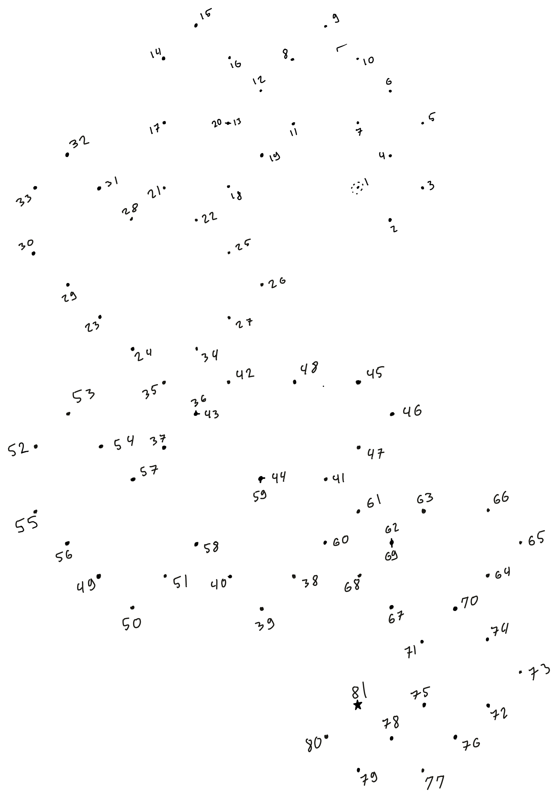

# Table of content

- Abstract
- Introduction
	- Vocabulary and jargon
	- Programming recap
	- Idris and dependent types
	- Idris and type holes
		- Simple example
		- Dependent types example
		- Holes in Idris
		- What’s wrong with non-dependent types
	- idris2 and linear types
		- Incremental steps
		- Dropping and picking it up again
		- Dancing around linear types
		- Linear intuition
	- The story begins
- Quantitative Type Theory in practice
	- Opening the door to new opportnities
	- Permtations
	- Compile-time string concatenation
	- Invertible functions
	- Support for non-computational theories
	- Levitation improvements
- Context review
	- Origins
	- Applications
	- Cutting edge linear types
- Section 1: Quantitative Type theory ergonomics
- Section 2: Performance improvement in Idris2
	- What's the big idea?
		- Why mutation
		- Why QTT and idris2
		- Why it would work?

	- The implementation ?
		- % mutate
		- automatically mutate linear use
		- automatically dispatch linear calls

	- benchmarks
		- synthetic benchmarks (fib, update, megaupdate)
		- compiler benchmarks (run the optimised version of the compiler on things and compare with unoptimised)
		- real projects (SAT, Game of life, Statebox)

	- Results
		- synthetic results
			- No improvements because Chez is too smart (to verify)
			- check with JS
		- compiler results
			- No improvements because the compiler does not make heavy use of linearity
		- real projects

- Conclusion
	- Promising but currently limited
		- limited by linearity use
		- limited by runtime
	- solutions
		- Make more use of linearity (by making linear things the default -\> have a restricted version of Idris
			- linearity is now super annoying so we need graded modal types
		- Make use of linearity in the runtime directly (make a reference counted runtime)


# Abstract

Idris2 is a programming language featuring Quantitative type theory, a Type Theory centered around tracking _usage quantities_ in addition to dependent types. This is the result of more than 30 years of developement spawned by the work of Girard on Linear logic.
Until Idris2, our understanding of linear types and their uses in dependently-typed programs was hypothetical. However this changes with languages like Idris2, which allow us to explore the semantics of running programs using linear and dependent types. 
In this thesis I explore multiple facets of programming through the lens of quantitative programming, from ergonomics, to performance. I will present how quantitative annotations can help the programmer write program that precisely match their intension, help the compiler better analyse the program written, and help the output bytecode to run faster.

# Introduction 

In this project I will demonstrate different uses and results stemming from a programming practice that allows us to specify how many times each variable is being used. This information is part of the type system, in our case we are tracking if a variable is allowed to be used exactly once, or if it has no restrictions. Such types are called “linear types”. 

As we will see there is a lot more to this story, so as part of this thesis, I will spend some time introducing the topic of dependent types and linear types. After that we will see some example of (new and old) uses for linear types in Idris2. This focus on practical examples will be followed by a context review of the existing body of theoretical work around linear types. Once both the theoretical and practical landscape have been set I will talk about the main two topics of this thesis, the ergonomics of Quantitative Type Theory (QTT, for short) for software development and the performance improvement we can derive from the linearity features of Idris2.

The ergonomics chapter will focus on how the current implementation of Idris can be extended, and the step already taken toward those extensions. And the performance chapter will analyse one aspect of performance that can be optimised thanks to clever use of linearity.

Let us begin slowly and introduce the basic concepts. The following will only make assumptions about basic understanding of imperative and functional programming. 

## Some vocabulary and jargon 

Technical papers are often hard to approach for the uninitiated because of their heavy use of unfamiliar vocabulary and domain-specific jargon. While jargon is useful for referencing complicated ideas succinctly, it is a double edged sword as it also tends to hinder learning by obscuring important concepts. Unfortunately, I do not have a solution for this problem, but I hope this section will help mitigate this feeling of helplessness when sentences seem to be composed of randomly generated sequences of letters rather than legitimate words.

You will find more complete definitions at the end, in the glossary.

##### Type

A label associated to a collection of values. For example `String` is the type given to strings of characters for text. `Int` is the type given to integer values. `Nat` is the type given to natural numbers.

##### Type-System

Set of rules the types in a program have to follow in order to be accepted by the compiler. The goal of the type-system is to catch some classes of errors while helping the programmer reach their goal more easily.

##### Linear types

Types that have a usage restriction. Typically, a value labelled with a linear type can only be used once, no less, no more.

##### Linearity / Quantity / Multiplicity

Used interchangeably most of the time. They refer the the number of times a variable is expected to be used.

##### Syntax

The structure of some piece of information, usual in the form of _text_. Syntax itself does not convey any meaning.

##### Semantics

The meaning associated to a piece of data, most often related to syntax.

##### Pattern matching

Destructuring a value into its constituent parts in order to access them or understand what kind of value we are dealing with.

#####  Generic type / Polymorphic type / Type parameter

A type that needs a concrete type in order to be complete. For example `Maybe a` takes  the single type `a` as parameter. Once we pass it the type `Int` it become the complete type `Maybe Int`.

## Programming recap

If you know about programming, you’ve probably heard about types and functions. Types are ways to classify values that the computer manipulates and functions are instructions that describe how those values are changed. 

In _imperative programming_ functions can perform powerful operations like "malloc" and "free" for memory management or make network requests through the internet. While powerful in a practical sense, those functions are really hard to study because they are hard to define in a mathematical way. In order to make life easier we only consider functions in the _mathematical_ sense of the word : A function is something that takes an input and returns an output. 

```haskell
f : A -> B
```

This notation tells us what type the function is ready to ingest as input and what type is expected as the output.

```haskell
input    output
    v    v
f : A -> B
^
name 
```

This simplifies our model because it forbids the complexity related to complex operations like arbitrary memory modification or network access [^1].
Functional programming describes a programming practice centered around the use of such functions. In addition, traditional functional programming language have a strong emphasis on their type system which allow the types to describe the structure of the values very precisely.

During the rest of this thesis we are going to talk about Idris2, a purely functional programming language featuring Quantitiative Type Theory (QTT), a type theory[^2] based around managing resources. But before we talk about QTT itself, we have to explain what is Idris and what are dependent types.

## Idris and dependent types 

Before we jump into Idris2, allow me to introduce Idris, its predecessor. Idris is a programming language featuring dependent types. 

A way to understand dependent types is to think of the programming language as having _first class types_, that is, types are values, just like any other, in the language. Types being normal values means we can create them, pass them as arguments to functions and return them to functions. This also means the difference between “type-level” and “term-level” is blurred. 

### Simple example

Let us start with a very simple example of a function in Idris, without dependent types. This function returns whether or not a list [^3] is empty:

```haskell
isEmpty : List a -> Bool
isEmpty [] = True
isEmpty (x :: xs) = False
```
  
Every Idris function is comprised of two parts, the _Type signature_ and the _implementation_ (or body) of the function. Let us start by dissecting the Type signature:

```haskell
--    ┌ Name of the function
--    │ 
--    │         ┌ Type of the argument 
--    │         │ 
--    │         │       ┌ Return type            
-- ╭──┴──╮   ╭──┴──╮  ╭─┴──╮
   isEmpty : List a -> Bool
--                ▲
--                │ 
--                └Type parameter
```

Every signature starts with a name, followed by a colon `:` and ends with a type. In this case, the type is `List a -> Bool` which represents a function that takes a list of `a` and returns a `Bool`. Interestingly, the type `a` is a _Type parameter_ and could be anything, this function will work for all lists, irrespective of their content.

As for the body, here is how it is composed:

```haskell
--    ┌ Recall the function name
--    │   
--    │     ┌ Pattern matching on the empty list
--    │     │   
--    │     │    ┌ Return value
-- ╭──┴──╮  ▼  ╭─┴──╮
   isEmpty [] = True
--             ┌ Pattern matching on the non-empty list
--         ╭───┴───╮
   isEmpty (x :: xs) = False
--          ▲    ▲     ╰─┬─╯
--          │    │       └ Return value
--          │    │
--          │    └ Tail of the list
--          │
--          └ Head of the list
```

For the body we need to recall the name of the function for every pattern match we make. In our case we only have two cases, the empty list `[]` and the non-empty list `x :: xs`. When we match on a value we may discover that we can access new variables and we give them names. In this case the `::` case allows us to bind the head and the tail of the list to the names `x` and `xs`. Depending on whether we are dealing with an empty list or not we return `True` or `False` to indicate that the list is empty or not.

Pattern matching is particularly important in Idris because it allows the compiler to better understand how the types flow through our program. We are going to see an example of how dependent pattern matching manifests itself when we introduce _type holes_.

### Dependent types example

Now let us look at an example with dependent types.

```haskell
intOrString : (b : Bool) -> if b then Int else String
intOrString True = 404
intOrString False = "we got a string"
```

This short snippet already shows a lot of things, but again the most important part is the type signature. Let us inspect it:

```haskell
--             ┌ Name of the argument
--             │
--             │    ┌ Type of the argument  
--             │    │ 
--             │    │                  ┌ Return type
--             ▼    ▼       ╭──────────┴────────────╮  
intOrString : (b : Bool) -> if b then Int else String
--             │               ▲
--             └─[dependency]──┘
```

As you can see the return type is a _program in and of itself_! `if b then Int else String` returns `Int` if `b` is `True` and `String` otherwise. Which means the return type is different depending on the value of `b`. This dependency is why they are called _dependent types_.

_Pattern matching_ on the argument allows us to return different values for each branch of our program

```haskell
--           ┌ `b` is True so we expect to return `Int`
--           │
--           │      ┌ An Int as a return value
--           ▼    ╭─┴─╮
intOrString True = 404 
intOrString False = "we got a string"
--           ▲      ╰───────┬───────╯
--           │              └ A String as a return value
--           │
--           └ `b` is `False` so we expect to return a String
```

This typically cannot be done[^4] in programming languages with conventional type systems. Which is why one might want to use Idris rather than Java, C or even Haskell in order to implement their programs.

### Holes in Idris

A very useful feature of Idris is _type holes_, one can replace any term by a variable name prefixed by a question mark, like this : `?hole` . This tells the compiler to infer the type at this position and report it to the user in order to better understand what value could possibly fit the expected type. In addition, the compiler will also report what it knows about the surrounding context to give additional insight.

If we take our example of `intOrString` and replace the implementation by a hole we have the following:

```haskell
intOrString : (b : Bool) -> if b then Int else String
intOrString b = ?hole
```

Asking the Idris compiler what the hole is supposed to contain we get

```haskell
b : Bool
--------------------------------
hole : if b then Int else String
```

This information does not tell us what value we can use. However it informs us that the type of the value _depends on the value of `b`_ . Therefore, pattern matching [^5] on `b` might give us more insight.

```haskell
intOrString : (b : Bool) -> if b then Int else String
intOrString True = ?hole1
intOrString False = ?hole2
```

Asking again what is in `hole1` get us

```haskell
hole1 : Int
```

and `hole2` gets us

```haskell
hole2 : String
```

Which we can fill with literal values like `123` or `"good afternoon"`. The complete program would look like this:

```haskell
intOrString : (b : Bool) -> if b then Int else String
intOrString True = 123
intOrString False = "good afternoon"
```

### What’s wrong with non-dependent types?

Non-dependent type systems cannot represent the behaviour described by `intOrString` and have to resort to patterns like `Either` [^6] to encapsulates the two possibles cases our program can encounter.

```haskell
eitherIntOrString :: Bool -> Either Int String
eitherIntOrString True = Left 404
eitherIntOrString False = Right "we got a string"
```

While this is fine in principle, it comes with a set of drawbacks that cannot be solved without dependent types. In order to see this, let us place a hole in the implementation of `eitherIntOrString`:

```haskell
eitherIntOrString : Bool -> Either Int String
eitherIntOrString b = ?hole
```

```haskell
b : Bool
------------------------
hole : Either Int String
```

While this type might be easier to read than `if b then Int else String` it does not tell us how to proceed in order to find a more precise type to fill. We can try pattern matching on `b`:

```haskell
intOrString' : Bool -> Either Int String
intOrString' True = ?hole1
intOrString' False = ?hole2
```

But it does not provide any additional information about the return types to use.

```haskell
-----------
hole1 : Either Int String
```

```haskell
-----------
hole2 : Either Int String
```

In itself using `Either` isn't a problem, however `Either`’s lack of information manifests itself in other ways during programming, take the following program:

```haskell
checkType : Int
checkType = let intValue = eitherIntOrString True in ?hole
```

```haskell
intValue : Either Int String
---------------
hole : Int
```

The compiler is unable to tell us if this value is an `Int` or a `String`. Despite us _knowing_ that `IntOrString` returns an `Int` when passed `True`, we cannot use this fact to convince the compiler to simplify the type for us. We have to go through a runtime check to ensure that the value we are inspecting is indeed an `Int`:

```haskell
checkType : Int
checkType = let intValue = eitherIntOrString True in
                case intValue of
                     (Left i) => ?hole1
                     (Right str) => ?hole2
```

But doing so introduces the additional problem that we now need to provide a value for an impossible case (`Right`). What do we even return? We do not have an `Int` at hand to use. Our alternatives are:
  
- Panic and crash the program.
- Make up a default value, silencing the error but hiding a potential bug.
- Change the return type to `Either Int String` and letting the caller deal with it.

None of which are ideal nor replicate the functionality of the dependent version we saw before. This is why dependent types are desirable, they help:
- Avoid needless runtime checks.
- The compiler better understand the semantics of the program.
- Inform the programmer by communicating precisely which types are expected.

This concludes our short introduction to dependent types and I hope you've been convinced of their usefulness. In the next section we are going to talk about linear types.

## Idris2 and linear types

Idris2 takes things further and introduces _linear types_ in its type system, allowing us to define how many times a variable will be used. Three different quantities exist in Idris2 : `0`, `1` and `ω`. `0` means the value cannot be used in the body of a function, `1` means it has to be used exactly once, no less, no more.  `ω`   means the variable isn't subject to any usage restrictions, just like other (non-linear) programming languages. 

We are going to revisit this concept later as there are more subtleties, especially about the `0` usage. For now we are going to explore some examples of linear functions and linear types, starting with very simple functions such as incrementing numbers.

### Incremental steps

Take the following function

```haskell
increment : Nat -> Nat
increment n = S n
```

As we've seen before with our `intOrString` function we can name our arguments in order to refer to them later in the type signature. We can do the same here even if we do not use the argument in a dependent type. Here we are going to name our first argument `n`.

```haskell
increment : (n : Nat) -> Nat
increment n = S n
```

In this case, the name `n` doesn't serve any other purpose than documentation, but our implementation of linear types has one particularity: quantities have to be assigned to a _name_ . Since the argument of `increment` is used exactly once in the body of the function we can update our type signature to assign the quantity `1` to the argument `n`

```haskell
--           ┌ We declare `n` to be linear
--           ▼
increment : (1 n : Nat) -> Nat
increment n = S n
--              ▲
--              │
--              └ We use n once here
```

Additionally, Idris2 feature pattern matching and the rules of linearity also apply to each variable that was bound when matching on it. That is, if the value we are matching is linear then we need to use the pattern variables linearly. 

```haskell
sum : (1 n : Nat) -> (1 m : Nat) -> Nat
sum Z m = m
--  ▲
--  └ We match on the argument here
sum (S n) m = S (sum n m)
--  ╰─┬─╯            ▲
--    │              └ We use `n`
--    │
--    └ We match on the argument and bind `n`
```

In this last example we match on `S` and bind the argument of `S` to the variable `n`. Since the original argument was linear, `n` is linear too and is indeed used later with `sum n m`.

### Dropping and picking it up again

Obviously this programming discipline does not allow us to express every program the same way as before. Here are two typical examples that cannot be expressed :

```haskell
drop : (1 v : a) -> ()

copy : (1 v : a) -> (a, a)
```

We can explore what is wrong with those functions by trying to implement them and making use of holes.

```haskell
drop : (1 v : a) -> ()
drop v = ?drop_rhs
```

```haskell
0 a : Type
1 v : a
------------
drop_rhs : ()
```
  
As you can see, each variable is annotated with an additional number on its left, `0` or `1`, that informs us how many times each variable has to be used (If there is no restriction, the usage number is simply left blank, just like our previous examples didn't show any usage numbers).

As you can see we need to use `v` (since it marked with `1`) but we are only allowed to return `()`. This would be solved if we had a function of type `(1 v : a) -> ()`  to consume the value and return `()`, but this is exactly the signature of the function we are trying to implement!

If we try to implement the function by returning `()` directly we get the following:

```haskell
drop : (1 v : a) -> ()
drop v = ()
```

```haskell
There are 0 uses of linear variable v
```

Which indicates that `v` is supposed to be used but no uses have been found.

Similarly for `copy` we have

```haskell
copy : (1 v : a) -> (a, a)
copy v = ?hole
```

```haskell
0 a : Type
1 v : a
-----------
hole : (a, a)
```

In which we need to use `v` twice but we're only allow to use it once. Using it twice result in this program with this error

```haskell
copy : (1 v : a) -> (a, a)
copy v = (v, v)
```

```haskell
There are 2 uses of linear variable v
```

Interestingly enough, partially implementing our program with a hole gives us an amazing insight

```haskell
copy : (1 v : a) -> (a, a)
copy v = (v, ?hole)
```

```haskell
0 a : Type
0 v : a
-----------
hole : a
```

The hole has been updated to reflect the fact that though `v` is in scope, no uses of it are available. Despite that we still need to make up a value of type `a` out of thin air, which is impossible [^7].

While there are experimental ideas that allow us to recover those capabilities they are not currently present in Idris2. We will talk about those limitations and how to overcome them in the "limitations and solutions for quantitative types” section. 

### Dancing around linear types

Linear values cannot be duplicated or ignored, but provided we know how the values are constructed, we can work hard enough to tear them apart and build them back up. This allows us to dance around the issue of ignoring and duplicating linear variables by exploiting pattern matching in order to implement functions such as ``copy : (1 _ : a) `-> (a, a)`` and `drop : (1 _ : a) -> ()`

The next snippet show how to implement those for `Nat`:

```haskell
dropNat : (1 _ : Nat) -> ()
dropNat Z = ()
dropNat (S n) = dropNat n

copyNat : (1 _ : Nat) -> (Nat, Nat)
copyNat Z = (Z, Z)
copyNat (S n) = let (a, b) = copyNat n in
                    (S a, S b)
```

It is worth noticing  that `dropNat` effectively spends `O(n)` doing nothing, while `copyNat` _simulates_ allocation by constructing a new value that is  identical and takes the same space as the original one (albeit very inefficiently, one would expect a memcpy to be `O(1)`, not `O(n)` in the size of the input).

We can encapsulate those functions in the following interfaces:

```haskell
interface Drop a where
    drop : (1 _ : a) -> ()

interface Copy a where
    copy : (1 _ : a) -> (a, a)
```

Since we know how to implement those for `Nat` we can ask ourselves how we could give implementation of those interfaces to additional types.

```haskell
module Main

import Data.List

data Tree a = Leaf a | Branch a (Tree a) (Tree a)

interface Drop a where
    drop : (1 _ : a) -> ()

interface Copy a where
    copy : (1 _ : a) -> (a, a)

Drop a => Drop (List a) where
    copy ls = ?drop_list_impl

Copy a => Copy (List a) where
    Copy ls = ?copy_list_impl

Drop a => Drop (Tree a) where
    copy tree = ?drop_Tree_impl

Copy a => Copy (Tree a) where
    Copy tree = ?copy_tree_impl

```

Going through this exercise would show that this process of tearing apart values and building them back up would be very similar than what we’ve done for `Nat`, but there is an additional caveat to this approach: primitive types do not have constructors like `Nat` and `Tree` do. `String`, `Int`, `Char`, etc, are all assumed to exist in the compiler and are not declared using the typical `data` syntax. This poses a problem for our implementation of `Copy` and `Drop` since we do not have access to their constructors nor structure. A solution to this problem will be provided in the section “QTT ergonomics”

### Linear intuition
  
One key tool in progressing in this thesis is to develop an intuition for linear types. Since they are (mostly) not present in other programming languages, it is important to built up this intuition especially in the absence of familiarity with the practice of linear types.

To that end we are going to explore a number of examples that illustrate how linearity can be understood.

#### You can’t have your cake and eat it too

Imagine this procedure

```haskell
eat : (1 c : Cake) -> Full
eat (MkCake ingredients) = digest ingredients
```

This allows you to eat your cake. Now imagine this other one:

```haskell
keep : (1 c : Cake) -> Cake
keep cake = cake
```

This allows you to keep your cake to yourself. Given those two definitions, you can’t both _have_ your cake _and eat it too_:

```haskell
notPossible : (1 c : Cake) -> (Full, Cake)
notPossible cake = (eat cake, keep cake)
```

This fails with the error

```haskell
Error: While processing right hand side of notPossible. There are 2 uses of linear name cake.

    |
    | notPossible cake = (eat cake, keep cake)
    |                    ^^^^^^^^^^^^^^^^^^^^^

Suggestion: linearly bounded variables must be used exactly once.
```

A linear variable must be used exactly once, therefore, you must choose between having it, or eating it, but not both.

Note that removing every linearity annotation makes the program compile:

```haskell
eat : (c : Cake) -> Full
eat (MkCake ingredients) = digest ingredients

keep : (c : Cake) -> Cake
keep cake = cake

nowPossible : (c : Cake) -> (Full, Cake)
nowPossible cake = (eat cake, keep cake)
```

Since we have not said anything about `Cake` it means there are no restriction in usage, and we can have as much cake as we want and keep it too.

#### Drawing unexpected parallels

Take the following picture:



This is a simple _connect the dots_ game. If you have this text printed out and have a pencil handy, I encourage you to try it out and discover the picture that hides behind those dots. 

The point of this exercise is to show what happens to a linear variable once it’s consumed: It cannot be reused anymore. The dot pattern is still visible, the numbers can still instruct you how to connect them. But since the drawing has already been carried out, there is no possible way to repeat the experience of connecting the dots. 

Linear variables are the same, once they are used, they are “spent”. This is shown explicitly in Idris2’s type system by using holes:

```haskell
let 1 dots = MkDots
    1 drawing = connect dots in
    ?rest
```

inspecting the hole we get:

```haskell
 0 dots : Graph
 1 drawing : Graph
------------------------------
rest : Fun
```

Which indicates that, while we can still _see_ the dots, we cannot do anything with them, they have linearity `0`. However, we ended up with a `drawing` that we can now use! [^8]

#### Safe inlining with 1

Linear variables have to be used exactly once, no less, no more. An extremely nice property this gives us can be summarised with the following statement:

> A linear variable can always be safely inlined

_Inlining_ refers to the ability of a compiler to replace a function call by the implementation of the function. This is a typical optimisation technique aimed at reducing the cost of function calls[^9] as well as enabling further optimisations on the resulting program.

_Safely inlined_ means that the inlining process will not result in a bigger and less efficient program. Take the following example:

```haskell
let x = f y in
    (x, x)
```

After inlining `x`, that is, replace every occurrence of `x` by its definition, we obtain:

```haskell
(f y, f y)
```

Which is less efficient than the original program. Indeed, imagine that `f` is a function that takes 5 days to run. The first case calls `f` once and duplicates its result, which would take 5 days. But the second case calls `f` twice, which would take 10 days in total.

If `x` were to be _linear_ this problem would be caught:

```haskell
let 1 x = f y in
    (x, x)
```

```haskell
There are 2 uses of linear variable x
```

Conversely, if a program typechecks while using linear variable, then all linear variables can be inlined without loss of performance. What’s more, inlining can provide further opportunities for optimisations down the line. In the following example, while `y` cannot be inlined, `x` can be.

```haskell
let 1 x = 1 + 3 in
    y = x + 10 in
    (y, y)
```

The result of inlining `x` would be as follows [^10]:

```haskell
let y = 1 + 3 + 10 in
    (y, y)
```


#### Erased runtime for 0

In Idris2, variables can also be annotated with linearity `0`, this means that the value is _inaccessible_ and cannot be used. But if that were truly the case, what would be the use of such a variable?

Those variables are particularly useful in a dependently-typed programming language because, while they cannot be used in the body of our program, they can be used in type signatures. Take this example with vector:

```haskell
length : Vect n a -> Nat
length [] = Z
length (_ :: xs) = S (length xs)
```

The length of the vector is computed by pattern matching on the vector and recursively counting the length of the tail of the vector and adding `+1` to it (`S`). If the vector is empty, the length returned is zero (`Z`).

Another way to implement the same function in Idris1 (without linear types) was to do the following:

```haskell
-- This works in Idris1
length : Vect n a -> Nat
length _ {n} = n
```

the `{n}` syntax would bring the value from the _type level_ to the _term level_, effectively making the type of the vector a value that can be used within the program. However doing the same in Idris2 is forbidden:

```haskell
Error: While processing right hand side of length. n is not accessible in this context.

    |
    | length _ {n} = n
    |                ^
```

It is hard to understand why this is the case just by looking at the type signature `Vect n a -> Nat` and this is because it is not complete. Behind the scenes, the Idris2 compiler is adding implicit arguments [^11] for `n` and `a` and automatically gives them linearity `0`. The full signature looks like this:

```haskell
length : {0 n : Nat} -> {0 a : Type} -> Vect n a -> Nat
length _ {n} = n
```

The `0` means we cannot use the variable outside of type signatures, but how come we can use them in the type signature and not to implement our `length` function?

The difference is that linearity `0` variables are available _at compile time_ and are forbidden to appear _at runtime_. The compiler can use them, compute types with them, but they cannot be allocated and used during execution of the program we generate.

This is why linearity `0` variables are also called `erased` variables because they are removed from the execution of the program. We can use them to convince the compiler that some invariants hold, but we cannot allocate any memory for them during the execution of our program.

Finally, another subtlety is that erased variable can actually appear inside the body of function, but only in position where they are arguments to functions with `0` usage. Such functions are:

##### Arguments annotated with `0`

```haskell
toNat : (0 n : Nat) -> INat n -> Nat
toNat Z Zero = Z
toNat (S n) (Succ m) = S (toNat n m)
--       ▲                      ▲
--       │                      └ Used even if erased
--       │
--       └ Bound with linearity 0
```

Here the recursive call uses `n` which has linearity `0`, but this is allowed because the first argument of `toNat` takes an argument of linearity `0`. In other words, `n` cannot be consumed, but `toNat` does not consume it’s first argument anyways, so all is good.

##### Rewrites

```haskell
sym : (0 prf : x = y) -> y = x
sym prf = rewrite prf in Refl
```

Rewriting a type does not consume the proof.

##### Type signatures

```haskell
--          ┌ `n` is erased
--          ▼
reverse' : {0 n : Nat} -> (1 vs : Vect n Nat) -> Vect n Nat
reverse' vs = let v2 : Vect n Nat = reverse vs in v2
--                          ▲
--                          └ `n` appears here
```

Even if `n` appears in the body of the function, appearing in a type signature does not count as a use.

#### No branching with 0

In general, we cannot match on erased variables, there is however an exception to this rule. Whenever matching on a variable _does not_ result in additional branching, then we are allowed to match on this variable, even if it erased. Such matches are called _uninformative_, and they are characterised by the fact that they do not generate new codepaths.

No new codepaths means that, whether we match or not, the output bytecode would be the same. Except that matching on those variable would inform us of very important properties from our types. Just like the `intOrString`  example informed us of the return type of our function, an uninformative match can reveal useful information to both the programmer and the compiler.

A good example of an uninformative match is `Refl` which has only one constructor:

```haskell
data (=) : (a, b : Type) -> Type where
  Refl : (a : Type) -> a = a
```

This suggests that, even if our equality proof has linearity `0`, we can match on it, since there is only 1 constructor we are never going to generate new branches.

But an uninformative match can also happen on types with multiple constructors. Take this indexed [^12] `Nat` type:

```haskell
data INat : Nat -> Type where
  IZ : INat Z
  IS : INat n -> INat (S n)
```

This is simply a duplicate for `Nat` but carries its own value as index. Now let us write a function to recover the original `Nat` from an `INat`:

```haskell
toNat : (0 n : Nat) -> (1 m : INat n) -> Nat
toNat Z IZ = Z
toNat (S n) (IS m) = S (toNat n m)
```

Even if we annotated `n` with linearity `0` we are allowed to match on it. To understand why, let us add some holes and remove the matching:

```haskell
toNat : (0 n : Nat) -> (1 m : INat n) -> Nat
toNat n IZ = ?branch
toNat (S n) (IS m) = S (toNat n m)
```

Idris2 will not allow this program to compile and will fail with the following error:

```haskell
Error: While processing left hand side of toNat. When unifying INat 0 and INat ?n.
Pattern variable n unifies with: 0.

    |
    |   IZ : INat Z
    |             ^
    |   IS : INat n -> INat (S n)
    |  toNat n IZ = ?branch
    |        ^

Suggestion: Use the same name for both pattern variables, since they unify.
```

It tells us that `n` unifies with `Z` and forces the user to spell out the match. Effectively forcing uninformative matches to be made. A similar error appears if we try the same thing on the second branch, trying to remove `S n`.

## The story begins

This conclude our introductory chapter. I suggest you come back to it regularly to brush up on the linear concepts, pay particular attention the “linear intuition” section in order to make sense of _erased_ variables and _linear_ variables. I also want to stress that at the end is a glossary that lists all the important terms and concepts necessary to understand the body of this work. Please feel free to consult it if something is unclear.

In the next section I will start listing and talking about uses of linear types, and what happens when they are combined with dependent types. Some of them were already known, but some of them are also new and delightful.

# Quantitative Type Theory in practice

Linear types haven’t really found a place in mainstream commercial application of software engineering. Becase qtt is even more niche than linear logic and because it’s much newer it hasn’t seen almost _any_ use under any shape or form. The Idris2 compiler itself stands as the most popular example of a complex program that showcases uses for QTT and quantitative types. For this reason, while this section does not provide any concrete contributions, I thought it was warranted to list some new, innovative and unexpected uses for linear types and QTT.

## Opening the door to new opportunities

The door protocol lol

## limitations and solutions for quantitative types

We've seen how we can write addition of natural numbers using linear types. But can we write a multiplication algorithm using linear types? Let us inspect the traditional multiplication algorithm and see if we can update it with linear types. 

### Linear multiplication

Here is a multiplication function without any linear variables

```haskell
multiplication : (n : Nat) -> (m : Nat) -> Nat
multiplication Z m = Z 
multiplication (S n) m = m + (multiplication n m)
```

Just like with addition, we notice that some variables are only used once, but some aren’t. `n` is used exactly once in both branches, but `m` is not used in one branch, and used twice in the other. Which leads to the following program:

```haskell
 multiplication : (1 n : Nat) -> (m : Nat) -> Nat
 multiplication Z m = Z
 multiplication (S n) m = m + (multiplication n m)
```

Which compiles correctly, but how could we go about implementing a completely linear version of `mutliplication`?

indeed, writing `multiplication : (1 n : Nat) -> (0 m : Nat) -> Nat` gets us the error:

```haskell
Error: While processing right hand side of multiplication. m is not accessible in this context.

    |
    | multiplication (S n) m = m + (multiplication n m)
    |                          ^
```

Which catches the fact that `m` is use twice in the second branch (but the first branch is fine).

Ideally we would like to write this program:

```haskell
--        The multiplicity depends on the first arugment
--                               v
multiplication : (1 n : Nat) -> (n m : Nat) -> Nat
multiplication Z m = Z
multiplication (S n) m = m + (multiplication n m)
```

However Idris2 and QTT do not support _dependent linearities_ or _first class linearity_ where linearity annotations are values within the language.

We can however attempt to replicate this behaviour with different proxies:

```haskell
provide : Copy t => Drop t => (1 n : Nat) -> (1 v : t) -> (DPair Nat (\x => n = x), Vect n t)
provide 0 v = let () = drop v in (MkDPair Z Refl, [])
provide (S k) v = let (v1, v2) = copy v
                      (MkDPair n prf, vs) = provide k v1 in MkDPair (S n) (cong S prf), v2 :: vs)

multiplication : (1 n, m : Nat) -> Nat
multiplication n m = let (MkDPair n' Refl, ms) = provide n m in mult n' ms
  where
    mult : (1 n : Nat) -> (1 _ : Vect n Nat) -> Nat
    mult 0 [] = 0
    mult (S k) (m :: x) = m + (mult k x)
```

This program attempts to simulate the previous signature by creating a dependency between `n` and a vector of length `n` containing copies of the variable `m`[^13] with the type `mult : (1 n : Nat) -> (1 _ : Vect n Nat) -> Nat `. 

As we’ve demonstrated, we technically can express more complex relationship between linear types provided they implement our interfaces `Drop` and `Copy`. However, the extra work to make the dependency explicit in the type isn’t worth the effort. Indeed, giving up this dependency allows us to write the following program:

```haskell
lmult : (1 n, m : Nat) -> Nat
lmult 0 m = let () = drop m in Z
lmult (S k) m = let (a, b) = copy m in a + lmult k b
```

Which is a lot simpler and achieves the same goal, it even has the same performance characteristics.

### More granular dependencies
  
While our previous example has only be mildly successful, there exist a language that can express our idea, and that is _Granule_.

Granule is a programming language with _graded modal types_, types which rely on _graded modalities_. Those are annotation that span a _range_ of different values in order to describe each type. Those values can themselves be paired up together and combined in order to represent even more complex behaviour than our linear multiplication. For now, let us stick to multiplication and see what a future version of Idris supporting graded modalities could look like.

Granule’s syntax is very close to Idris, Agda and Haskell, however, linearity in _Granule_ is the default so there is nothing to specify for a linear variable.
In addition, `Nat` is not a `Type` in _Granule_ but a _modality_, which means, in order to work with `Nat` and write dependencies between them we will create a data type indexed on `Nat`:

```haskell
data INat (n : Nat) where
  Z : INat 0;
  S : INat n -> INat (n + 1)
```

This allows us to write the add function as follows:

```haskell
linearAdd : forall {n m : Nat} . INat n -> INat m -> INat (n + m)
linearAdd Z m = m;
linearAdd (S n) m = S (linearAdd n m)
```

If we were to omit the `m` in the first branch and write `linearAdd Z m = Z` we would get the error:

```haskell
Linearity error: multiplication.gr:
Linear variable `m` is never used.
```

Which is what we expect.

Now that we have indexed `Nat` we can try again our `multiplication` function:

```haskell
multiplication : forall {n m : Nat} . INat n -> (INat m) [n] -> INat (n * m)
multiplication Z [m] = Z;
multiplication (S n) [m] = linearAdd m (multiplication n m)
```

As you can see,  we annotate the second argument of the type signature with `[n]` which  indicates that the modality of the second argument depends on the value of the first argument. This syntax repeats in the implementation where the second argument `m` has to be “unboxed” using the `[m]` syntax which will tell the compiler to correctly infer the usage allowed by the indexed modality. In the first branch there are `0` uses available, and in the second there are `n + 1` uses available.

While _Granule_ doesn’t have dependent types, indexed types are enough to show interesting programs such as multiplication. More recent developments have made progress toward implementing full type dependency between quantities and terms in the language.

## Permutations

During my time on this Master program I was also working for a commercial company using Idris for their business: Statebox.

One of their project is a validator for petri-nets and petri-net executions: [FSM-oracle](https://github.com/statebox/fsm-oracle). While the technical details of this projects are outside the scope of this text, there is one aspect of it that is fundamentally linked with linear types, and that is the concept of permutation.

FSM-Oracle describes petri-nets using [_hypergraphs_](http://www.zanasi.com/fabio/files/paperCALCO19b.pdf) those hypergraphs have a concept of [_permutation_ ](https://github.com/statebox/fsm-oracle/blob/master/src/Permutations/Permutations.idr#L31) that allows to move wires around. This concept is key in a correct and proven implementation of hypergraphs. However, permutations also turn out to be extremely complex to implement as can attest the files [trying to fit](https://github.com/statebox/fsm-oracle/blob/master/src/Permutations/PermutationsCategory.idr) their definition into a [Category](https://github.com/statebox/fsm-oracle/blob/master/src/Permutations/PermutationsStrictMonoidalCategory.idr).

Linear types can thankfully ease the pain by providing a very simple representation of permutations:

```haskell
Permutation : Type -> Type
Premutation a = (1 ls : List a) -> List a
```

That is, a `Permutation` parameterised over a type `a` is a linear function from `List a` to `List a`. 

This definition works because no elements from the input list can be omited  or reused for the output list. _Every single element_ from the argument has to find a new spot in the output list. Additionally, since the type `a` is unknown, no special value can be inserted in advance. Indeed, the only way to achieve this effect would be to pattern match on `a` and create values once `a` is known, but this would require `a` to be bound with a multiplicity greater than `0`:

```haskell
fakePermutation : {a : Type} -> (1 _ : List a) -> List a
fakePermutatoin {a = Int} ls = 42 :: ls
fakePermutation {a = _} ls = reverse ls
```

In this example, `a` is bound with _unrestricted_ multiplicity, which give us the hint that it _is_ inspected and the permutation might not be a legitimate permutation.

What’s more, viewing permutations as a function gives it extremely simple categorical semantics: It is just an instance of the category of types with linear functions as morphisms.

Assuming `Category` is defined this way:

```haskell
-- operator for composition
infix 2 .*.
-- operator for morphisms
infixr 1 ~>

record Category (obj : Type)  where
  constructor MkCategory
  (~>)          : obj -> obj -> Type -- morphism
  identity      : {0 a : obj} -> a ~> a
  (.*.)         : {0 a, b, c: obj}
               -> (a ~> b)
               -> (b ~> c)
               -> (a ~> c)
  leftIdentity  : {0 a, b : obj}
               -> (f : a ~> b)
               -> identity .*. f = f
  rightIdentity : {0 a, b : obj}
               -> (f : a ~> b)
               -> f .*. identity = f
  associativity : {0 a, b, c, d : obj}
               -> (f : a ~> b)
               -> (g : b ~> c)
               -> (h : c ~> d)
               -> f .*. (g .*. h) = (f .*. g) .*. h
```

We can write and instance of `Category` for `List o`:

```haskell
Permutation : List o -> List o -> Type
Permutation a b = Same a b

permutationCategory : Category (List o)
permutationCategory = MkCategory
  Permutation
  sid
  linCompose
  linLeftIdentity
  linRightIdentity
  linAssoc
```

Using the definitions and lemmas for `Same` which is a data type that represents a linear function between two values of the same type:

```haskell
-- a linear function between two values of the same type
record Same {0 o : Type} (input, output : o) where
  constructor MkSame
  func : LinearFn o o
  -- check the codomain of the function is correct
  check : (func `lapp` input) = output

sid : Same a a
sid = MkSame lid Refl

linCompose : {0 o : Type}
  -> {0 a, b, c : o}
  -> Same a b
  -> Same b c
  -> Same a c
linCompose (MkSame fn Refl) (MkSame gn Refl)
  = MkSame (lcomp fn gn) Refl

linRightIdentity : {0 o : Type}
   -> {0 a, b : o}
   -> (f : Same a b)
   -> linCompose f (MkSame Main.lid Refl) = f
linRightIdentity (MkSame (MkLin fn) Refl) = Refl

linLeftIdentity : {0 o : Type}
   -> {0 a, b : o}
   -> (f : Same a b)
   -> linCompose (MkSame Main.lid Refl) f = f
linLeftIdentity (MkSame (MkLin fn) Refl) = Refl

linAssoc : (f : Same a b) ->
           (g : Same b c) ->
           (h : Same c d) ->
           linCompose f (linCompose g h) = linCompose (linCompose f g) h
linAssoc (MkSame (MkLin fn) Refl)
         (MkSame (MkLin gn) Refl)
         (MkSame (MkLin hn) Refl) = Refl

```

`LinearFunction` is defined as follows:

```haskell
record LinearFn (a, b : Type) where
  constructor MkLin
  fn : (1 _ : a) -> b

lid : LinearFn a a
lid = MkLin (\1 x => x)

lapp : LinearFn a b -> (1 _ : a) -> b
lapp f a = f.fn a

lcomp : LinearFn a b -> LinearFn b c -> LinearFn a c
lcomp f g = MkLin (\1 x => g.fn (f.fn x))
```

While this looks like a lot of code, the entire definition holds within 100 lines (including the `Category` definition), and most importantly it is extremely straightforward. So much that in the future, it wouldn’t seem extravagant to have the type-system automatically derive such an instance.

## Compile-time string concatenation

Strings are ubiquitous in programming. That is why a lot of programming languages have spent a considerable effort in optimising string usage and string API ergonomics. Most famously Perl is notoriou for is extensive and powerful string manipulation API including the much dreaded and beloved first-class regex support (with more recent additions including built-in support for grammars).

One very popular feature to ease the ergonomics of string literals is _string interpolation_. String interpolation allows you to avoid this situation

```haskell
show (MyData arg1 arg2 arg3 arg4) = "MyData (" ++ show arg1 ++ " " ++ show arg2 ++ " " ++ show arg3 ++ ++ show arg4 ++ ")"
```

by allowing string literal to include expressions _inline_ and leave the compiler to build the expected string concatenation. One example of string interpolation syntax would look like this 

```haskell
show (MyData arg1 arg2 arg3 arg4) = "MyData ({arg1} {arg2} {arg3} {arg4})"
```

The benefits are numerous but I won’t dwell on them here. One of them however is quite unexpected: Predict compile-time concatenation with linear types.

As mentioned before, one intuition to understand the _erased linearity_ `0` is to consider those terms absent at runtime but available at compile-time. In the case of string interpolation, this intuition becomes useful in informing the programmer of the intention of the compiler while using the feature. Indeed, in the following program we declare a variable and use it inside a string interpolation statement.

```haskell
let name = "Susan"
    greeting = "hello {name}" in
    putStrLn greeting
```

However, it would be reasonable to expect the compiler to notice that the variable is also a string literals and that, because it is only used in a string interpolation statement, it can be concatenated at compile time. Effectively being equivalent to the following:

```haskell
let greeting = "hello Susan" in 
    putStrLn greeting
```

But those kind of translations can lead to very misleading beliefs about String interpolation and its performance implications. In this following example the compiler would _not_ be able to perform the concatenation at compile time:

```haskell
do name <- readLine
   putStrLn "hello {name}"
```

Because the string comes from the _runtime_.

### Runtime you say? Wait a minute

Yes, we've already established this intuition that _erased_ linearity is absent at runtime but allowed unrestricted use at compile-time. This intuition stays true here and allows us to explore the possibility of allowing the following program to compile

```haskell
let 0 name = "Susan" 
    1 greeting = "hello {name}" in
    putStrLn greeting
```

Since the variable `name` has linearity `0`, it cannot appear at runtime, which means it cannot be concatenated with the string `"hello "`, which means the only way this program compiles is if the string `"Susan"` is inlined with the string `"hello "`at compile-time.

Using holes we can describe exactly what would happen in different circumstances. As a rule, string interpolation would do its best to avoid allocating memory and performing operations at runtime. Much like our previous optimisation, it would look for values which are constructed in scope and simply inline the string without counting it as a use.

```haskell
let 1 name = "Susan"
    1 greeting = "hello {name}" in
    putStrLn greeting
```

Would result in the compile error

```haskell
There are 0 uses of linear variable name
```


Adding a hole at the end would show.

```haskell
let 1 name = "Susan"
    1 greeting = "hello {name}" in
    ?interpolation
```

```haskell
1 name : String
1 greeting : String
---------------------------
interpolation : String
```

As you can see, the variable `name` has not been consumed by the string interpolation since this transformation happens at compile time.

Having the string come from a function call however means we do not know if it has been shared before or not, which means we cannot guarantee (unless we restrict our programming language) that the string was not shared before, therefore the string cannot be replaced at compile time. 

```haskell
greet : (1 n : String) -> String
greet name = let 1 greeting = "hello {name}" in ?consumed
```

```haskell
0 name : String
1 greeting : String
----------------------------
consumed : String
```

The string `name` has been consumed and the core will therefore perform a runtime concatenation.

## Invertible functions

Yet another use of linearity appears when trying to define invertible functions, that is function that have a counterpart that can undo their actions. Such functions are extremely common in practice but aren't usually described in terms of their ability to be undone. Here are a couple example

- Addition and substraction
- `::` and `tail`
- serialisation/deserialisation

The paper about [sparcl](https://icfp20.sigplan.org/details/icfp-2020-papers/28/Sparcl-A-Language-for-Partially-Invertible-Computation) goes into details about how to implement a language that features invertible functions, they introduce a new (postscript) type constructor `• : Type -> Type` that indicate that the type in argument is invertible. Invertible functions are declared as linear functions `A• -o B•`. Invertible functions can be called to make progress one way or the other given some data using the `fwd` and `bwd` primitives:

```haskell
fwd : (A• -> B•) -> A -> B
bwd : (A• -> B•) -> B -> A
```

Invertible functions aren't necessarily total, For example `bwd (+ 1) Z` will result in a runtime error. This is because of the nature of invertible functions: the `+ 1` functions effectively adds a `S` layer to the given data. In order to undo this operation we need to _peel off_ a `S` from the data. But `Z` doesn't have a `S` constructor surrounding it, resulting in an error.

Those type of runtime errors can be avoided in Idris by adding a new implicit predicate that ensure the data is of the correct format:

```haskell
bwd : (f : (1 _ : A•) -> B•) -> (v : B) -> {prf : v = fwd f x)} -> A
```

This ensures that we only take values of `B` that come from a `fwd` operation, that is, it only accepts data that has been correctly build instead of abitrary data. If we were to translate this into our nat example it would look like this

```haskell
undo+1 : (n : Nat) -> {prf : n = S k} -> Nat
```

which ensures that the argument is a `S` of `k` for any `k`.


## Support for non-computational theories

Agda features cubical type theory which allows to define a lot of theorems as a proof in the language, rather than as a postulate. However a notorious limitation of cubical Agda is the inability to be computed to runnable machine code. Efforts are going into inserting cubical theories into running programs, by restricting their uses to erased types, but this is still a work in progress.

However if the same effort existed in idris2, cubical theorems could all be annotated with linearity 0 such that the compiler trivially checks that they are never instantiated at runtime while providing the theorems and proofs we need at compile time.

##  Levitation improvements

The gentle art of levitation shows that a dependently typed language has enough resources to describe all indexed data types with only a few constructors. The ability to define types as a language library rather than a language features allows a treat deal of introspection given those data definitions. Indeed it is now possible to inspect them and derive interface definitions for them, as well as optimise some of them that are convertible to primitive types without loss of semantics. 

Those features are plagued by a terrible shortcoming: the verbosity of the definitions not only make the data declaration hard to write and read but also makes the compiler spend a lot of time constructing and checking those terms. Generating those definitions is linear in therms of constructors and constructing a value is quadratic in its number of arguments. 

This performance hit can be alleviated by erasing the proofs of well-formedness as mentioned in Ahmad Salim's thesis. Reducing the complexity from quadratic to linear. His implementation in Idris1 relies on erased terms with the `.` syntax. Ours can be strongly enforced by using the `0` linearity and the `Exists` data type. 
Our linear version of levitation shows how linearity polymorphism can help simplify the code by removing the need for our custom index and relying on linear variables. 

Levitation is now also incomplete with respects to data definitions in Idris2, indeed, the constructor 

```haskell
(::) : {n : Nat} -> {0 a : Type} -> a -> Vect n a -> Vect (S n) a 
```

There is no way to define `a` to be erased with traditional levitation, it must be augmented with new constructors to reflect that the arguments are erased. 

Coincidentally, this might actually _help_ our use of levitated declarations since we can now assume every index with usage `0` to be a type parameter and every other parameter to be an index. 

In addition, idris2 now supports type matching thanks to explicit linearity declarations for types. This is necessary in order to implement automatic derivation of interfaces with methods that use higher order functions like Functor and Applicative. 

# Context Review

This literature review, or context review, will enumerate and comment on the existing literature about linear types and related topics. In order to give context to this research project I will present it through three lenses: The first aims to tell the origin story of linear types and their youthful promises. The second will focus on the current understanding of their application for real-world use. And the last one will focus on the latest theoretical developments that linear types spun up.

## Origins

Linear types were first introduced by J-Y. Girard in his 1987 publication simply named _Linear logic_ . In this text he introduces the idea of restricting the application of the weakening rule and contraction rule from intuitionistic logic in order to allow to statement to be managed as _resources_. Linear terms once used cannot be referred again, premises cannot be duplicated and contexts cannot be extended. This restriction was informed by the necessity real-world computational restriction, in particular accessing information concurrently.

One of the pain points mentioned was the inability to restrict usages to something more sophisticated than "used exactly once". Linear variables could be promoted to their unrestricted variants with the exponential operator (`!`) but that removes any benefit we get from linearity. A limitation that will be revisited in the follow-up paper: Bounded linear logic.

It is worth noting that, already at this stage, memory implication were considered, typically the exponential operator was understood as being similar to "long term storage" of a variable such that it could be reused in the future.

### Bounded Linear Logic, Girard 1991

Bounded linear logic improves the expressivity of linear logic while keeping its benefits: intuitionnistic-compatible logic that is computationally relevant. The key difference with linear logic is that weakening rules are _bounded_ by a finite value such that each value can be used as many time as the bound allows. In addition, some typing rules might allow it to _waste_ resources by_underusing_ the variable, hinting that affine types might bring some concrete benefits to our programming model.

As before, there is no practical application of this in terms of programming language, at least not that I could find. However this brings up the first step toward a managing _quantities_ and complexity in the language. An idea that will be explored again later with Granule and Quantitative Type Theory.

NOTE: (I should re-read this one to find more about the expected uses at the time)


## Applications

Soon after the development of linear types, they appeared in a paper aimed at optimising away redundant allocations when manipulating lists: The deforestation algorithm.

Deforestation (Wadler ref) is a small algorithm proposed to avoid extranious allocation when performing list operations in a programming language close to System-F.  The assumption that operations on lists must be linear was made to avoid duplicating operations. If a program was non-linear, the optimisation would duplicate each of the computation associated with the non-linear variable, making the resulting program less efficient.

While deforestation itself might not be the algorithm that we want to implement today, it is likely we can come up with a similar, or even better, set of optimisation rules in idris2 by relying on linearity. In this case linearity avoid duplicating computation, this idea was again investigated in "Once upon a Type" which formalises the detection of linear variables and uses this information for safe inlining. Indeed arbitrarily inlining functions might result in duplicated computation (just like in the deforestation algorithm). Beside inlining and mutation, another way to use linear types for performance is memory space mutation.

Linear types ca change the world (Walder 1991) show that Linear types can be used for in-place update and mutation instead of relying on copying. And they both provide programming API that make use of linear defintions and linear data in order to showcase where and how the code differ in both performance and API.
  
However the weakness of this result is that the API exposed to the programmer relies on a continuation, which is largely seen as unacceptable user experience (ask your local javascript developer what they think of "callback hell"). However, we can probably reuse the ideas proposed there and rephrase them in the context of Idris2 in order to provide a more user-friendly API for this feature, maybe even make it transparent for the user. This API problem carries over to another way linear types can be useful: Memory management and reference counting.

It turns out that linear types can also be used to replace entirely the memory management system, this paper shows that a simple calculus augmented with memory management primitives can make use of linearity in order to control memory allocation and deallocation using linear types.

This breakthrough is not without compromises either. The calculus is greatly simplified for modern standards and the amount of manual labour required from the developper to explicitly share a value is jarring in this day and age. What's more, it is not clear how to merge this approach with modern implementation of linearity (such a Quantitative Type Theory). While this paper seems quite far removed from our end goal of a transparent but powerful memory optimisation it suggest some interesting relation between data/codata and resource management (linear infinite streams?).

## Practical affine types
  
What does it mean to have access to linear and affine types _in practice_? Indeed, most the results we've talked about develop a theory for linear types using a variant of linear logic, and then present a toy language to showcase their contribution. However this does not teach us how they would interact and manifest in existing programs or in existing software engineering workflows. Do we see emerging new programming patterns? Is the user experience improved or diminished? In what regards is the code different to read and write? All those questions can only be answered by a fully fledged implementation of a progrmming language equiped to interact with existing systems.

Practical affine types show that their implementation for linear+affine types allow to express common operations in concurent programs without any risk of data races. They note that typical stateful protocols should also be implementatble since their language is a strict superset of other which already provided protocol implementations. Those two results hint at us that linear types in a commercially-relevant programming language would provide us with additional guarantees without impeding on the existing writing or reading experience of programs. A result that we well certainly attempt to reproduce in Idris2.

## Linear Haskell 2017

Haskell already benefits from a plethora of big and small extensions, they are so prevalent that they became a meme in the community: every file must begin with a page of language extension declarations. Linear Haskell is notable in that it extends the type system to allow linear functions to be defined. It introduces the linear arrow `-o` which declares a function to be linear. Because of Haskell's laziness, linearity doesn't mean "will be used exactly once" but rather "_if_ it is used, then it will be used exactly once".

This addition to the language was motivated by a concern for safe APIs, typically when dealing with unsafe or low-level code. Linear types allow to expose an API that cannot be misused while keeping the same level of expressivity and being completely backwards compatible. This backward compatibility is in part allowed thanks to parametric linearity, the ability to abstract over linearity annotations. 

## Cutting edge linear types

 Granule is a language that features _quantitative reasoning via graded modal types_. They even have indexed types to boot! This effort is the result of years of research in the domain of effect, co-effect, resource-aware calculus and co-monadic computation. Granule itself makes heavy use of _graded monads_ (Katsuma, Orchard et al. 2016) which allow to precisely annotate co-effects in the type system. This enables the program to model _resource management_ at the type-level. What's more, graded monads provide an algebraic structure to _combine and compose_ those co-effects. This way, linearity can not only be modelled but also _mixed-in_ with other interpretations of resources. While this multiplies the opportunities in resource tracking, this approach hasn't received the treatment it deserves with regards to performance and tracking runtime complexity.

### Quantitative type theory, Atkey 2016

Up until now we have not addressed the main requirement of our programming language: We intend to use _both_ dependent types _and_ linear types within the same language. However, such a theory was left unexplored until_I got plentty o nuttin_ from McBride and its descendant, _Quantitative type theory_, came to fill the gap. While other proposal talked about the subject, they mostly implement _indexed_ types instead of _fully dependent_ types. In order to allow full dependent types, two changes were made:
- Dependent typing can only use _erased_ variables
- Multiplicities are tracked on the _binder_ [^14]rather than being a feature of each value or of the function arrow (our beloved lollipop arrow `-o`)
While this elegantly merges the capabilities of a Martin-Löf-style type theory  (intuitionistic type theory, Per Martin-Löf, 1984) and Linear Logic, the proposed result does not touch upon potential performance improvement that such a language could feature. However it has the potential to bring together Linear types and dependent types in a way that allows precise resource tracking and strong performance guarantees.

### Counting immutable beans

As we've seen, linearity has strong ties with resource and memory management, including reference counting. Though _Counting immutable beans_ does not concern itself with linearity per se, it mentions the benefits of _reference counting_ as a memory management strategy for purely functional programs. Indeed, while reference counting has, for a long time, been disregarded in favor of runtime garbage collectors, it now has proven to be commercially viable in languages like Swift or Python. The specific results presented here are focused on the performance benefits in avoiding unnecessary copies and reducing the amount of increment and decrement operation when manipulating the reference count at runtime. It turns out the concept of "borrowing" a value without changing it reference count closely matches a linear type system with graded modalities. Indeed as long as the modality is finite and greater than 1 there is no need to decrement the reference count. Here is an illustration of this idea

```haskell
f : (2 v : Int) -> Int
f v = let 1 val1 = operation v -- operation borrow v, no need for dec
          1 val2 = operation v -- we ran out of ses for v, dec here
       in val1 + val2
```

In our example, since `v`could be shared prior to the calling of `f` we cannot prove that v can be freed, we can only decrement its reference count. However, by inspecting the reference count we could in addition reuse our assumption about "mutating unique linear variables" and either reclaim the space or reuse it in-place.


# Linear uses

As we've seen linear types have lots of promise regarding uses in modern programming practices. They allow to model common patterns that are notorious for being error-prone and the source of important security flaws. Indeed a protocol might have been proven safe but it's implementation might not be. Linear types allow stateful protocols to make use of an additional layer of guarantee. 

However those efforts have not been very successful in penetrating the mainstream of programming languages. While we will not discuss the reasons _why_ we will note that linear types can actually _help_ overcoming a common criticism of purely functional programming: That they are slow and do not/cannot provide any performance guarantee. Indeed, as we've seen in the review, linear types show a lot of promise regarding performance but have not realised that promise in practice. Our hypothesis is that Idris2 will provide the necessary infrastructure to demonstrate those ideas and finally legitimize linear types as a valid typing discipline for commercial software.

Indeed, Idris2 features both linear and dependent types, providing programmers with the tools to write elegant and correct software (Type Driven Development, Brady 2017), while ensuring performance. In this thesis I am going to reuse the intuition originally suggested by Wadler 1991 and rephrase it as 

> If you own a linear variable and it is not shared, you can freely mutate it

This somewhat mimics Rust's (Nicholas D Matsakis and Felix S Klock II. 2014) model of ownership where variables are free to be mutated as long as they are uniquely owned. But differs in that it does not make use of _uniqueness_ but rather uses linearity as a proxy for it. 

This idea can be illustrated with the following example:

```Idris
let 1 v : Int = 3
    1 v' : Int = v + 17
 in print v'
```

The bound variable `v` was created locally and is _linear_ advertising a use of `1`. Then, the function `+ 17` makes use of it and puts the result in a variable `v'`. This new variable does not need to allocate more memory and can simply reuse the one allocated for `v`, effectively mutating the memory space occupied by `v'` without losing the immutable semantics we expect.

As one can see this does away with the continuation while reaping the benefits of in-place mutation awarded by our linear property. In addition, this innocuous could be expanded to more complex examples like

```Idris
let 1 array = …
    1 array' = map f array
    1 array'' = map g array'
 in sum array''
```

Which could be executed in _constant space complexity_ effectively duplicating the results from deforestation, but in a more general setting since this approach does not make any assumption about the type of the data handled, only that operations are linear and mutations are constant in space.

## Mapping primitive to data types and vice-versa (TODO: Spin this as a motivation for automatically deriving instances, not just Copy and Drop)

At the end of the introduction we saw how primitive types are a problem for linearity, because we have no way of constructing them with classical constructors. However, we could define `String` as a list of `Char`, and have `Char` be defined as an 8 bits vector. Using both those definitions our primitive types have now become plain data with regular constructors.

```haskell
Bit : Type
Bit = Bool

Int32 : Type
Int32 = Vect 32 Bit

Char : Type
Char = Vect 8 Bit

String : Type
String = List Char
```

This allows us to implement `Copy` and `Drop` as expected. Additionally, since the procedure to implement those instances is very mechanical, it could almost certainly be automatically derived.

This approach is reminiscent of projects like practical levitation or Typedefs, which describe types and allow operations on the descriptions without modifying the semantics of the structure described, all while being able to map them to primitive version of themselves.

As the cherry on top, this mapping would allow the coverage checker to infer missing cases accurately for primitive types. Indeed this example should work but the Idris2 compiler is unable to check the coverage of all Strings:

```haskell
data IsTrueOrFalse : String -> Type where
  IsTrue : IsTrueOrFalse "True"
  IsFalse : IsTrueOrFalse "False"

fromString : (str : String) -> IsTrueOrFalse str => Bool
fromString "True" @{IsTrue} = True
fromString "False" @{IsFalse} = False
```

However, the following works correctly, suggesting that the special treatment of primitives is the culprit.

```haskell
data Bit = I | O

MyChar : Type
MyChar = Vect 8 Bit

MyString : Type
MyString = List MyChar

data IsTrueOrFalse : MyString -> Type where
  IsTrue : IsTrueOrFalse [[O,O,O,O,O,O,O,O]]
  IsFalse : IsTrueOrFalse [[O,O,O,O,O,O,I,O]]

fromString : (str : MyString) -> IsTrueOrFalse str => Bool
fromString [[O,O,O,O,O,O,O,O]] @{IsTrue} = True
fromString [[O,O,O,O,O,O,I,O]] @{IsFalse} = False

```
# Idris2 and multiplicities

Linear types allow us to declare variable to be use either `0`, `1` or any number of times. However, we’ve seen this approach is pretty restrictive, we’ve also seen that this limitation has been caught on early on with Bounded Linear Logic. In our case, we’re interested in making program more efficient by avoiding extraneous memory allocation to take place.
  
As we’ve seen in the previous chapter, though those optimisations are promising, they are not necessarily significant for every program. I posit that in order to bring about _significant_ change, and equally significant (but not unreasonable) change must be made to the computational model: Changing the memory model to reference counting rather than runtime garbage collection.

In this section I will explain the premise that lead me to this statement and follow it up with preliminary work done to achieve this goal.

## The problem with runtime garbage collection

## What is reference counting

## Linearity and reference counting

## Alternative semirings and their semantics

## Steps toward a working implementation

# Relaxing linearity propagation for safe inlining

By the way, there is something that's been nibbling at me for a while but I wasn't sure when to ask about it. Now that I'm writing everything down I think i have a clearer case for it:

linearProof : (1 v : Nat) -\> ProofOnNat v
linearProof Z = Refl 
linearProof (S n) = let proof = linearProof n in rewrite proof in Refl

This doesn't work because proof is automatically bound with linearity 1, however in that case I don't want to use it, at all.
 
I've been playing a lot with that a couple months ago and couldn't find the rules in the QTT paper that justified this behaviour. Someone asked on the slack why it was like this and I remember you said it was because "if we allow linearity unrestricted, then n (in this case) could be used more than once.
 
But I don't think this is true, at least in the way I understand it. It is clear if we use the "safe inlining" as an intuition for linearity that we can allow unrestricted binding from a linear function. However, it means it cannot be inlined (because that would cause duplicate use of linear variable). Take this example
 

let 1 x = 1 + 2
y = x + 3 in
y + y

This is safe as long as y is not inlined but x can be inlined into y. 
 
if x is inlined we get
 

let y = 1 + 2 + 3 in
y + y

 
which is safe. However if we inline y we get
 

let 1 x = 1 + 2 in
x + 3 + x + 3 

 
which duplicates x. So while binding y as linear forcefully deals with that, it is unnecessarily restrictive. The semantics of binding the result of a linear function to an unrestricted variable could just be "program is less efficient because we can't prove the variable is safely inlinable"
 
Did I miss anything or does that sound reasonable?

# 2 Implementation strategy

In order to gauge how effective in-place mutation would be for linear function I decided to start by adding a keyword that would tell the compiler to perform mutation for variable that are matched, irrespective of their linearity properties.

While this results in unsafe programs (since arbitrary mutation breaks referential transparency) , when used carefully in our benchmarks it will allow use to test how promising linearity improvements might be.

## Implementation details

The goal is to be able to write this program
```haskell
%mutating
update : Ty -> Ty
update (ValOnce v) = ValOnce (S v)
update (ValTwice v w) = ValTwice (S v) (S (S w))
```

where the `%mutating` annotation indicates that the value manipulated will be subject to mutation rather than construction.

If we were to write this code in a low-level c-like syntax we would like to go from the non-mutating version here

```haskell
void * update(v * void) {
    Ty* newv;
    if v->tag == 0 {
        newv = malloc(sizeof(ValOnce));
        newv->tag = 0;
        newv->val1 = 1 + v->val1;
    } else {
        newv = malloc(sizeof(ValTwice));
        newv->tag = 1;
        newv->val1 = 1 + v->val1;
        newv->val2 = 1 + 1 + v->val2;
    }
    return newv;
}
```

to the more efficient mutating version here
```haskell
void * update(v * void) {
    if v->tag == 0 {
        v->val1 = 1 + v->val1;
    } else {
        v->val1 = 1 + v->val1;
        v->val2 = 1 + 1 + v->val2;
    }
    return nv;
}
```

The two programs are very similar but the second one mutate the argument directly instead of mutating a new copy of it.

There is however a very important limitation:

### We only mutate uses of the constructor we are matching on

The following program would see no mutation

```haskell
%mutating
update : Ty -> Ty
update (ValTwice v) = ValOnce (S v)
update (ValOnce v) = ValTwice (S (S v))
```

Since the constructor we are matching on the left side of the clause does not appear on the right.

This is to avoid implicit allocation when we mutate a constructor which has more fields than the one we are given. Imagine representing data as a records:

```haskell
ValOnce = { tag : Int , val1 : Int }
ValTwice = { tag : Int , val1 : Int val2 : Int }
```

if we are given a value `ValOnce` and asked to mutate it into a value `ValTwice` we would have to allocate more space to accomodate for the extra `val2` field.
  
Similarly if we are given a `ValTwice` and are asked to mutate it into a value `ValOnce` we would have to carry over extra memory space that will remain unused.

Ideally our compiler would be able to identify data declaration that share the same layout and replace allocation for them by mutation, but for the purpose of this thesis we will ignore this optimisation and carefully design our benchmarks to make use of it. Which brings us to the next section

## Mutating branches

For this to work we need to add a new constructor to the AST that represents _compiled_ programs `CExp`. We add the consturctor 

```haskell
CMut : (ref : Name) -> (args : List (CExp vars)) -> CExp vars 
```

which represents mutation of a variable identified by its `Name` in context and using the argument list to modify each of its fields.

(This new constructor has to be carried of to tress `NamedExp` `ANF` and `Lifted`, the details are irrelevants and the changes trivial)

Once this change reached the code generator it needs to output a `mutation` instructon rather than an allocation operation. Here is the code for the scheme backend

*show scheme backend implementation for CMut*

AS you can see we generate one instruction per field to mutate as well ad a final instruction to _return_ the value passed in argument, this to keep the semantics of the existing assumption about constructing new values.

## Reference nightmare

There is however an additional details that isn't as easy to implement and this is related to getting a reference to the term we are mutating. 

Let's look at our `update` function once again and update it slightly 


```haskell
%mutating
update : (1 _ : Ty) -> Ty
update arg = case arg of
                  ValTwice v => ValTwice (S (S v))
                  ValOnce v => ValOnce (S v)
```

This version makes use of there temporary variable `arg` before matching on the function argument directly. Otherwise it's the same as what we showed before.

What needs to happen is that `ValTwice` on the first clause needs to access the variable `arg` and mutate it directly. And similarly for `ValOnce`.

```haskell
case arg of
     ValTwice v => -- access `arg` and mutate it with S (S v)
                   ValTwice (S (S v))
     ValOnce v => -- access `arg` and mutate it with S v
                  ValOnce (S v)
```

However looking at the AST for pattern match clauses we see that it does not carry any information about the original value that was matched:

```haskell
ConCase : Name -> (tag : Int) -> (args : List Name) ->
                 CaseTree (args ++ vars) -> CaseAlt vars
```

Thankfully this reference can be found  earlier in the `CaseTree` part of the AST. 

```haskell
  public export
  data CaseTree : List Name -> Type where

       Case : {name, vars : _} ->
              (idx : Nat) ->
              (0 p : IsVar name idx vars) ->
              (scTy : Term vars) -> List (CaseAlt vars) ->
              CaseTree vars
       STerm : Int -> Term vars -> CaseTree vars

       Unmatched : (msg : String) -> CaseTree vars

       Impossible : CaseTree vars
```

A `CaseTree` is either a case containing other cases, or a term, or a missing case, or an impossible case.

We note that the `Case` constructor contains the reference to the variable that is being matched. Therefore we can get it from here and then carry it to our tree transformation.

The tree transformation itself is pretty simple and can be sumarised with this excerpt:


```haskell
replaceConstructor : (cName : Name) -> (tag : Int) ->
                     (rhs : Term vars) ->
                     Core (Term vars)
replaceConstructor cName tag (App fc (Ref fc' (DataCon nref t arity) nm) arg) = 
    if cName == nm then pure (App fc (Ref fc' (DataCon (Just ref) t arity) nm) arg)
                   else App fc (Ref fc' (DataCon nref t arity) nm) <$> replaceConstructor cName tag arg 

```

Which checks that for every application of a data constructor if it is the same as the one we matched on, if it is, then the `CCon` instruction is replaced by a `CMut` which will tell the backend to _reuse_ the memory space taken by the argument.


# 3 Benchmarks & methodology

In order to test our performance hypothesis I am going to use a series of programs and run them multiple times under different conditions in order to measure different aspects of performances. Typically, observing how memory usage and runtime varies depending on the optimisation we use.

Each benchmark will be compared to its control which will be the original compiler without any custom optimisation. The variable we are going to introduce is the new mutation instruction.

There are 2 types of benchmarks we want to write:
- synthetic benchmarks designed to show off our improvements.
- real-world benchmarks designed to test its influence on programs that were not specifically designed to show off our improvements.
	 
The goal of the first category is to explore what is our "best case scenario" and then go from there. Indeed, if the best case scenario doesn't provide any results, then either there is something wrong with our implementation, or there is something wrong with our idea.

The second category aims to collect data about programs that are not built with a specific optimisation in mind such that we can observe how our changes manifest in everyday programs. This could give us insight into how to modify existing programs so that they take full advantage of linear types. Here is one possible course of action:

- Benchmark X doesn't show any improvement over the original compiler implementation.
- One function is changed from an unrestricted definition to a linear one.
- We find a performance improvement.

## Synthetic benchmarks

Synthetic benchmarks are designed to show off a particular effect of a particular implementation. They are not representative of real world programs and are mostly there to establish a baseline so that individual variables can be tweaked with further testing. For this project I have designed 3 benchmarks which are all expected to highlight our optimisation in different ways.

## Fibonnaci

One cannot have a benchmark suite without computing fibonacci, in this benchmark suite we are going to tweak the typical fibonacci implementation to insert an allocating function within our loop. Our mutation optimisation should get rid of this allocation and make use of mutation instead. Because of this we are going to look at three variants of the same program.

### Traditional Fibonacci

This version is the one you would expect from a traditional implementation in a functional programming language

```haskell
tailRecFib : Nat -> Int
tailRecFib Z = 1
tailRecFib (S Z) = 1
tailRecFib (S (S k)) = rec 1 1 k
  where
    rec : Int -> Int -> Nat -> Int
    rec prev curr Z = prev + curr
    rec prev curr (S j) = rec curr (prev + curr) j
```

As you can see it does not perform any extraneous allocation since it only makes use of primitive values like `Int` which are not heap-allocated. If our optimisation works perfectly, we expect to reach the same performance signature as this implementation.

### Allocating Fibonacci

This version of Fibonacci does allocate a new value for each call of the `update` function. We expect this version to perform worse than the previous one, both in memory and runtime, because those objects are allocated on the heap (unlike ints), and allocating and reclaiming storage takes more time than mutating values.

```haskell
data FibState : Type where
  MkFibState : (prev, curr :  Int) -> FibState

next : FibState -> FibState
next (MkFibState prev curr) = MkFibState curr (prev + curr)

rec : FibState -> Nat -> Int
rec (MkFibState prev curr) Z = prev + curr
rec state (S j) = rec (next state) j

tailRecFib : Nat -> Int
tailRecFib Z = 1
tailRecFib (S Z) = 1
tailRecFib (S (S k)) = rec (MkFibState 1 1) k
```

### Mutating Fibonacci

This version is almost the same as the previous one except our `update` function should now avoid allocating any memory, while this adds a function call compared to the first version we do expect this version to have a similar performance profile as the first one

```haskell
import Data.List
import Data.Nat

data FibState : Type where
  MkFibState : (prev, curr :  Int) -> FibState

%mutating
next : (1 _ : FibState) -> FibState
next (MkFibState prev curr) = MkFibState curr (prev + curr)


tailRecFib : Nat -> Int
tailRecFib Z = 1
tailRecFib (S Z) = 1
tailRecFib (S (S k)) = rec (MkFibState 1 1) k
  where
    rec : FibState -> Nat -> Int
    rec (MkFibState prev curr) Z = prev + curr
    rec state (S j) = rec (next state) j
```

## Real-world benchmarks

For our real world benchmarks we are going to use whatever is available to us. Since the ecosystem is still small we only have a handful of programs to pick from. For this purpose I've elected the following programs:

- The Idris2 compiler itself
- A Sat solver
### The Idris2 compiler as benchmark 

The Idris2 compiler itself has the benefit of being a large scale program with many parts that aren't immediately obvious if they would benefit from memory optimisation or not. Having our update statement be detected and replaced automatically will allow us to understand if our optimisation can be performed often enough, where and if it results in tangible performance improvements.

### A simple SAT solver as benchmark

Sat solvers themselves aren't necessarily considered "real-world" programs in the same sense that compilers or servers are. However they have two benefits:
- You can make them arbitrarily slow to make the performance improvement very obvious by increasing the size of the problem to solve.
- They still represent a real-life case study where a program need to be fast and where traditional functional programming has fallen short compared to imperative programs, using memory unsafe operations. If we can implement a fast SAT solver in our functional programming language, then it is likely we can also implement fast versions of other programs that were traditionally reserved to imperative, memory unsafe programming languages.

# Measurements

The benchmarks were run with a command link script written in idris itself which takes a source folder and recursively traverses it in order to find programs to execute and measure their runtime.

The analysis of the result was performed with another command line script which reads the output of out benchmark program and output data like minimum, maximum, mean and variance along with arrays for plotting our results on a graph.

## Idris-bench

Idris-bench is our benchmarking program and can be found at [https://github.com/andrevidela/idris-bench](https://github.com/andrevidela/idris-bench).

Idris-bench takes the following arguments:

- `-p | --path IDRIS_PATH` the path to the idris2 compiler we want to use to compile our tests. This is used to test the different between different compiler versions. Typically running the benchmarks with our optimized compiler and running the benchmarks without our optimisation can be done by calling the program with two different version of the idris2 compiler.
- `-t | --testPath TEST_PATH` The path to the root folder containing the test files.
- `-o | --output FILE_OUTPUT` The location and name of the CSV file that will be written with our results.
	- Alternatively `--stdout` can be given in order to print out the results on the standard output.
- `-c count` The number of times each file has to be benchmarked. This is to get multiple results and avoid lucky/unluck variations.
- `--node` If the node backend should be used instead. If this flag is absent, the Chez backend will be used instead

## Idris-stats

Once our results have been generated we are going to analyse them by computing the minimum time, maximum time, mean and variance of the collection of benchmark results. For this we are going to rely on another script: idris-stats. It take out CSV output and compute the data we need and output them as another CSV file. Again the code can be found here [https://github.com/andrevidela/idris-bench/blob/master/script/idris-stats.idr](https://github.com/andrevidela/idris-bench/blob/master/script/idris-stats.idr).

The program takes the file to analyse as single argument. The file is expected to be a CSV file with the following format:
```haskell
name of first benchmark, result1, result2, result3, etc
name of second benchmark, result1, result2, result3, etc
...
name of final benchmark, result1, result2, result3, etc
```

The first column is ignored for the purpose of data analysis.

For each row we compute the minimum value, the maximum value, the mean and the variance. As a reminder, the variance is computed as the sum of the square difference with the mean divided by the number of samples.

$$ \operatorname{Var}(X) = \frac{1}{n} \sum_{i=1}^n (x_i - \mu)^2 $$


## Expected results

Our expectation is that our programs will run fasters for 2 reasons:
- Allocation is slower than mutation
- Mutation avoids short lived variables that need to be garbage collected

Indeed allocation will always be slower than simply updating parts of the memory. Memory allocation requires finding a new memory spot that is big enough, writing to it, and then returning the pointer to that new memory address. Sometimes, allocation of big buffers will trigger a reshuffling of the memory layout because the available memory is so fragmented that a single continuous buffer of memory of the right size isn't available.

Obviously all those behaviours are hidden from the programmer through _virtual memory_ which allows to completely ignore the details of how memory is actually laid out and shared between processes. Operating systems do a great job a sandboxing memory space and avoid unsafe memory operations. Still, those operations happen, and make the performance of a program a lot less consistent than if we did not have to deal with it.

In addition, creating lots of short lived objects in memory will create memory pressure and trigger garbage collection during the runtime of our program. A consequence of automatic garbage collection is that memory management is now outside the control of the programmer and can trigger at times that are undesirable for the purpose of the program. Real-time applications in particular suffer from garbage collection because it makes the performance of the program hard to predict, an unacceptable trade-off when execution need to be guaranteed to run within a small time-frame.

# Running the benchmarks 

All the benchmarks were run on a laptop with the following specs:
- Intel core-i5 8257U (8th gen), 256KB L2 cache, 6MB L3 cache
- 16Gb of ram at 2133Mhz

While this computer has a base clock of 1.4Ghz, it features a boost clock of 3.9Ghz (a feature of modern CPUs called “turbo-boost”) which is particularly useful for single-core application like ours. However, turbo-boost might introduce an uncontrollable level of variance in the results since it triggers based on a number of parameters that aren't all under control (like ambient temperature, other programs running, etc). Because of this I've disabled turbo boost on this machine and run all benchmarks at a steady 1.4Ghz.

# The performance hypothesis

Using mutation in an isolated case did not result in any performance improvement, even with pathological code that would typically showcase the Benedict of such benchmarks, no improvements were found. 

My best hypothesis is that the Chez optimiser is smart enough to detect those cases and perform the optimisation were looking for before using having to do it.

While the chez backend is not intended to be the only backend for Idris 2 out goal isn't to make the runtime worse in order to show any improvement.

The next step is then to perform the optimisation automatically rather than manually on a large scale program such as the Idris 2 compiler itself. 


# Performing the optimization automatically 

We want to optimise this case

```haskell
let 1 v = a :: b in
    update v
```

The key observation is that a value `v` is constructed and bound linearly _and_ its only use is performed in-scope. 

Because we _know_ it won't be used later, we can mutate this value instead of creating a new copy within the body of `update` and return the mutated reference instead of returning a newly allocated value. 

However `update` might also be used in situations where it's argument isn't unique, for example update can be defined non-linearly

```haskell
update : (1 _ : List Nat) -> List Nat
update [] = []
update (x :: xs) = S x :: xs
```

But by virtue of subtyping can still be called with non-linear arguments. Since a shared value can _also_ be used exactly once, no invariant is broken. However, this breaks our performance fix since we cannot simply mutation whenever we deal with a linear function. We have to be sure that linearity implies uniqueness. 

This is why we need our ad-how scoping rule. It ensures the variable isn't shared before calling a linear function. 

# 4 Results
  
In this section I will present the results obtained from the compiler optimisation.  The metodology and the nature of the benchmarks is explained in the “Benchmarks & methodology” section.

## Results1: Fibonacci

Out first test suite runs the benchmark on our 3 fibonacci variants. As a refresher they are as follow:
- The first one is implemented traditionally, carrying at all times 2 Ints representing the last 2 fibonacci numbers and computing the next one
- Second one boxes those Ints into a datatype that will be allocated every time it is changed
- The Third one will make use of our optimisation and mutate the boxes values instead of discarding the old one and allocating a new one.

The hypothesis is as follows: Chez is a very smart and efficient runtime, and our example is small and simple. Because of this, we expect a small difference in runtime between those three versions. However, the memory pressure incurred in the second example will trigger the garbage collector to interfere with execution and introduce uncertainty in the runtime of the program. This should translate in our statistical model as a greater variance in the results rather than a strictly smaller mean.

### The results

Here are there results of running our benchmarks 100 times in a row:

```haskell
../Idris2_fib_benchmark/fibTestNoMutation.idr,5.76e-4,0.00119,6.733999999999996e-4,1.0818499999999999e-8
../Idris2_fib_benchmark/fibTest.idr,5.84e-4,8.41e-4,6.449e-4,2.3797899999999993e-9
../Idris2_fib_benchmark/fibTailRec.idr,5.88e-4,8.53e-4,6.499100000000001e-4,2.692301899999999e-9

[3, 18, 18, 32, 12, 0, 2, 4, 0, 0, 0, 2, 1, 2, 1, 1, 1, 0, 0, 1, 0, 0, 0, 0, 0, 0, 0, 0, 1, 1]
[7, 22, 26, 27, 6, 2, 3, 1, 1, 2, 0, 2, 1, 0, 0, 0, 0, 0, 0, 0, 0, 0, 0, 0, 0, 0, 0, 0, 0, 0]
[7, 20, 20, 28, 9, 5, 2, 2, 2, 2, 0, 1, 1, 1, 0, 0, 0, 0, 0, 0, 0, 0, 0, 0, 0, 0, 0, 0, 0, 0]
```


This is the result of calling our data analysis program on the csv file generated by our benchmarking program. The benchmarking program was called with those options

```haskell
build/exec/benchmarks -d ../idris2-fib-benchmarks -o results.csv -p $(which idris2dev) 
```

And the statistical analysis program with no options except for the file:

```haskell
build/exec/stats results_mutation_100_attempts_with_startup.csv
```

The results are in the following format:

```haskell
name of benchmark, minimum, maximum, average, variance
```

The three arrays at the end correspond to an aggergation of the data in “buckets”. Our statistical tool makes 30 “buckets” which represent the different time slots that each benchmark result falls into. The first bucket is the minimum time measured across all benchmarks and the last bucket is the maximum time measured across all benchmarks. There are 28 other buckets in between those two extremities. The array represents the number of results that land for each bucket. 

As you can see the results are pretty consistent with our predictions but the values themselves aren't statistically significant. In order to get a better picture we are going to run the same benchmark 1000 times instead of 100.

```haskell
../Idris2_fib_benchmark/fibTestNoMutation.idr,5.08e-4,0.001795,6.561829999999996e-4,1.4789385511000005e-8
../Idris2_fib_benchmark/fibTest.idr,5.08e-4,0.001753,5.882930000000001e-4,1.5392219150999998e-8
../Idris2_fib_benchmark/fibTailRec.idr,4.89e-4,0.001974,6.241300000000006e-4,3.8718697099999886e-8

[53, 126, 460, 192, 47, 23, 31, 32, 11, 5, 1, 2, 2, 4, 1, 5, 0, 2, 1, 1, 0, 0, 0, 0, 0, 1, 0, 0, 0, 0]
[261, 546, 76, 32, 18, 12, 13, 7, 2, 5, 10, 4, 3, 5, 0, 1, 1, 0, 0, 2, 0, 1, 0, 0, 1, 0, 0, 0, 0, 0]
[217, 527, 80, 44, 23, 14, 12, 11, 7, 6, 10, 2, 6, 11, 5, 4, 4, 2, 1, 2, 1, 1, 0, 3, 3, 1, 2, 0, 0, 1]
```

The results are pretty similar which gives us a greater confidence in their accuracy.

 There is however something we can do to improve our measurement and that is to subtract the startup time of the scheme runtime. Indeed every program is measured using the difference between the time it started and the time it ended. But this time also includes the time it takes to launch scheme and then execute a program on it. Indeed the following program:

```haskell
main : IO ()
main = pure ()
```

Takes 0.13 seconds to run despite doing nothing. This time is the startup time and can go up to 0.3 seconds.

## Results 2: Fibonacci without startup time

In order to remove the startup time we are going to change the emitted bytecode to wrap our main function inside a time-measuring function. Since the timer won't start until the program is ready to run the startup time will be eliminated. Running our empty program we get

```haskell
0.000000000s elapsed cpu time
```

Which is what we expect.

This time we will run our benchmarks 1000 times using the same command as before. We expect to see the same results but the difference should give us a greater interval of confidence. Running our statistical analysis gives us those results

```haskell
../Idris2_fib_benchmark/fibTestNoMutation.idr,1.696760896,1.977075901,1.7447377120060026,9.18303221644259e-4
../Idris2_fib_benchmark/fibTest.idr,1.734708117,2.152951106,1.786299514231,0.002247060292357963
../Idris2_fib_benchmark/fibTailRec.idr,1.65627213,1.881412963,1.6768551703740004,9.142437018832634e-4

[0, 0, 136, 113, 17, 620, 62, 22, 4, 6, 4, 3, 2, 3, 4, 0, 1, 2, 1, 0, 0, 0, 0, 0, 0, 0, 0, 0, 0, 0]
[0, 0, 0, 0, 164, 217, 36, 160, 264, 47, 36, 18, 19, 7, 5, 5, 7, 3, 2, 3, 2, 2, 1, 0, 0, 0, 1, 0, 0, 1]
[647, 221, 19, 4, 52, 33, 8, 2, 5, 2, 0, 4, 2, 1, 0, 0, 0, 0, 0, 0, 0, 0, 0, 0, 0, 0, 0, 0, 0, 0]
```

As you can see the results aren't exactly as expected, both our _average_ and our _variance_ is higher than without any optimisation. A result that we definitely did not anticipate and goes against the belief that founded our hypothesis.

One possible explanation is that scheme performs JIT compilation and correctly identifies the hot-loop in our unoptimized example but is unable to perform such optimization with our mix of pure and mutating code.

## Results 3: Fibonacci without startup time, small loop

In order to test the JIT hypothesis we are going to run the same test, _without_ startup time but with a much smaller loop so that the results are measured in milliseconds rather than seconds. This should be enough to prevent the runtime from identifying the loop and performing its optimisation.

In order to reduce the running time from seconds to milliseconds we simply change the loop count from `8*10^6` to `8*10^4` reducing it by two orders of magnitude reduces the running time accordingly.

```haskell
../Idris2_fib_benchmark/fibTestNoMutation.idr,0.007216185,0.008861124,0.007520532116999987,3.5827851856347296e-8
../Idris2_fib_benchmark/fibTest.idr,0.006543267,0.010942671,0.006867369243000004,5.3106313711037986e-8
../Idris2_fib_benchmark/fibTailRec.idr,0.006385357,0.007625528,0.006624731209000001,2.4002041892751334e-8

[0, 0, 0, 0, 0, 72, 411, 361, 106, 17, 12, 8, 6, 2, 3, 2, 0, 0, 0, 0, 0, 0, 0, 0, 0, 0, 0, 0, 0, 0]
[0, 95, 493, 288, 83, 13, 9, 10, 3, 0, 3, 1, 0, 0, 0, 0, 0, 0, 1, 0, 0, 0, 0, 0, 0, 0, 0, 0, 0, 1]
[303, 470, 161, 41, 13, 7, 1, 4, 0, 0, 0, 0, 0, 0, 0, 0, 0, 0, 0, 0, 0, 0, 0, 0, 0, 0, 0, 0, 0, 0]
```

And indeed this data does not disprove our JIT hypothesis (but it does not confirm it either). However, since this thesis is not about the intricacies of the scheme runtime we are going to let the issue rest for now. 

Those results showcase two things: That our optimisation works, and that it is not significant enough to be strictly superior to other forms of optimisations. Ideally the best way to test our optimisation would be to write our own runtime which runs on _bare metal_ or some approximation of it (WASM/LLVM) which would (probably) be even faster than scheme, and give us more control over which optimisations play nicely together and which ones are redundant or even harmful to performance.

Idris2 has an alternative javascript backend, however, the javascript code generation is unable to translate our programs into plain loops free of recursion. Because of this, our benchmark exceeds the maximum stack size and the program aborts. When the stack size is increased the program segfaults.

# Safe inlining 

As we’ve seen in the context review, one of the use-cases for linear types is to detect where control flow allows for safe inlining of functions. In the following snippet, `y` cannot be inlined without duplicating computation.

```haskell
let x = 1 + 2
    y = x + 3 in
    y + y
```

Indeed inlining it would result in

```haskell
let x = 1 + 2
    x + 3 + x + 3
```

where the `+ 3` operation is performed twice. `x` however can be inlined safely:

```haskell
let y = 1 + 2 + 3 in
    y + y
```

the `1 + 2` operation is performed only once after inlining.

One area where linearity and inlining comes into play is when defining effects. Indeed, a linear state monad could have the following `bind` signature:
```haskell
(>>=) : (1 _ : LState s a) -> (1 f : a -> LState s b) -> LState s b
(>>=) (LState s) c = LState (\x => …)
```

Which indicates that the state is inspected linearity and the function is applied exactly once. Since programs using `bind` compose with themselves we often see the following sequence of operations:
```haskell
inital >>= f >>= g
```

which once inlined results in

```haskell
LState (\x => let v = initial >>= f)
                  g v)
```

```haskell
LState (\x => let v = x (LState (\y => let w = y initial 
                                           f w))
                  g v)
```
# 6 Future work


## Enlarging the scope

Currently we only look at the _immediate_ scope of let bindings. Technically speaking there is nothing preventing our optimisation from working with a more indirect scoping mechanism. Indeed the following should trigger our optimisation

```haskell
defaultVal : MyData
defaultVal = MkDefault 3

update : (1 rec : MyData) -> MyData
update (MkDefault n) = MkDefault (S n)
update (MkOther n) = MkOther (S (S n))

operate : MyData
operate = let 1 def = defaultVal
              1 newVal = update def in
              update newVal
```

But it will not because `defaultVal` is not a constructor, it's a function call that returns itself a constructor.

One implementation strategy would be to wait for the compiler to inline those definitions and then run our optimiser without further changes.

Another optimisation would be to aggressively follow references to see if they result in plain data constructors and replace the entire call chain by the constructor itself, and then run our optimisation.

While both those strategies are valid they incur a cost in terms of complexity and compile time that may not be worth the effort in terms of performance results. They could be hidden behind a -O3 flag, but that kind of effort is probably better spend in making the ergonomics of linear types more streamlined, which would help make those optimisations more commonplace. Which is the topic of the next section

## Making linearity easier to use

There are multiple barriers that make linearity harder to use than one might expect. They roughly end up in two buckets:

- I want to use linearity but I cannot
- I have  a linear variable and that's actually annoying

### Not linear enough

The first one appears when the programmer tries to make thoughtful usage of linear and erased annotation but finds that other parts of existing libraries do not support linearity. Here are a couple of examples

```haskell
operate : (1 n : Nat) -> (1 m : Nat) -> Int
operate n m = n + m
```

gives the error 

```haskell
Trying to use linear name n in non-linear context
```

Because the `+` interface is defined as 

```haskell
interface Num ty where
    (+) : ty -> ty -> ty
```

Despite addition on `Nat` being defined linearly

```haskell
plus : (1 n : Nat) -> (1 m : Nat) -> Nat
plus Z m = m
plus (S n) m = S (plus n m)
```

A similar problem occurs with interfaces

```haskell
interface Monad (Type -> Type) where
    ...

data MyData : (0 ty : Type) -> Type where
    ...

instance Monad MyData where
    ...
```

```haskell
Expected Type -> Type
got (0 ty : Type) -> Type
```

One way to solve those issues would be to have linearity polymorphism and be able to abstract over linearity annotations. For example the map function could be written as

```haskell
map : forall l . ((l v : a) -> b) -> (l ls : List a) -> List b
map f [] = []
map f (x :: xs) = f x :: map f xs
```

That is, the list is linearly consumed iff the higher order function is linear. What it means for our interface problem is that it could be rewritten as

```haskell
interface forall l . Functor (m : (l _ : Type) -> Type) where
    ...
interface forall l . Functor {l} m ⇒ Applicative {l} m where
    ...
interface forall l . Applicative {l} m ⇒ Monad {l} m where
    ...
```

A similar solution could be provided for `Num`

```haskell
interface Num ty where
    (+) : forall l. (l n : ty) -> (l m : ty) -> ty
```

So that it can be used with both linear and non-linear variables.

### Too linear now

We've already mentionned before how benefitial it would be for our optimisation strategy to be _100%_ linear in every aspect. We also mentioned how this is a problem to implement basic functionality like `drop` and `copy`, but those are artifical examples, rarely does a programmer need to call `copy` or `drop` in industrial applications. Therefore I will present a couple of situation where being _entirely_ linear results in tricky code or impossible code and then propose a solution.

#### Logging

This is a common scenario, you're trying to debug effectful code, and for this you're spreading around log statements hoping that running the program will give you insight into how it's running.

```haskell
do datas <- getData arg1 arg2
   Just success <- trySomething datas (options.memoized)
     | _ ⇒ pure $ returnError "couldn't make it work"
   case !(check_timestamp success) of
      Safe t v ⇒ functionCall t v
      Unsafe t ⇒ trySomethingElse t
      UnSynchronized v ⇒ functionCall 0 v 
      Invalid ⇒ pure $ returnError "failed to check"
```

Assuming everything is linear, there is no possible way to add a new print statement without getting a linearity error:

```haskell
do datas <- getData arg1 arg2
   Just success <- trySomething datas (options.memoized)
     | _ ⇒ pure $ returnError "couldn't make it work"
   putStrLn $ show success -- <- one use here
   --
   -- And one use there ----|
   --                       v
   case !(check_timestamp success) of
      Safe t v ⇒ functionCall t v
      Unsafe t ⇒ trySomethingElse t
      UnSynchronized v ⇒ functionCall 0 v 
      Invalid ⇒ pure $ returnError "failed to check"
```
# Conclusion

# Appendices: Glossary and definitions

While the initial list of fancy words in the introduction is nice it suffers from being superficial and therefore incomplete. These are more details definitions using examples and imagery

## Linearity / Quantity / Multiplicity

Used interchangably most of the time. They refer the the number of type a variable is expected to be used.

## Linear types
Linear types describe values that can be used exactly 0 times, exactly 1 time or have no restriction put on them

## Affine types
Affine types describe values that can be used at most 0 times, at most 1 times or at most infinitely many times (aka no restrictions)

## Monad
A mathematical structure that allows to encapsulate _change in a context_. For example `Maybe` is a Monad because it creates a context in which the values we are manipulating might be absent.

## Co-monad / Comonad
A mathematical structure that allows to encapsulate _access to a context_. For example `List` is a Comonad because it allows us to work in a context were the value we manipulate is one out of many available to us, those other values available to us are the other values of the list.

## Semiring
A mathematical structure that requires its values to be combined with `+` and `*` in the ways you expect from natural numbers

## Lattice
A mathematical structure that relates values to one another in a way that doesn't allow arbitrary comparaison between two arbitrary values. Here is a pretty picture of one:

As you can see we can't really tell what's going on  between X and Y, they aren't related directly, but we can tell that they are both smaller than W and greater than Z

## Syntax
The structure of some piece of information, usual in the form of _text_. Syntax itself does not convey any meaning. Imagine this piece of data

*picture of a circle*

We can define a syntactic rules that allow us to express this circle, here is one: all shapes that you can draw without lifting your pen or making angles. From this definition lots of values are allowed, including |, -,  O but not + for example because there is a 90º angle between two bars.
Is it supposed to be the letter "O", the number "0" the silouhette of a planet? the back of the head of a stick figure?

## Semantics
The meaning associated to a piece of data, most often related to syntax. From the _syntax_ definition if we have

*picture of 10*

we can deduce that the circle means "the second digit of the number 10" which is the number "0". We were able to infer semantics from context. Similarly

*picture of :)*

we can deduce that the meaning of the circle was to represent the head of a stick figure, this time from the front.

## Pattern matching

## Implicit argument

## Term/Expression/Value

[^1]:	We can recover those features by using patterns like "monad" but it is not the topic of this brief introduction

[^2]:	_Type theory_ is the abstract study of type systems, most often in the context of pure, mathematical, logic. When we say “a Type Theory” we mean a specific set of logical rules that can be implemented into a _Type System_

[^3]:	A list is defined as  

	``data List a = Nil | Cons a (List a)
	  
	Which mean a list is either empty (`Nil`) or non-empty (`Cons`) and will contain an element of type `a` and a reference to the tail of the list, which itself might be empty or not. It is customary to write the `Cons` case as `::`, and in fact the official implementation uses the symbol `::` instead of the word `Cons`. It is also customary to represent the empty list by `[]`.

[^4]:	Some version of dependent types might be achievable in other programming languages depending on how much the programmer is ready to indulge in arcane knowledge. But the core strength of Idris is that dependent types are not arcane, they are an integral part of the typing experience.

[^5]:	Idris has an interactive mode that allows the pattern matching to be done automatically by hitting a simple key stroke which will generate the code in the snippet automatically. This won’t be showcased here, as it is not an Idris development tutorial, but one can read more about it in _Type Driven Development in Idris_ by Edwin Brady.

[^6]:	Defined as :
	``data Either a b = Left a | Right b

[^7]:	This is because we have no information about the type parameter `a`, as we will see later, if we are given more information about how to construct and destructure values, we _can_ implement `copy` and `drop`.

[^8]:	You will notice that the program asks us to return a value of type `Fun` this is because the goal of this exercise is to have fun.

[^9]:	In low level programming, procedure calls require a context change where all the existing variables are stored in long term storage, then the procedure is called, then the result is stored somewhere, and finally the previous context is finally restored.

[^10]:	This example does not quite work in Idris2 as it stands, we will talk about this topic in the “QTT ergonomics” section.

[^11]:	Implicit arguments are arguments to function that are not given by the programmer, but rather are filled in by the compiler automatically. Implicit arguments are extremely important in dependently-types languages because without them every type signature would be extremely heavy. Moreover, since the distinction between types and terms is blurry, the mechanism to infer _types_ is the same as the mechanism to infer _terms_ which is how the compiler can infer which value to insert whenever a function require an implicit argument.

[^12]:	A _type parameter_ that changes with the values that inhabit the type. For example `["a", "b", "c"] : Vect 3 String` has index `3` and a type parameter `String`, because it has 3 elements and the elements are Strings. 

[^13]:	 For the purposes of this example there is no proof that the vector _actually_ contains only copies of `m` but this is an invariant that could be implemented at the type level with a data structure like the following:

	``data NCopies : (n : Nat) -\> (t : Type) -\> (v : t)-\> Type where
	``  Empty : NCopies Z t v
	``  More : (1 v : t) -\> (1 _ : NCopies n t v) -\> NCopies (S n) t v

	The example given uses `Vect` for brevity and readability, the code quickly becomes unwieldy with equality proofs everywhere, which aren’t the point of the example, nor showcase linear types.

[^14]:	A Binder associates a value to a name. `let n = 3 in …` _binds_ the value `3` to the name `n`.  Named arguments are also _binders_.