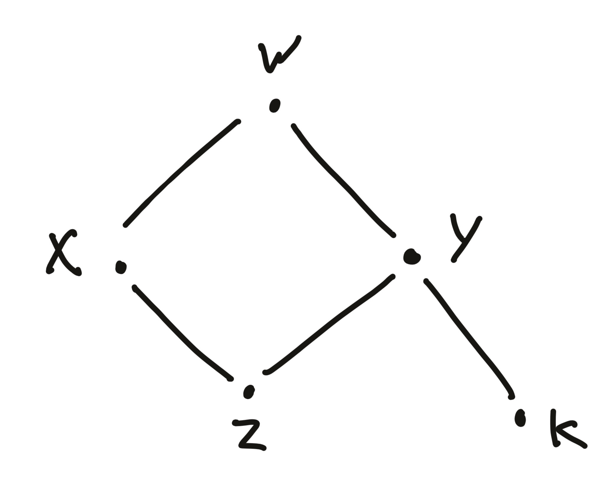
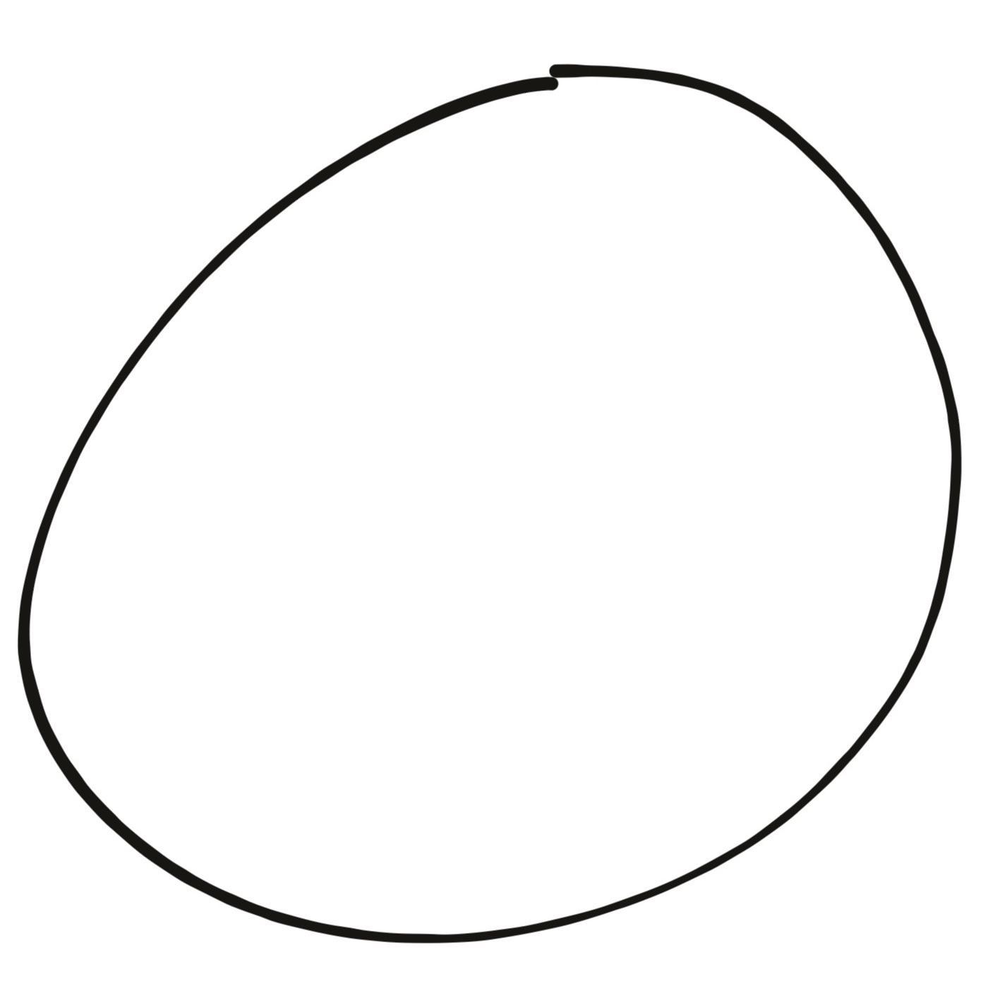
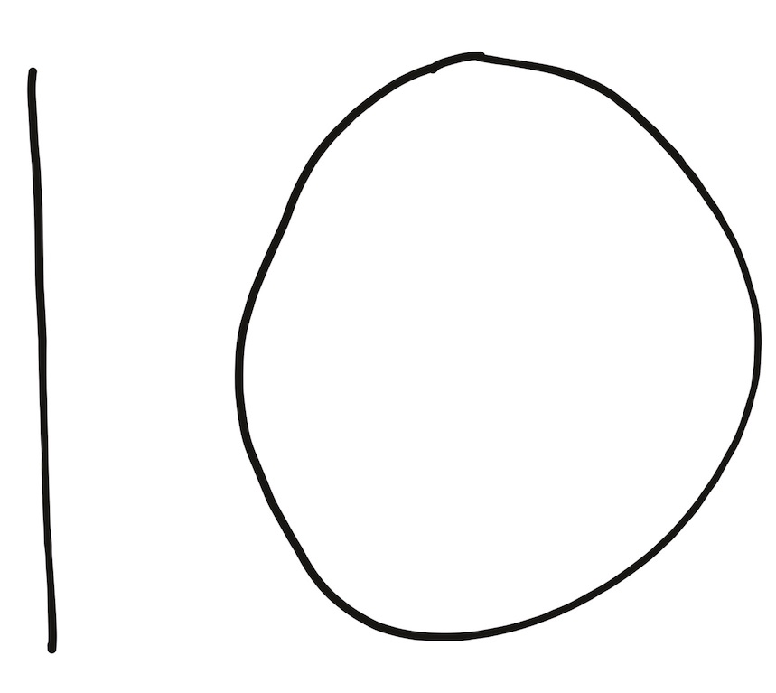

\title{Exploring the uses of Quantitative Types}
\author{Andre Videla}
\maketitle

# Abstract

Idris2 is a programming language featuring Quantitative type theory, a Type Theory centered around tracking _usage quantities_ in addition to dependent types. This is the result of more than 30 years of development spawned by the work of Girard on Linear logic.
Until recently, our understanding of linear types and their uses in dependently-typed programs was hypothetical. However, this changes with Idris2, which allow us to explore the semantics of running programs using linear and dependent types. 
In this thesis I explore multiple facets of programming through the lens of quantitative programming, from ergonomics, to performance. I will present how quantitative annotations can help the programmer write programs that precisely match their intention, provide more information to the compiler to better analyse the program written, and enable the output bytecode to run faster.

\newpage
\setcounter{secnumdepth}{2}
\tableofcontents
\newpage
# Introduction 

In this project I will demonstrate different uses and results stemming from a programming practice that allows us to specify how many times each variable is being used. This information is part of the type system, in our case we are tracking if a variable is allowed to be used exactly once, or if it has no restrictions. Such types system is called a “linear type system”. 

As we will see, there is a lot more to this story, so as part of this thesis, I will spend some time introducing dependent types as well as our host language: Idris. This warm up will be followed by a context review outlining the existing body of work about linear types and related topics. Once both the theoretical and technical landscape have been set I will introduce the concept of linear and quantitative type. Those two concepts together are the key to understanding the rest of this thesis which is about the ergonomics of Quantitative Type Theory\cite{qtt}\cite{nuttin} (QTT, for short) for software development and the performance improvement we can derive from the linearity features of Idris2.

The main goal of this thesis is to explore the uses of quantitative types in a dependently-typed setting for real-world programs, those last two chapters are the result of such exploration. With it, I aim to explain the limitation of quantitative types and propose ways of getting around them. Some of those ideas have been implemented in the Idris2 compiler, and we discuss their details and consequences.

Let us begin slowly and introduce the basic concepts. The following will only make assumptions about basic understanding of imperative and functional programming. 

## Some vocabulary and jargon 

Technical papers are often hard to approach for the uninitiated because of their heavy use of unfamiliar vocabulary and domain-specific jargon. While jargon is useful for referencing complicated ideas succinctly, it is a double-edged sword as it also tends to hinder learning by obscuring important concepts. Unfortunately, I do not have a solution for this problem, but I hope this section will help mitigate this feeling of helplessness when sentences seem to be composed of randomly generated sequences of letters rather than legitimate words.

You will find more complete definitions at the end, in the glossary.

##### Type

A label associated to a collection of values. For example, `String` is the type given to strings of characters for text. `Int` is the type given to integer values. `Nat` is the type given to natural numbers.

##### Type-System

Set of rules the types in a program have to follow in order to be accepted by the compiler. The goal of the type-system is to catch some classes of errors while helping the programmer reach their goal more easily.

##### Linear types

Types that have a usage restriction. Typically, a value labelled with a linear type can only be used once, no less, no more.

##### Linearity / Quantity / Multiplicity

Used interchangeably most of the time. They refer to the number of times a variable is expected to be used.

##### Syntax

The structure of some piece of information, usual in the form of _text_. Syntax itself does not convey any meaning.

##### Semantics

The meaning associated to a piece of data, most often related to syntax.

##### Pattern matching

Destructuring a value into its constituent parts in order to access them or understand what kind of value we are dealing with.

#####  Generic type / Polymorphic type / Type parameter

A type that needs a concrete type in order to be complete. For example, `Maybe a` takes  the single type `a` as parameter. Once we pass it the type `Int`, it becomes the complete type `Maybe Int`.

## Programming recap

If you know about programming, you’ve probably heard about types and functions. Types are ways to classify values that the computer manipulates and functions are instructions that describe how those values are changed. 

In _imperative programming_ functions can perform powerful operations like "malloc" and "free" for memory management or make network requests through the internet. While powerful in a practical sense, those functions are really hard to study because they are hard to define in a mathematical way. In order to make life easier we only consider functions in the _mathematical_ sense of the word : A function is something that takes an input and returns an output. 

```haskell
f : A -> B
```

This notation tells us what type the function is ready to ingest as input and what type is expected as the output.

```haskell
input    output
    v    v
f : A -> B
^
name 
```

This simplifies our model because it forbids the complexity related to complex operations like arbitrary memory modification or network access [^1].
Functional programming describes a programming practice centered around the use of such functions. In addition, traditional functional programming languages have a strong emphasis on their type system which allows the types to describe the structure of the values very precisely.

During the rest of this thesis we are going to talk about Idris2, a purely functional programming language featuring Quantitiative Type Theory (QTT), a type theory[^2] based around managing resources. But before we talk about QTT itself, we have to explain what is Idris and what are dependent types.

## Idris and dependent types 

Before we jump into Idris2, allow me to introduce Idris\cite{idris1}, its predecessor. Idris is a programming language featuring dependent types. 

A way to understand dependent types is to think of the programming language as having _first class types_, that is, types are values, just like any other in the language. Types being normal values means we can create them, pass them as arguments to functions and return them from functions. This also means the difference between “type-level” and “term-level” is blurred. 

### Simple example

Let us start with a very simple example of a function in Idris, without dependent types. This function returns whether or not a list[^3] is empty:

```haskell
isEmpty : List a -> Bool
isEmpty [] = True
isEmpty (x :: xs) = False
```
  
Every Idris function consists of two parts, the _Type signature_ and the _implementation_ (or body) of the function. Let us start by dissecting the Type signature:

```haskell
--    ┌ Name of the function
--    │ 
--    │         ┌ Type of the argument 
--    │         │ 
--    │         │       ┌ Return type            
-- ╭──┴──╮   ╭──┴──╮  ╭─┴──╮
   isEmpty : List a -> Bool
--                ▲
--                │ 
--                └Type parameter
```

Every signature starts with a name, followed by a colon `:` and ends with a type. In this case, the type is `List a -> Bool` which represents a function that takes a list of `a` and returns a `Bool`. Interestingly, the type `a` is a _Type parameter_ and could be anything, this function will work for all lists, irrespective of their content.

As for the body, here is how it is composed:

```haskell
--    ┌ Recall the function name
--    │   
--    │     ┌ Pattern matching on the empty list
--    │     │   
--    │     │    ┌ Return value
-- ╭──┴──╮  ▼  ╭─┴──╮
   isEmpty [] = True
--             ┌ Pattern matching on the non-empty list
--         ╭───┴───╮
   isEmpty (x :: xs) = False
--          ▲    ▲     ╰─┬─╯
--          │    │       └ Return value
--          │    │
--          │    └ Tail of the list
--          │
--          └ Head of the list
```

Function bodies are implemented with _clauses_ of the form `*function name* *arguments* = *value*`, everything before the `=` is called _the left-hand side_ and everything after is called _the right-hand side_. Arguments on the left-hand side are pattern matched, and for each corresponding match the function return a suitable value.

In this example, we only have two cases, the empty list `[]` and the non-empty list `x :: xs`. When we match on a value we may discover that we can access new variables, and we give them names (or _bind_ them). In this case the `::` case allows us to bind[^4] the head and the tail of the list to the names `x` and `xs`. Depending on whether we are dealing with an empty list or not we return `True` or `False` to indicate if the list is empty.

Pattern matching is particularly important in Idris because it allows the compiler to better understand how the types flow through our program. We are going to see an example of how dependent pattern matching\cite{view_from_the_left} manifests itself when we introduce _type holes_.

### Dependent types example

Now let us look at an example with dependent types.

```haskell
intOrString : (b : Bool) -> if b then Int else String
intOrString True = 404
intOrString False = "we got a string"
```

This short snippet already shows a lot of things, but again the most important part is the type signature. Let us inspect it:

```haskell
--             ┌ Name of the argument
--             │
--             │    ┌ Type of the argument  
--             │    │ 
--             │    │                  ┌ Return type
--             ▼    ▼       ╭──────────┴────────────╮  
intOrString : (b : Bool) -> if b then Int else String
--             │               ▲
--             └─[dependency]──┘
```

As you can see the return type is a _program in and of itself_! `if b then Int else String` returns `Int` if `b` is `True` and `String` otherwise. In other words, the return type is different depending on the value of `b`. This dependency is why they are called _dependent types_.

_Pattern matching_ on the argument allows us to return different values for each branch of our program

```haskell
--           ┌ `b` is True so we expect to return `Int`
--           │
--           │      ┌ An Int as a return value
--           ▼    ╭─┴─╮
intOrString True = 404 
intOrString False = "we got a string"
--           ▲      ╰───────┬───────╯
--           │              └ A String as a return value
--           │
--           └ `b` is `False` so we expect to return a String
```

This typically cannot be done in programming languages with conventional type systems. Which is why one might want to use Idris rather than Java, C or even Haskell in order to implement their programs. Some programming languages can exhibits some behaviours similar to dependent types but achieving this often comes at the expense of readability, performance and ergonomics\cite{hasochism}.

### Holes in Idris

A very useful feature of Idris is _type holes_, one can replace any term by a variable name prefixed by a question mark, like this : `?hole` . This tells the compiler to infer the type at this position and report it to the user in order to better understand what value could possibly fit the expected type. In addition, the compiler will also report what it knows about the surrounding context to give additional insight.

If we take our example of `intOrString` and replace the implementation by a hole we have the following:

```haskell
intOrString : (b : Bool) -> if b then Int else String
intOrString b = ?hole
```

We can then ask the compiler what is the expected type, information provided by the compiler will be shown with a column of `>` on the left side to distinguish it from code. When the compiler tells us about holes, its will display the variables available in the immediate scope of the hole above a horizontal bar, and the “goal” under the horizontal bar. Here is the type we get when asking about our `hole`:

```haskell
> b : Bool
> --------------------------------
> hole : if b then Int else String
```

This information does not tell us what value we can use, however it informs us that the return type _depends on the value of `b`_ . Therefore, pattern matching on `b` might give us more insight. It is worth noting that Idris has an interactive mode that allows the pattern matching to be done automatically by hitting a simple keystroke which will generate the code in the snippet automatically. This won’t be showcased here, as it is not an Idris development tutorial, but this approach has already been put to use and proven effective in other programming languages with proof-assistant features\cite{tdd}\cite{agda_interactive}. Back to the example:

```haskell
intOrString : (b : Bool) -> if b then Int else String
intOrString True = ?hole1
intOrString False = ?hole2
```

Asking again what is in `hole1` gets us:

```haskell
> hole1 : Int
```

And `hole2` gets us:

```haskell
> hole2 : String
```

Which we can fill with literal values like `123` or `"good afternoon"`. The complete program would look like this:

```haskell
intOrString : (b : Bool) -> if b then Int else String
intOrString True = 123
intOrString False = "good afternoon"
```

### What’s wrong with non-dependent types?

Non-dependent type systems cannot represent the behaviour described by `intOrString` and have to resort to patterns like `Either` [^5] to encapsulate the two possible cases our program can encounter.

```haskell
eitherIntOrString :: Bool -> Either Int String
eitherIntOrString True = Left 404
eitherIntOrString False = Right "we got a string"
```

While this is fine in principle, it comes with a set of drawbacks that cannot be solved without dependent types. In order to see this, let us place a hole in the implementation of `eitherIntOrString`:

```haskell
eitherIntOrString : Bool -> Either Int String
eitherIntOrString b = ?hole
```

```haskell
> b : Bool
> ------------------------
> hole : Either Int String
```

While this type might be easier to read than `if b then Int else String` it does not tell us how to proceed in order to find a more precise type to fill. We can try pattern matching on `b`:

```haskell
intOrString' : Bool -> Either Int String
intOrString' True = ?hole1
intOrString' False = ?hole2
```

But it does not provide any additional information about the return types to use.

```haskell
> -----------
> hole1 : Either Int String
```

```haskell
> -----------
> hole2 : Either Int String
```

In itself using `Either` isn't a problem, however `Either`’s lack of information manifests itself in other ways during programming; take the following program:

```haskell
checkType : Int
checkType = let intValue = eitherIntOrString True 
             in ?hole
```

```haskell
> intValue : Either Int String
> ---------------
> hole : Int
```

In this program we create the variable `intValue` by assigning it to the result of the function call to `eitherIntOrString` with the argument `True`. When we ask for the type of `Hole` we see that we are expected to return an `Int`
The compiler is unable to tell us if `intValue` contains an `Int` or a `String`. Despite us _knowing_ that `IntOrString` returns an `Int` when passed `True`, we cannot use this fact to convince the compiler to simplify the type for us. We have to go through a runtime check to ensure that the value we are inspecting is indeed an `Int`:

```haskell
checkType : Int
checkType = let intValue = eitherIntOrString True in
                case intValue of
                     (Left i) => ?hole1
                     (Right str) => ?hole2
```

But doing so introduces the additional problem that we now need to provide a value for an impossible case (the `Right` case). What do we even return? We do not have an `Int` at hand to use. Our alternatives are:
  
- Panic and crash the program.
- Make up a default value, silencing the error but potentially introducing a bug.
- Change the return type to `Either Int String` and letting the caller deal with it.

None of which are ideal nor replicate the functionality of the dependent version. This is why dependent types are desirable, they help:

- Inform the programmer by communicating precisely which types are expected.
- The compiler better understand the semantics of the program.
- Avoid needless runtime checks.

## The story begins

This concludes our introductory chapter. Dependent types are a thesis topic in themselves, but this introduction should be enough to give you a general idea. It remains to introduce and explain _linear types_, but we will get to it after the upcoming context review. In which I am going to present the existing literature surrounding the topic of this thesis: linear and quantitative types. Those research documents should steer us toward the goal of this thesis, exploring the uses of quantitative types for real-world programs, explaining their limitations and proposing ways of getting around them, and designing and implementing use cases for them within the Idris2 compiler.

I also want to stress that at the end is a glossary that lists all the important terms and concepts necessary to understand the body of this work. Please feel free to consult it if something is unclear.

\newpage

# Context Review

In this context review, I will comment on the existing literature about linear types and present in four parts: The first aims to tell the origin story of linear types and their youthful promises. The second will focus on the current understanding of their application for real-world use. The third one will focus on the latest theoretical developments that linear types spun up. And the last one will present existing research project based on linear types. This section aims to motivate and explain why we use linear types before we introduce them formally in the next chapter.

## Origins

Linear types were first introduced by J-Y. Girard in his 1987\cite{linear-logic} publication simply named _Linear logic_ . In this text he introduces the idea of restricting the application of the weakening rule and contraction rule from intuitionistic logic in order to allow to statements to be managed as _resources_. Linear terms once used cannot be referred again, premises cannot be duplicated and contexts cannot be extended. This restriction was informed by the necessity of real-world computational restriction, in particular accessing information concurrently.

One of the pain-points mentioned was the inability to restrict usages to something more sophisticated than "used exactly once". Linear variables could be promoted to their unrestricted variants with the exponential operator (`!`) but it removes any benefit we get from linearity. A limitation that will be revisited in the follow-up paper: Bounded linear logic.

Already at this stage, the memory implication of linear types were considered. Typically, the exponential operator was understood as being similar to "long-term storage" of a variable such that it could be reused in the future, whereas linear variables were stored in short-term memory to be reclaimed, like a register or a stack.

_Bounded linear logic_\cite{bll} improves the expressivity of linear logic while keeping its benefits: intuitionistic-compatible logic that is computationally relevant. The key difference with linear logic is that weakening rules are _bounded_ by a finite value such that each value can be used as many times as the bound allows. In addition, some typing rules might allow it to _waste_ resources by _underusing_ the variable, hinting that affine types might bring some concrete benefits to our programming model.

As before, there is no practical application of this in terms of programming language. However, this brings up the first step toward managing _quantities_ in the language. An idea that will be explored again later with Granule\cite{granule}\cite{effect_coeffects_grading}\cite{graded_monads_rings}\cite{monads_and_effects} and Quantitative Type Theory\cite{qtt}\cite{nuttin}.

## Applications

Soon after the development of linear types, they appeared in a paper aimed at optimising away redundant allocations when manipulating lists: The deforestation algorithm.

Deforestation\cite{deforestation} is an algorithm designed to avoid extraneous allocation when performing list operations in a programming language close to System-F.  The assumption that operations on lists must be linear was made to avoid duplicating operations. If a program was non-linear, the optimisation would duplicate each of the computation associated with the non-linear variable, making the resulting program less efficient.

While deforestation itself might not be the algorithm that we want to implement today, it is likely we can come up with a similar set of optimisation rules in Idris2 that rely on linearity.

Using linearity to avoid duplicating computation was again investigated in _Once upon a Type_\cite{once_upon_a_type} which formalises the detection and inference of linear variables. And uses this information for safe inlining. Indeed, arbitrarily inlining functions might result in duplicated computation:

```haskell
let x = f y in
    (x, x)
```

In this example inlining into `(f x, f x)` duplicates the work done by `f`.

Beside inlining another way to use linear types for performance is memory space mutation. _Linear types can change the world_\cite{linear_types_update} show that Linear types can be used for in-place update and mutation instead of relying on copying. They provide a safe API to update values by relying on the linearity of the argument being used.
  
However, the weakness of this result is that the API exposed to the programmer relies on nested continuations when traversing nested data types. Which is largely seen as undesirable user experience. _Is there a use for linear logic_\cite{linear_use} makes similar claims and introduces a concept of types with a _unique_ pointer to them. This removes the need for the clumsy continuation style, but comes are the cost of more complex typing rules. This restriction for unique pointers is something we are going to encounter again during this thesis.

The memory management benefits from linear types do not stop here, in _ Reference counting as a computational interpretation of linear logic _\cite{linear_ref_count}, linear types are shown to correspond to reference counting in the runtime. This paper shows that a simple calculus augmented with memory management primitives can make use of linearity in order to control memory allocation and deallocation using linear types. While the calculus itself isn’t very ergonomic to use for programming, one could imagine using it as a backend for a reference counted runtime.

Linear types need not be used exclusively for compiler optimisations but can also greatly improve programming ergonomics and safety as we see in_Practical affine types_\cite{affine_types}; which aims to answer “What does it mean to have access to linear and affine types _in practice_”? Indeed, most of the results we've talked about develop a theory for linear types using a variant of linear logic, and then present a toy language to showcase their contribution. However, this does not teach us how they would interact and manifest in existing programs or in existing software engineering workflows. Do we see emerging new programming patterns? Is the user experience improved or diminished? In what regard is the code different to read or write? How is  the code organised  and shared? All those questions can only be answered by a fully fledged implementation of a programming language equipped to interact with existing systems. 

_Practical affine types_ show that their implementation for linear+affine types allows us to express common operations in concurrent programs without any risk of data races\cite{linear_race}. They note that typical stateful protocols should also be implementable since their language is a strict superset of others which already provided protocol implementations. Those two results hint at us that linear types in a commercially-relevant programming language would provide us with additional guarantees without impeding on the existing writing or reading experience of programs.

Haskell already benefits from a plethora of big and small extensions, they are so powerful that combining them results in some extremely useful, though quite unergonomic, implementation of dependent types\cite{hasochism}. Linear Haskell\cite{linear_haskell} is notable in that it extends the type system to allow linear functions to be defined. It introduces the linear arrow `-o` which declares a function to be linear. Because of Haskell's laziness, linearity doesn't mean "will be used exactly once" but rather "_if it is used_, then it will be used exactly once".

This addition to the language was motivated by a concern for safe APIs, typically when dealing with unsafe or low-level code. Linear types allow to expose an API that cannot be misused while keeping the same level of expressivity and being completely backwards compatible. This backward compatibility is in part allowed thanks to parametric linearity, the ability to abstract over linearity annotations. And in part due to the approach of making _function arrows_ linear instead of _types_ themselves.

Linearity on the type has the benefit that values themselves can be marked linear, which would enforce their uniqueness. But often comes at the cost of splitting our context in two\cite{lightweight_linear_types} between linear values and non-linear values which makes is unsuitable for a dependent type theory in which both types and terms live in the same context[^6].

## Cutting edge linear types

 Granule is a language that features _quantitative reasoning via graded modal types_ and features indexed types[^7]. This effort is the result of years of research in the domain of effect, co-effect, resource-aware calculus and co-monadic computation\cite{monad_or_comonad}. Granule itself makes heavy use of _graded monads_\cite{effect_coeffects_grading} which allow to precisely annotate co-effects\cite{coeffect_computation} in the type system. This enables the program to model _resource management_ at the type-level. What's more, graded monads provide an algebraic structure to _combine and compose_ those co-effects\cite{quantitative_coeffects}; this way, linearity can not only be modelled but also _mixed-in_ with other interpretations of resources. While this multiplies the opportunities in resource tracking, this approach hasn't received the treatment it deserves regarding performance and tracking runtime complexity.

Until now, we have not addressed the main requirement of Idris2: We intend to use _both_ dependent types _and_ linear types within the same language. However, no satisfying theory came until _I got plenty o nuttin_\cite{nuttin} and its descendant, _Quantitative type theory_ \cite{qtt}. A previous attempt\cite{integrating_linear_dependent}noted that a single language could have both a linear arrow and a dependent arrow and while the linear arrow can depend on non-linear terms, the linear arrow cannot be dependent. This is achieved again by splitting our context in two between a linear and non-linear. 

In order to implement full dependent types QTT makes the following changes:

- Dependent typing uses _erased_ variables
- Multiplicities are tracked on the _binder_rather than being a feature of the type of a variable.

While this elegantly merges the capabilities of a Martin-Löf-style type theory\cite{martin-lof}  and Linear Logic\cite{linear-logic}, the proposed result does not touch upon the potential performance improvement that such a language could feature but removing indices from the runtime\cite{store_indices}. However, it has the potential to bring together Linear types and dependent types in a way that allows precise resource tracking and strong performance guarantees. Resource tracking through semirings is not a novel idea, but has been explored through the lens of and explicit comonadic computation \cite{parametric_effects} instead of dependent linear type systems.

Unfortunately, this approach does not solve every long-standing problems of computer science like how to use the univalence axiom in the language like cubical Agda\cite{cubical_agda}. Interestingly enough, cubical type theory and homotopy type theory display a problem that could be solved in Idris2 very easily: They are non-computational. This means that they could be restricted to _erased_ multiplicity such that they are enforced by the compiler to never appear at runtime.

Since this approach has already been tried in Agda\cite{agda}, maybe Idris2 should be extended with Observational Type Theory \cite{ott} in order to solve the problem of functional extensionality. This would greatly improve the range of programs Idris2 can write as we see with Idris-CT\cite{idris-ct} which require postulating function extensionality for a lot of their proofs. Such an extension to the language would beautifully mix the dependent type aspect of Idris with linear types.

As we've seen earlier, linearity has strong ties with resource and memory management, including reference counting. _Counting immutable beans_\cite{immutable_beans} does not concern itself with linearity, but it references a number of heuristics which are eerily similar to the rules enforces by linear logic. Those heuristics show up in the context of using reference counting for a purely functional programming language. While reference counting has, for a long time, been disregarded in favour of runtime garbage collectors, it now has proven to be commercially viable in languages like Swift or Python. The specific results presented here are focused on the performance benefits in avoiding unnecessary copies and reducing the amount of increment and decrement operation when manipulating the reference count at runtime. We are going to revisit this statement in a later section and frame it in the context of quantitative types.

## Innovative uses of linear types

In this final section of the context review I will present some interesting uses for linear types in some detail.

### Opening the door to new opportunities

Protocol descriptions and dependent types work marvellously well. State machines can be represented by data types and their index can ensure we compose them in ways that make sense. 

As a reminder of how state machines can be encoded in Idris, here is a simple door protocol in Idris using _indexed monads_ \cite{parameterised_computation} where the indices behave like a Hoare Triple. An approach that’s been put to practice in _State machines all the way down_\cite{state_machines} and gives rise to our example:

```haskell
data DoorState = Open | Closed

data Door : Type -> DoorState -> DoorState -> Type where 
    Open : Door () Closed Open
    Close : Door () Open Closed
    Play : Door () Open Open
    Pure : ty -> Door ty state state
    (>>=) : Door a state1 state2 ->
             (a -> Door b state2 state3) ->
             Door b state1 state3
```

This encodes a state machine with two states, `Open` and `Closed`. The protocol of this state machine has three operations `Open` ,`Close` and `Play`. It models a game room in which one can enter by opening the door, play some game in the room and leave the room by closing the door behind them.

Assuming we want to enforce operations on the door that start and end in the `Closed` state we can represent the computation with this signature:

```haskell
doorProtocol : Door () Closed Closed
```

One issue with this approach is that it constrains us to a free-monadic style implementation where we need to write and interpreter for our monadic program, and we cannot mix other protocols within is without changing the `Door` data type.

The following example uses Idris2, with linear types, to implement the same protocol. While Linear types have not been formally introduced, it will be the topic of the next chapter, it is enough to show that we can use them to replace our previous implementation by one that is simpler and more intuitive:

```haskell

data DoorState = Open | Closed

data Door : (state : DoorState) -> Type where
  MkDoor : Door Closed
  Open : (1 _ : Door Closed) -> Door Open
  Close : (1 _ : Door Open) -> Door Closed
  Play : (1 _ : Door Open) -> Door Open

-- Take an operation on doors and execute it
operateDoor : (op : (1 _ : Door Closed) -> Door Closed)
           -> Door Closed
operateDoor op = op MkDoor
```

In this example, instead of monadic composition we use plain _function composition_ in order to ensure that our protocol obeys the rules of our protocol. This result is desirable only because monads do not compose between each others, which prevented us from trivially interleaving another protocol in the _indexed monad_ example, but functions do compose.

`operateDoor` verifies the protocol because it forces the `op` function has to make use of the provided door. The client of the API has no choice but to manipulate the existing door until the protocol is over.

```haskell
-- Doesn't typecheck because door is ignored.
operateDoor (\door => MkDoor) 
```

We can now define the program simply by combining our door operations:

```haskell
infixr 1 &>

-- Sequential linear function composition.
(&>) : ((1 _ : a) -> b) -> 
       ((1 _ : b) -> c) -> 
        (1 _ : a) -> c
(&>) f g x = g (f x)

operateDoor : (1 _ : Door Closed) -> Door Closed
operateDoor = Play &> Close &> Open &> Play &> Play &> Close
```

This also makes combining other protocols trivial, assume we have another protocol to connect to the internet and is characterised by the signature `connect : (1 _ : Socket Open) -> Socked Closed` we can take the product of the two functions and interleave their arguments:

```haskell
operateProd : (1 _ : (Socket Open, Door Open)) 
           -> (Socket Closed, Door Closed)
operateProd (socket, door) = 
  let openDoor = Open door
      socket' = send "message" socket
      door' = Enjoy openDoor in
      (close socket', Close door')
```

Which is much more natural than having to rewrite our door protocol and rewrite our interpreter for the operations of the protocol.

### More granular dependencies

Granule is a programming language with _graded modal types_, types which rely on _graded modalities_. Those are annotations that span a _range_ of different values in order to describe each type. Those values can themselves be paired up together and combined in order to represent even more complex behaviour than our linear multiplication. For now, let us stick to multiplication and see what a future version of Idris supporting graded modalities could look like.

Granule’s syntax is very close to Idris, Agda and Haskell, however, linearity in _Granule_ is the default so there is nothing to specify for a linear variable.
In addition, `Nat` is not a `Type` in _Granule_ but a _modality_ modelling exact usage. Which means that, in order to work with `Nat` and write dependencies between them, we will create a data type indexed on `Nat`:

```haskell
data INat (n : Nat) where
  Z : INat 0;
  S : INat n -> INat (n + 1)
```

This allows us to write the add function as follows:

```haskell
linearAdd : forall {n m : Nat} . INat n -> INat m -> INat (n + m)
linearAdd Z m = m;
linearAdd (S n) m = S (linearAdd n m)
```

If we were to omit the `m` in the first branch and write `linearAdd Z m = Z` we would get the error:

```haskell
> Linearity error: multiplication.gr:
> Linear variable `m` is never used.
```

Which is what we expect.

Now that we have indexed `Nat` we can implement a `multiplication` function and properly carry around the usage characteristic of our program:

```haskell
multiplication : forall {n m : Nat} . INat n -> (INat m) [n] -> INat (n * m)
multiplication Z [m] = Z;
multiplication (S n) [m] = linearAdd m (multiplication n m)
```

As you can see,  we annotate the second argument of the type signature with `[n]` which  indicates that the modality of the second argument depends on the value of the first argument. This syntax repeats in the implementation where the second argument `m` has to be “unboxed” using the `[m]` syntax which will tell the compiler to correctly infer the usage allowed by the indexed modality. In the first branch there are `0` uses available, and in the second there are `n + 1` uses available.

While _Granule_ doesn’t have dependent types, indexed types are enough to implement interesting programs such as multiplication. More recent developments have made progress toward implementing full type dependency between quantities and terms in the language\cite{dependent_graded}.

### Invertible functions

Yet another use of linearity is to use them to implement _invertible functions_. That is functions that have a counterpart that can undo their actions. Such functions are extremely common in practice but aren't usually described in terms of their ability to be undone. Here are a couple of examples:

- Addition and subtraction
- `::` and `tail`
- serialisation/deserialisation

The paper about Sparcl\cite{invertible_functions} goes into details about how to implement a language that features invertible functions, they introduce a new (postscript) type constructor `• : Type -> Type` that indicate that the type in argument is invertible. Invertible functions are declared as linear functions `A• -o B•`. Invertible functions can be called to make progress one way or the other given some data using the `fwd` and `bwd` primitives:

```haskell
fwd : (A• -o B•) -> A -> B
bwd : (A• -o B•) -> B -> A
```

Invertible functions aren't necessarily total, For example `bwd (+ 1) Z` will result in a runtime error. This is because of the nature of invertible functions: the `+ 1` function effectively adds an `S` layer to the given data. In order to undo this operation, we need to _peel off_ an `S` from the data. But `Z` doesn't have an `S` constructor surrounding it, resulting in an error.

Those type of runtime errors can be avoided in Idris by adding a new implicit predicate that ensure the data is of the correct format:

```haskell
bwd : (f : (1 _ : A•) -> B•) -> (v : B) -> {prf : v = fwd f x)} -> A
```

This ensures that we only take values of `B` that come from a `fwd` operation, that is, it only accepts data that has been correctly built instead of arbitrary data. If we were to translate this into our nat example it would look like this:

```haskell
undo+1 : (n : Nat) -> {prf : n = S k} -> Nat
```

Which ensures that the argument is an `S` of `k` for any `k`.

\newpage

# Idris2 and linear types

We’ve seen in the introduction how Idris features dependent types and some basic demonstrations about how to use them. Idris2 takes things further and introduces _linear types_ through Quantitative Type Theory, allowing us to define how many times a variable will be used. Three different quantities exist in Idris2 : `0`, `1` and `ω`. `0` means the value cannot be used in the body of a function, `1` means it has to be used exactly once, no less, no more.  `ω`  means the variable isn't subject to any usage restrictions, just like other (non-linear) programming languages. In Idris2,  `ω` is implicit, when no quantity is specified and left blank, it is assumed to be unrestricted. This is why we have not seen any usage quantities during the introduction.

We are going to revisit usage quantities later, as there are more subtleties, especially with the `0` usage. For now, we are going to explore some examples of linear functions and linear types, starting with very simple functions such as incrementing numbers.

## Incremental steps

When designing examples, natural numbers are a straightforward data type to turn to. Their definition is extremely simple: `data Nat = Z | S Nat` which means that a `Nat` is either zero `Z` or the successor  of another natural number, `S`.
  
Given this definition let us look at the function that increments a natural number:

```haskell
increment : Nat -> Nat
increment n = S n
```

As we've seen before with our `intOrString` function, we can name our arguments in order to refer to them later in the type signature. We can do the same here even if we do not use the argument in a dependent type. Here we are going to name our first argument `n`.

```haskell
increment : (n : Nat) -> Nat
increment n = S n
```

In this case, the name `n` doesn't serve any other purpose than documentation, but our implementation of linear types has one particularity: quantities have to be assigned to a _name_[^8]. Since the argument of `increment` is used exactly once in the body of the function we can update our type signature to assign the quantity `1` to the argument `n`:

```haskell
--           ┌ We declare `n` to be linear
--           ▼
increment : (1 n : Nat) -> Nat
increment n = S n
--              ▲
--              │
--              └ We use n once here
```
  
The compiler will now check that `n` is used exactly once.

Additionally, the rules of linearity also apply to each pattern variable that was bound. That is, if the value we are matching is linear, then we need to use the pattern variables linearly. 

```haskell
sum : (1 n : Nat) -> (1 m : Nat) -> Nat
sum Z m = m
--  ▲
--  └ We match on the argument here
sum (S n) m = S (sum n m)
--  ╰─┬─╯            ▲
--    │              └ We use `n`
--    │
--    └ We match on the argument and bind `n`
```

In this last example we match on `S` and bind the argument of `S` (the predecessor) to the variable `n`. Since the original argument was linear, `n` is linear too and is indeed used later with `sum n m`.

## Dropping and picking it up again

Obviously, this programming discipline does not allow us to express every program the same way as before. Here are two typical examples that cannot be expressed :

```haskell
drop : (1 v : a) -> ()

copy : (1 v : a) -> (a, a)
```

Here, the first function aims to ignore the argument and the second duplicates its argument and packages it in a pair.

We can explore what is wrong with those functions by trying to implement them and making use of holes.

```haskell
drop : (1 v : a) -> ()
drop v = ?drop_rhs
```

```haskell
> 0 a : Type
> 1 v : a
> ------------
> drop_rhs : ()
```
  
As you can see, each variable is annotated with an additional number on its left, `0` or `1`, that informs us how many times each variable has to be used (If there is no restriction, the usage number is simply left blank).

As you can see we need to use `v` (since it is marked with `1`) but we are only allowed to return `()`. This would be solved if we had a function of type `(1 v : a) -> ()`  to consume the value and return `()`, but this is exactly the signature of the function we are trying to implement!

If we try to implement the function by returning `()` directly we get the following:

```haskell
drop : (1 v : a) -> ()
drop v = ()
```

```haskell
> There are 0 uses of linear variable v
```

Which indicates that `v` is supposed to be used, but no uses have been found.

Similarly, for `copy` we have:

```haskell
copy : (1 v : a) -> (a, a)
copy v = ?hole
```

```haskell
> 0 a : Type
> 1 v : a
> -----------
> hole : (a, a)
```

In which we need to use `v` twice, but we're only allowed to use it once. Using it twice result in this program with this error:

```haskell
copy : (1 v : a) -> (a, a)
copy v = (v, v)
```

```haskell
> There are 2 uses of linear variable v
```

Interestingly enough, partially implementing our program with a hole gives us an amazing insight:

```haskell
copy : (1 v : a) -> (a, a)
copy v = (v, ?hole)
```

```haskell
> 0 a : Type
> 0 v : a
> -----------
> hole : a
```

The hole has been updated to reflect the fact that though `v` is in scope, no uses of it are available. Despite that we still need to make up a value of type `a` out of thin air, which is impossible because we do not know how to construct a value of type `a`.

While there are experimental ideas that allow us to recover those capabilities, they are not currently present in Idris2. We will talk about those limitations and how to overcome them in section 4.

## Dancing around linear types

Linear values cannot be duplicated or ignored, but provided we know how the values are constructed, we can work hard enough to tear them apart and build them back up. This allows us to dance around the issue of ignoring and duplicating linear variables by exploiting pattern matching in order to implement functions such as ``copy : (1 v : a) `-> (a, a)`` and `drop : (1 v : a) -> ()`.

The next snippet show how to implement those for `Nat`:

```haskell
dropNat : (1 v : Nat) -> ()
dropNat Z = ()
dropNat (S n) = dropNat n

copyNat : (1 v : Nat) -> (Nat, Nat)
copyNat Z = (Z, Z)
copyNat (S n) = let (a, b) = copyNat n in
                    (S a, S b)
```

Notice that `dropNat` effectively spends `O(n)` doing nothing, while `copyNat` _simulates_ allocation by constructing a new value that is  identical and takes the same space as the original one (albeit very inefficiently).

We can encapsulate those functions in the following interfaces:

```haskell
interface Drop a where
    drop : (1 v : a) -> ()

interface Copy a where
    copy : (1 v : a) -> (a, a)
```

Since we know how to implement those for `Nat` we can ask ourselves how we could give implementation of those interfaces to additional types.

```haskell
module Main

import Data.List

data Tree a = Leaf a | Branch a (Tree a) (Tree a)

interface Drop a where
    drop : (1 v : a) -> ()

interface Copy a where
    copy : (1 v : a) -> (a, a)

Drop a => Drop (List a) where
    copy ls = ?drop_list_impl

Copy a => Copy (List a) where
    Copy ls = ?copy_list_impl

Drop a => Drop (Tree a) where
    copy tree = ?drop_Tree_impl

Copy a => Copy (Tree a) where
    Copy tree = ?copy_tree_impl

```

Going through this exercise would show that this process of tearing apart values and building them back up would be very similar than what we’ve done for `Nat`, but there is an additional caveat to this approach: primitive types do not have constructors like `Nat` and `Tree` do. `String`, `Int`, `Char`, etc, are all assumed to exist in the compiler and are not declared using the typical `data` syntax. This poses a problem for our implementation of `Copy` and `Drop` since we do not have access to their constructors nor structure. A solution to this problem will be provided in section 5.1.

## Linear intuition
  
One key tool in understanding this thesis is to develop an intuition for linear types. Linear types are rare in other programming languages which make them seem foreign at first glance. In the absence of familiarity, it is especially important to build up intuition.

To that end we are going to explore a number of examples that illustrate how linearity can be understood.

### You can’t have your cake and eat it too

Imagine this procedure:

```haskell
eat : (1 cake : Cake) -> Full
eat (MkCake ingredients) = digest ingredients
```

This allows you to eat your cake. Now take this other one:

```haskell
keep : (1 cake : Cake) -> Cake
keep cake = cake
```

This allows you to keep your cake to yourself. Given those two definitions, you can’t both _have_ your cake _and eat it too_:

```haskell
notPossible : (1 cake : Cake) -> (Full, Cake)
notPossible cake = (eat cake, keep cake)
```

This fails with the error:

```haskell
> Error: While processing right hand side of notPossible.
>   There are 2 uses of linear name cake.
> 
>     |
>     | notPossible cake = (eat cake, keep cake)
>     |                    ^^^^^^^^^^^^^^^^^^^^^
> 
> Suggestion: linearly bounded variables must be used exactly once.
```

A linear variable must be used exactly once, therefore, you must choose between having it, or eating it, but not both.

Note that removing every linearity annotation makes the program compile:

```haskell
eat : (cake : Cake) -> Full
eat (MkCake ingredients) = digest ingredients

keep : (cake : Cake) -> Cake
keep cake = cake

nowPossible : (cake : Cake) -> (Full, Cake)
nowPossible cake = (eat cake, keep cake)
```

Since we have not said anything about `Cake` it means there are no restriction in usage, and we can have as much cake as we want and keep it too.

\newpage
### Drawing unexpected parallels

Take the following picture:


This is a simple _connect the dots_ game. If you have this text printed out and have a pencil handy, I encourage you to try it out and discover the picture that hides behind those dots. 

The point of this exercise is to show what happens to a linear variable once it’s consumed: It cannot be reused anymore. The dot pattern is still visible, the numbers can still instruct you how to connect them. But since the drawing has already been carried out, there is no possible way to repeat the experience of connecting the dots. 

Linear variables are the same, once they are used, they are “spent”. This is shown explicitly in Idris2’s type system by using holes:

```haskell
let 1 dots = MkDots
    1 drawing = connect dots in
    ?rest
```

Inspecting the hole we get:

```haskell
>  0 dots : Graph
>  1 drawing : Graph
> ------------------------------
> rest : Fun
```

Which indicates that, while we can still _see_ the dots, we cannot do anything with them, they have linearity `0`. However, we ended up with a `drawing` that we can now use![^9]

### Safe inlining with 1

Linear variables have to be used exactly once, no less, no more. An extremely nice property this gives us can be summarised with the following statement:

> A linear variable can always be safely inlined

_Inlining_ refers to the ability of a compiler to replace a function call by the body of the function. This is a typical optimisation technique aimed at enabling further optimisations on the resulting program.

_Safely inlined_ means that the inlining process will not result in a bigger and less efficient program. Take the following example:

```haskell
let x = f y in
    (x, x)
```

After inlining `x`, that is, replace every occurrence of `x` by its definition, we obtain:

```haskell
(f y, f y)
```

Which is less efficient than the original program. Indeed, imagine that `f` is a function that takes 5 days to run. The first case calls `f` once and duplicates its result, which would take 5 days. But the second case calls `f` twice, which would take 10 days in total.

If `x` were to be _linear_ this problem would be caught:

```haskell
let 1 x = f y in
    (x, x)
```

```haskell
> There are 2 uses of linear variable x
```

Conversely, if a program typechecks while using a linear variable, then all linear variables can be inlined without loss of performance. What’s more, inlining can provide further opportunities for optimisations down the line. In the following example, while `y` cannot be inlined, `x` can be.

```haskell
let 1 x = 1 + 3 in
    y = x + 10 in
    (y, y)
```

The result of inlining `x` would be as follows[^10]:

```haskell
let y = 1 + 3 + 10 in
    (y, y)
```


### Erased runtime for `0`

In Idris2, variables can also be annotated with linearity `0`, this means that the value is _inaccessible_ and cannot be used. But if that were truly the case, what would be the use of such a variable?

Those variables are particularly useful in a dependently-typed programming language because, while they cannot be used in the body of our program, they can be used in type signatures. Take this example with vector:

```haskell
length : Vect n a -> Nat
length [] = Z
length (_ :: xs) = S (length xs)
```

The length of the vector is computed by pattern matching on the vector and recursively counting the length of the tail of the vector and adding `+1` to it (recall the `S` constructor for `Nat`). If the vector is empty, the length returned is zero (`Z`).

Another way to implement the same function in Idris 1 (without linear types) was to do the following:

```haskell
-- This works in Idris1
length : Vect n a -> Nat
length _ {n} = n
```

The `{n}` syntax would bring the value from the _type level_ to the _term level_, effectively making the type of the vector a value that can be used within the program. However, doing the same in Idris2 is forbidden:

```haskell
> Error: While processing right hand side of length. 
>   n is not accessible in this context.
> 
>     |
>     | length _ {n} = n
>     |                ^
```

It is hard to understand why this is the case just by looking at the type signature `Vect n a -> Nat` and this is because it is not complete. Behind the scenes, the Idris2 compiler is adding implicit arguments [^11] for `n` and `a` and automatically gives them linearity `0`. The full signature looks like this:

```haskell
length : {0 n : Nat} -> {0 a : Type} -> Vect n a -> Nat
length _ {n} = n
```

The `0` means we cannot use the variable outside of the type signature, but how come we can use them in the type signature and not to implement our `length` function?

The difference is that linearity `0` variables are available _at compile time_ and are forbidden to appear _at runtime_. The compiler can use them, compute types with them, but they cannot be allocated and used during execution of the program we generate.

This is why linearity `0` variables are also called `erased` variables because they are removed from the execution of the program. We can use them to convince the compiler that some invariants hold, but we cannot allocate any memory for them during the execution of our program.

Finally, another subtlety is that erased variables can actually appear inside the body of a function, but only in position where they are allowed are arguments to functions with `0` usage. Such functions are:

#### 1. Arguments annotated with `0`
```haskell
toNat : (0 n : Nat) -> INat n -> Nat
toNat Z Zero = Z
toNat (S n) (Succ m) = S (toNat n m)
--       ▲                      ▲
--       │                      └ Used even if erased
--       │
--       └ Bound with linearity 0
```

Here the recursive call uses `n` which has linearity `0`, but this is allowed because the first argument of `toNat` takes an argument of linearity `0`. In other words, `n` cannot be consumed, but `toNat` does not consume its first argument anyway, so all is good.

#### 2. Rewrites

```haskell
sym : (0 prf : x = y) -> y = x
sym prf = rewrite prf in Refl
```

Rewriting a type does not consume the proof.

#### 3. Type signatures

```haskell
--          ┌ `n` is erased
--          ▼
reverse' : {0 n : Nat} -> (1 vs : Vect n Nat) -> Vect n Nat
reverse' vs = let v2 : Vect n Nat = reverse vs in v2
--                          ▲
--                          └ `n` appears here
```

Even if `n` appears in the body of the function, appearing in a type signature does not count as a use.

### No branching with 0

In general, we cannot match on erased variables, there is however an exception to this rule. Whenever matching on a variable _does not_ result in additional branching, then we are allowed to match on this variable, even if it erased. Such matches are called _uninformative_, and they are characterised by the fact that they do not generate new codepaths.

No new codepaths means that, whether we match or not, the output bytecode would be the same. The difference lies in that matching on those variable would inform us and the compiler of very important properties from our types. Just like the `intOrString`  example informed us of the return type of our function, an uninformative match can reveal useful information to both the programmer and the compiler.

A good example of an uninformative match is `Refl` which has only one constructor:

```haskell
data (=) : (a, b : Type) -> Type where
  Refl : (a : Type) -> a = a
```

This suggests that, even if our equality proof has linearity `0`, we can match on it, since there is only 1 constructor we are never going to generate new branches.

But an uninformative match can also happen on types with multiple constructors. Take this indexed `Nat` type:

```haskell
data INat : Nat -> Type where
  IZ : INat Z
  IS : INat n -> INat (S n)
```

This is simply a duplicate for `Nat` but carries its own value as index. Now let us write a function to recover the original `Nat` from an `INat`:

```haskell
toNat : (0 n : Nat) -> (1 m : INat n) -> Nat
toNat Z IZ = Z
toNat (S n) (IS m) = S (toNat n m)
```

Even if we annotated `n` with linearity `0`, we are allowed to match on it. To understand why, let us add some holes and remove the matching:

```haskell
toNat : (0 n : Nat) -> (1 m : INat n) -> Nat
toNat n IZ = ?branch
toNat (S n) (IS m) = S (toNat n m)
```

Idris2 will not allow this program to compile and will fail with the following error:

```haskell
> Error: While processing left hand side of toNat. 
>   When unifying INat 0 and INat ?n.
> Pattern variable n unifies with: 0.
> 
>     |
>     |   IZ : INat Z
>     |             ^
>     |   IS : INat n -> INat (S n)
>     |  toNat n IZ = ?branch
>     |        ^
> 
> Suggestion: Use the same name for both pattern variables, since they 
>   unify.
```

It tells us that `n` unifies with `Z` and forces the user to spell out the match. Effectively forcing uninformative matches to be made. A similar error appears if we try the same thing on the second branch, trying to remove `S n`.

\newpage

# Quantitative Type Theory in practice

QTT is still a recent development and because of its young age, it has not seen widespread use in commercial applications. The Idris2 compiler itself stands as the most popular example of a complex program that showcases uses for QTT and quantitative types. Linear types already benefit from a body of work that showcase their uses \cite{linear_diff}\cite{linear_types_update}\cite{linear_types_session}\cite{linear_types_subst}\cite{actor_channels}\cite{linear_race}\cite{linear_use}\cite{once_upon_a_type}\cite{deforestation}, but one of the goals of this thesis was to list and discover some new and innovative uses for linear types and QTT. In this chapter I will mention some specific uses for QTT that I discovered during my study.

## Limitations and solutions for quantitative types

We've seen how we can write addition of natural numbers using linear types. But can we write a multiplication algorithm using linear types? Let us inspect the traditional multiplication algorithm and see if we can update it with linear types. 

### Linear multiplication

Here is a multiplication function without any linear variables

```haskell
multiplication : (n : Nat) -> (m : Nat) -> Nat
multiplication Z m = Z 
multiplication (S n) m = m + (multiplication n m)
```

Just like with addition, we notice that some variables are only used once, but some aren’t. `n` is used exactly once in both branches, but `m` is not used in one branch, and used twice in the other. Which leads to the following program:

```haskell
 multiplication : (1 n : Nat) -> (m : Nat) -> Nat
 multiplication Z m = Z
 multiplication (S n) m = m + (multiplication n m)
```

Which compiles correctly, but how could we go about implementing a completely linear version of `mutliplication`?

Indeed, writing `multiplication : (1 n : Nat) -> (0 m : Nat) -> Nat` gets us the error:

```haskell
Error: While processing right hand side of multiplication. 
    m is not accessible in this context.

    |
    | multiplication (S n) m = m + (multiplication n m)
    |                          ^
```

Which catches the fact that `m` is use twice in the second branch (but the first branch is fine).

Ideally, we would like to write this program:

```haskell
--        The multiplicity depends on the first arugment
--                               ▼
multiplication : (1 n : Nat) -> (n m : Nat) -> Nat
multiplication Z m = Z
multiplication (S n) m = m + (multiplication n m)
```

However, Idris2 and QTT do not support _dependent linearities_ or _first class linearity_ where linearity annotations are values within the language.

We can, however, attempt to replicate this behaviour with different proxies:

```haskell
provide : Copy t => Drop t => (1 n : Nat) -> (1 v : t) 
       -> (DPair Nat (\x => n = x), Vect n t)
provide 0 v = let () = drop v in (MkDPair Z Refl, [])
provide (S k) v = let (v1, v2) = copy v
                      (MkDPair n prf, vs) = provide k v1
                   in MkDPair (S n) (cong S prf), v2 :: vs)

multiplication : (1 n, m : Nat) -> Nat
multiplication n m = let (MkDPair n' Refl, ms) = provide n m in mult n' ms
  where
    mult : (1 n : Nat) -> (1 vs : Vect n Nat) -> Nat
    mult 0 [] = 0
    mult (S k) (m :: x) = m + (mult k x)
```

This program attempts to simulate the previous signature by creating a dependency between `n` and a vector of length `n` containing copies of the variable `m`[^12] with the type `mult : (1 n : Nat) -> (1 _ : Vect n Nat) -> Nat `. 

As we’ve demonstrated, we technically can express a more complex relationship between linear types provided they implement our interfaces `Drop` and `Copy`. However, the extra work to make the dependency explicit in the type isn’t worth the effort. Indeed, giving up this dependency allows us to write the following program:

```haskell
lmult : (1 n, m : Nat) -> Nat
lmult 0 m = let () = drop m in Z
lmult (S k) m = let (a, b) = copy m in a + lmult k b
```

Which is a lot simpler and achieves the same goal, it even has the same performance characteristics.

## Permutations

The following example is certainly my favourite since it combines both dependent types and linear types in a way that wasn’t possible before. It has been done in the context of my work for Statebox, a company that strongly relies on dependent types to write formally verified software.

One of their project is a validator for petri-nets\cite{petri-nets}  and petri-net executions: [FSM-oracle](https://github.com/statebox/fsm-oracle)[^13]. While the technical details of this project are outside the scope of this text, there is one aspect of it that is fundamentally linked with linear types, and that is the concept of permutation.

FSM-Oracle describes petri-nets using [_hypergraphs_](http://www.zanasi.com/fabio/files/paperCALCO19b.pdf) \cite{cartographer} those hypergraphs use [_permutations_ ](https://github.com/statebox/fsm-oracle/blob/master/src/Permutations/Permutations.idr#L31)[^14] in order to model that wire inside it can be moved around. This concept is key in a correct and proven implementation of hypergraphs. However, permutations turn out to be extremely complex to implement using only dependent types, as shown by the files [trying to fit](https://github.com/statebox/fsm-oracle/blob/master/src/Permutations/PermutationsCategory.idr)[^15] their definition into a [Category](https://github.com/statebox/fsm-oracle/blob/master/src/Permutations/PermutationsStrictMonoidalCategory.idr)[^16].

The relevant bit about permutation can be found in the two files `Permutations.idr` and `SwapDown.idr`, a permutation relies on a list of “swaps” that describe the operation that we can do on a list to generate a new permutation of the same list.

```haskell
data Perm : {o : Type} -> List o -> List o -> Type where
  Nil : Perm [] []
  Ins : Perm xs ys -> SwapDown (a::ys) zs -> Perm (a::xs) zs

data SwapDown : List t -> List t -> Type where
  HereS  : SwapDown (a::as) (a::as)
  ThereS : SwapDown (a::as) bs -> SwapDown (a::b::as) (b::bs)
```

If you don’t have access to the internet to witness the proofs in their full glory, here is an example of what we are dealing with:

```haskell
permAssoc : (ab : Perm aas bbs) -> (bc : Perm bbs ccs) 
         -> (cd : Perm ccs dds)
         -> permComp ab (permComp bc cd) = permComp (permComp ab bc) cd
permAssoc Nil bc cd = Refl
permAssoc (Ins {xs=as} {ys=bs} ab' abb) bc cd 
  with (shuffle abb (permComp bc cd)) proof bdPrf
  | Ins {ys=ds} bd' add with (shuffle abb bc) proof bcPrf
    | Ins {ys=cs} bc' acc with (shuffle acc cd) proof cdPrf
      | Ins {ys=ds'} cd' ad'd =
        let (Refl, Refl, Refl) = shuffleComp abb bc cd bcPrf cdPrf bdPrf
         in insCong5 Refl Refl Refl (permAssoc ab' bc' cd') Refl
```

This function ensures that composition of permutation is associative. It relies on helper functions such as `shuffleComp` which are not even implemented in Idris 1 because it is too hard to implement.

Linear types can thankfully ease the pain by providing a very simple representation of permutations :

```haskell
Permutation : Type -> Type
Permutation a = (1 ls : List a) -> List a
```

That is, a `Permutation` parameterised over a type `a` is a linear function from `List a` to `List a`[^17].

This definition works because no elements from the input list can be omitted  or reused for the output list. _Every single element_ from the argument has to find a new spot in the output list. Additionally, since the type `a` is unknown, no special value can be inserted in advance. Indeed, the only way to achieve this effect would be to pattern match on `a` and create values once `a` is known, but this would require `a` to be bound with a multiplicity greater than `0`:

```haskell
fakePermutation : {a : Type} -> (1 _ : List a) -> List a
fakePermutatoin {a = Int} ls = 42 :: ls
fakePermutation {a = _} ls = reverse ls
```

In this example, `a` is bound with _unrestricted_ multiplicity, which give us the hint that it _is_ inspected and the permutation might not be a legitimate permutation.

What’s more, viewing permutations as a function gives it extremely simple categorical semantics: It is just an instance of the category of types with linear functions as morphisms.

Assuming `Category` is defined this way:

```haskell
-- operator for composition
infix 2 .*.
-- operator for morphisms
infixr 1 ~>

record Category (obj : Type)  where
  constructor MkCategory
  (~>)          : obj -> obj -> Type -- morphism
  identity      : {0 a : obj} -> a ~> a
  (.*.)         : {0 a, b, c: obj}
               -> (a ~> b)
               -> (b ~> c)
               -> (a ~> c)
  leftIdentity  : {0 a, b : obj}
               -> (f : a ~> b)
               -> identity .*. f = f
  rightIdentity : {0 a, b : obj}
               -> (f : a ~> b)
               -> f .*. identity = f
  associativity : {0 a, b, c, d : obj}
               -> (f : a ~> b)
               -> (g : b ~> c)
               -> (h : c ~> d)
               -> f .*. (g .*. h) = (f .*. g) .*. h
```

We can write and instance of `Category` for `List o`:

```haskell
Permutation : List o -> List o -> Type
Permutation a b = Same a b

permutationCategory : Category (List o)
permutationCategory = MkCategory
  Permutation
  sid
  linCompose
  linLeftIdentity
  linRightIdentity
  linAssoc
```

Using the definitions and lemmas for `Same` which is a data type that represents a linear function between two values of the same type:

```haskell
-- a linear function between two values of the same type
record Same {0 o : Type} (input, output : o) where
  constructor MkSame
  func : LinearFn o o
  -- check the codomain of the function is correct
  check : (func `lapp` input) = output

sid : Same a a
sid = MkSame lid Refl

linCompose : {0 o : Type}
  -> {0 a, b, c : o}
  -> Same a b
  -> Same b c
  -> Same a c
linCompose (MkSame fn Refl) (MkSame gn Refl)
  = MkSame (lcomp fn gn) Refl

linRightIdentity : {0 o : Type}
   -> {0 a, b : o}
   -> (f : Same a b)
   -> linCompose f (MkSame Main.lid Refl) = f
linRightIdentity (MkSame (MkLin fn) Refl) = Refl

linLeftIdentity : {0 o : Type}
   -> {0 a, b : o}
   -> (f : Same a b)
   -> linCompose (MkSame Main.lid Refl) f = f
linLeftIdentity (MkSame (MkLin fn) Refl) = Refl

linAssoc : (f : Same a b) ->
           (g : Same b c) ->
           (h : Same c d) ->
           linCompose f (linCompose g h) = linCompose (linCompose f g) h
linAssoc (MkSame (MkLin fn) Refl)
         (MkSame (MkLin gn) Refl)
         (MkSame (MkLin hn) Refl) = Refl

```

`LinearFunction` is defined as follows:

```haskell
record LinearFn (a, b : Type) where
  constructor MkLin
  fn : (1 _ : a) -> b

lid : LinearFn a a
lid = MkLin (\1 x => x)

lapp : LinearFn a b -> (1 _ : a) -> b
lapp f a = f.fn a

lcomp : LinearFn a b -> LinearFn b c -> LinearFn a c
lcomp f g = MkLin (\1 x => g.fn (f.fn x))
```

While this looks like a lot of code, the entire definition holds within 100 lines (including the `Category` definition), and a lot of the definitions like `LinearFn` and `Same` are generic enough to be reused in other modules.

Additionally, this approach is extremely straightforward. So much that in the future, it wouldn’t seem extravagant to have the type-system automatically generate the code as part of a derived interface. 

Finally and most importantly, this program could not exist without using both dependent types to declare the necessary proofs to formally verified our Categorical structure, and linear types to implement `Permutation`. It is a beautiful example where the two features meet and merge in a way that is both practical and elegant.

##  Levitation improvements

_The gentle art of levitation_\cite{levitation} shows that a dependently typed language has enough resources to describe all indexed data types with only a few constructors. The ability to define types as a language library rather than a language features allows a great deal of introspection which in turns allows a realm of possibilities. Indeed, we can now define operations on those data types that will preserve the semantics of the type but make the representation more efficient. We can generate interface implementations for them automatically. And we can use them to construct new types out of existing ones\cite{category_of_containers}\cite{delta_for_data}\cite{indexed_containers}, including representations for primitive types such as `Int` or `String`, an approach that’s been proven effective with Typedefs\cite{typedefs}.

_The practical guide to levitation_\cite{levitation} shows that those features are plagued by multiple shortcomings: the verbosity of the definitions not only make the data declaration hard to write and read, it makes the compiler spend a lot of time constructing and checking those terms, and it has trouble identifying what is a type parameter or what is an index.

Thankfully, the performance inefficiency from levitation can be alleviated by a smart use of erasure. In his thesis, Ahmad Salim relies on erasing terms with the `.` (dot) syntax, which does its best but cannot enforce erasure of terms. 

While the following has not been implemented, it shows Idris2 has a lot of promise in lifting previous performance limitations. This is because, in Idris2, we can perform and enforce erasure by annotating well-formedness proofs with `0` and use data types such as `Exists` instead of `DPair`. 

More challenges arise when we try to use levitation to represent Idris data definitions. Indeed, linear and erased variables in constructors cannot be represented. We cannot represent the following constructor.

```haskell
(::) : {n : Nat} -> {0 a : Type} -> a -> Vect n a -> Vect (S n) a 
```

This suggests that levitation could be extended to support constructors with linear and erased arguments, but it is unknown if _levitation_ itself (defining the description of linear data types in terms of itself) would be achievable.

Interestingly enough, encoding linearity in levitated description might also help fix one of the shortcoming of levitation in Idris: automatically discerning between type parameters and type indices. Combined with the ability to pattern match on types, in turn would allow the Idris2 compiler to generate definitions for interfaces such as `Functor` and `Applicative`. 

## Compile-time string concatenation

Strings are ubiquitous in programming. That is why a lot of programming languages have spent a considerable effort in optimising string usage and string API ergonomics. Most famously, Perl is notorious for its extensive and powerful string manipulation API including first-class regex support with more recent additions including built-in support for grammars.

One very popular feature to ease the ergonomics of string literals is _string interpolation_. String interpolation allows you to avoid this situation:

```haskell
show (MyData arg1 arg2 arg3 arg4) = 
  	"MyData (" ++ show arg1 ++ " " ++ show arg2 ++ " " ++ show arg3 ++ ++ show arg4 ++ ")"
```

It allows string literal to include expressions _inline_ and leave the compiler to build the expected string concatenation. One example of string interpolation syntax would look like this:

```haskell
show (MyData arg1 arg2 arg3 arg4) = "MyData ({arg1} {arg2} {arg3} {arg4})"
```

The benefits are numerous, but I won’t dwell on them here[^18]. One of them however is quite unexpected: Predict compile-time concatenation with linear types.

As mentioned before, the intuition to understand the _erased linearity_ `0` is to consider those terms absent at runtime but available at compile-time. In the case of string interpolation, this intuition becomes useful in informing the programmer when the compiler can perform compile-time concatenation. 

```haskell
let name = "Susan"
    greeting = "hello {name}" in
    putStrLn greeting
```

In the above example, it would be reasonable to expect the compiler to notice that the variable `name` is a string literals and that, because it is only used in a string interpolation statement, it can be concatenated at compile time. Effectively being equivalent to the following:

```haskell
let greeting = "hello Susan" in 
    putStrLn greeting
```

But this kind of translation can lead to very misleading beliefs about String interpolation and its performance implications. In this following example the compiler would _not_ be able to perform the concatenation at compile time:

```haskell
do name <- readLine
   putStrLn "hello {name}"
```

This is because the string comes from the _runtime_; indeed, static strings can be inserted at compile-time while strings from the runtime need to be concatenated. This means the following program typechecks:

```haskell
let 0 name = "Susan" 
    1 greeting = "hello {name}" in
    putStrLn greeting
```

Since the variable `name` has linearity `0`, it cannot appear at runtime, which means it cannot be concatenated with the string `"hello "`, which means the only way this program compiles is if the string `"Susan"` is inlined with the string `"hello "`at compile-time.

Using holes we can describe exactly what would happen in different circumstances. As a rule, string interpolation would do its best to avoid allocating memory and performing operations at runtime. Much like our previous optimisation, it would look for values which are constructed in scope and simply concatenate the string without counting it as a use.

```haskell
let 1 name = "Susan"
    1 greeting = "hello {name}" in
    putStrLn greeting
```

Would result in the error

```python
> There are 0 uses of linear variable name
```


Adding a hole at the end would show.

```haskell
let 1 name = "Susan"
    1 greeting = "hello {name}" in
    ?interpolation
```

```haskell
> 1 name : String
> 1 greeting : String
> ---------------------------
> interpolation : String
```

As you can see, the variable `name` has not been consumed by the string interpolation since this transformation happens at compile time.

Having the string come from a function call, however, means we do not know if it has been shared before or not, which means we cannot guarantee (unless we restrict our programming language further) that the string was not shared before, therefore the string cannot be replaced at compile time. 

```haskell
greet : (1 n : String) -> String
greet name = let 1 greeting = "hello {name}" in ?consumed
```

```haskell
> 0 name : String
> 1 greeting : String
> ----------------------------
> consumed : String
```

The string `name` has been consumed and the core will therefore perform a runtime concatenation.

\newpage

# Quantitative Type Theory and Programming ergonomics

In the previous section, we highlighted uses of linear types in Idris2. In this section we are going to show the limitations of linear types in terms of ergonomics and provide solutions for them.

## Mapping primitive to data types and vice-versa 

At the end of section 3 we encountered a problem with primitive types and linearity. We could not implement `copy` and `drop` because we do not have access to the constructors of primitive types.

This is because those types are not defined using the `data` syntax used for normal declarations. Rather, they are assumed to exist by the compiler and are built using custom functions which are different for each backend. If only `String` and `Int` were defined as plain data types, we could implement functions such as `copy` and `drop`.

It turns out this is possible, we can use a clever encoding that maps plain data types to primitive types and have the compiler “pretend” they are plain data types until the codegen phase where they are substituted by their primitive variants. Just like in _Haskell_, `String` could be represented as a `List` of `Char`, and `Char` could be represented as `Vect 8 Bool`. Using both those definitions our primitive types have now become plain data with regular constructors:

```haskell
Bit : Type
Bit = Bool

Int32 : Type
Int32 = Vect 32 Bit

Char : Type
Char = Vect 8 Bit

String : Type
String = List Char
```

This allows us to implement `Copy` and `Drop` by inheriting the instance from `List` and `Vect`. Additionally, since the procedure to implement those instances is very mechanical, it could almost certainly be automatically derived.

This approach is reminiscent of projects like levitation\cite{levitation}, Typedefs[^19], or containers\cite{indexed_containers} , which describe data types as data structures. And the benefits of this approach would translate quite well to our situation, beyond the ability to dance around linearity with primitive types.

Indeed, once our types are represented as a data types we can use their structure to infer its properties. For example, if a data type has _type parameters_, then we can generate instances for `Functor`, `Applicative`, etc. If the data type resembles `List Char` , then we can replace it by the primitive type `String`. Finally, we can use semantic-preserving operations on our data types in order to optimise their representations in the generated code. For example, `data Options = Folder Int | Directory Int` is equivalent to `Vect 33 Bool` which can be represented as an unboxed `Int64` . Even more optimisations could be performed by mapping `Vect` of constant length to buffers of memory of constant size and index through them in `O(1)` instead of `O(n)`.

As the cherry on top, this mapping would help the coverage checker to infer missing cases accurately for primitive types, allowing to write proofs about primitive types easier. In the following example the Idris2 compiler is unable to check the coverage of all strings, even though it should:

```haskell
data IsTrueOrFalse : String -> Type where
  IsTrue : IsTrueOrFalse "True"
  IsFalse : IsTrueOrFalse "False"

fromString : (str : String) -> IsTrueOrFalse str => Bool
fromString "True" @{IsTrue} = True
fromString "False" @{IsFalse} = False
```

However, the following works correctly, suggesting that the special treatment of primitives is the culprit.

```haskell
data Bit = I | O

MyChar : Type
MyChar = Vect 8 Bit

MyString : Type
MyString = List MyChar

data IsTrueOrFalse : MyString -> Type where
  IsTrue : IsTrueOrFalse [[O,O,O,O,O,O,O,O]]
  IsFalse : IsTrueOrFalse [[O,O,O,O,O,O,I,O]]

fromString : (str : MyString) -> IsTrueOrFalse str => Bool
fromString [[O,O,O,O,O,O,O,O]] @{IsTrue} = True
fromString [[O,O,O,O,O,O,I,O]] @{IsFalse} = False

```
## Idris2 and multiplicities

Linear types allow us to declare variable to be use either `0`, `1` or any number of times. However, we’ve seen this approach is pretty restrictive, in this thesis we are interested in how to use multiplicities and quantitative types for the benefit of the user in terms of ergonomics and performance.

I posit that in order to bring about _significant_ change in performance, an equally significant (but not unreasonable) change must be made to the computational model. This section explores the idea of changing the memory model to reference counting rather than runtime garbage collection.

### Alternative semirings and their semantics

Quantitative type theory tracks usage through a generic semirings, any implementation of QTT can use any semiring for it to function. Idris2 uses the following semiring:

```haskell
data ZeroOneOmega = Rig0 | Rig1 | RigW

rigPlus : ZeroOneOmega -> ZeroOneOmega -> ZeroOneOmega
rigPlus Rig0 a = a
rigPlus a Rig0 = a
rigPlus Rig1 a = RigW
rigPlus a Rig1 = RigW
rigPlus RigW RigW = RigW

rigMult : ZeroOneOmega -> ZeroOneOmega -> ZeroOneOmega
rigMult Rig0 _ = Rig0
rigMult _ Rig0 = Rig0
rigMult Rig1 a = a
rigMult a Rig1 = a
rigMult RigW RigW = RigW
```

This semiring captures the semantics of linear logic (with erasure), where terms have to be used exactly once, or can be completely unrestricted. But semirings are extremely generic structures. Here is an example of another semiring:

```haskell
data Cycle5 = Zero | One | Two | Three | Four

add1 : Cycle5 -> Cycle5
add1 Zero = One
add1 One = Two
add1 Three = Four
add1 Four = Zero

add : Cycle5 -> Cycle5 -> Cycle5
add Zero = id
add One = add1
add Two = add1 . add1
add Three = add1 . add1 . add1
add Four = add1 . add1 . add1 . add1

mutl : Cycle5 -> Cycle5 -> Cycle5
mutl Zero = const Zero
mult One = id
mult Two = \x => x `add` x
mult Three = \x => x `add` x `add` x
mult Four = \x => x `add` x `add` x `add` x
```

Which is the finite group[^20] of size 5. Using this semiring would mean that we cannot have more than 5 of every variable. It would also mean that sharing a variable too many times result in linearity `0` which is pretty odd.

One very useful semiring is the `InfNat` semiring, the natural numbers equipped with a `top` value:

```haskell
data InfNat = N Nat | Top
```

This semiring tracks precise uses that including the ones that are greater than `1` but finite. With `InfNat` as a semiring one could imagine implementing `copy` like so:

```haskell
--      ┌ We changed our multiplicity to 2
--      ▼
copy : (2 v : a) -> (a, a)
copy v = (v, v)
```

This encoding of resources is extremely expressive since it encapsulates both linearity and variable sharing. We are going to see how to use it for a very practical purpose in the section [Putting everything together](#putting-everything-together). In the meantime, here is another very useful semiring:

```haskell
data Interval = Interval InfNat InfNat
```

Using an interval as semiring has semantics akin to _affine types_ and would allow us to write the following program:

```haskell
--           ┌ We changed our multiplicity to a range
--         ╭─┴──╮
isEmpty : ([0..1] v : Maybe a) -> Bool
isEmpty Nothing = True -- linear here
isEmpty (Just _) = False -- non-linear here, erased in fact
```

There are infinitely many semirings, some make more sense than others. We could for example combine semirings in pairs, since pairs of semirings are also semirings. Another semiring is showcased in_Granule_\cite{granule}  which has a good example of _privacy access_ as a resource semiring.

In conclusion, different semirings allow us to express different resource semantics, some more useful than others. In the next few pages I will explore how the _precise usage_ semiring `InfNat` is useful and will show a refactoring that allows us to use it in Idris2.

### Reference counting and Garbage collection

This section summarises three competing strategies for a memory management model that does not rely on manual memory management (which is known to be the source of countless bugs and security issues). This will serve as a motivation for the next section which will justify our use of quantitative types for performance.

_Tracing garbage collection_ (which we will refer to as “GC”) generally refers to algorithms of automatic memory management such as _mark & sweep_ or to runtimes using them such as the _Boehm-GC_. The greatest benefit of garbage collection is that the burden of memory management is completely lifted from the programmer. But this feature is not always good news, the benefits come at the expense of predictability and control.

Since the garbage collector runs automatically without any input from the programmer, there is no way to tell how often the garbage collector will run and for how long, just by looking at a program. What’s more, garbage collection does not happen instantly, some algorithms stop the execution of the program for an unknown amount of time in order to reclaim memory. And this process cannot be stoped or controlled. A number of programming patterns emerged as a result (Object-pool pattern) but instead of making programming easier, they exhibit a structure akin to manual memory management (mutate existing memory spaces, avoid memory leaks). Which is exactly what GC advertises to eliminate.

On the other hand, Rust \cite{rust} manages to remove all manual memory management, but it comes at the cost of a restricted programming model based on borrowing and lifetimes. Functions define lifetimes which ensure the arguments will not be freed during the execution of the function and avoid use-after-free errors. Borrowing and move semantics are very close to linear type semantics and ensure no two mutable pointers are being accessed at the same time on the same memory space. This programming practice might seem a bit foreign at a cursory look, but in fact it is similar to what is considered good programming practice in manual memory management programming languages like C++.

Finally, _reference counting_ describes an automatic memory management system that tracks how many references runtime variables have. The runtime does this by pairing each heap-allocated value with a _counter_ that will be incremented every time the value is shared, and decremented every time the value is consumed. Once the counter reaches 0, the value is freed. This, guarantees the maximum amount of memory is always available since objects are deleted immediately at the end of their lifetime, instead of having to wait for the garbage collector to delete them. While appealing, this approach has multiple shortcomings compared to garbage collection:

- It still has a runtime cost, since each dereferencing and aliasing induce a decrement/increment operation.
- Typical implementation do not support reference cycles which introduce memory leaks.
- The memory management is not completely removed from the control of the user since they now need to pay attention to cycles and lifetimes.

This list might look discouraging at first glance, but we have a solution to provide for each one of them.

While it is true that reference counting incurs a runtime cost, there are a lot of opportunities for optimisations. Not all aliasing and not all dereferencing needs to lead to an increment or decrement operations. As for cycles, Idris2 being a functional programming language, there are very few opportunities to construct cyclical data structures. 

As for the last shortcoming of reference counting, the following sections will focus on how to address manual memory management in a reference counted runtime leveraging quantitative types. This will not remove the need for thinking about memory management, but it will make memory management a _linearity error_ rather than an invisible property of programs. Finally, encouraging users to think about memory management need not be a bad thing. Such a powerful link between quantities and memory could make Idris2 competitive with other commercial programming language and even systems programming.

### Putting everything together: Linearity and reference counting

The idea of mapping linear usage to reference counting isn’t new \cite{linear_ref_count}, but with QTT, we can have a much greater control over the semantics of the semiring we use in order to make it correspond precisely with the behaviour of our runtime.

_Counting immutable beans_\cite{immutable_beans} shows us how effective reference counting can be in a purely functional programming language. Their intuition and heuristics lead to performant code without affecting the source language. Using QTT we can improve this approach in two regards:

- Make the semantics of reference counting explicit in the type
- Remove the need for heuristics and formalise them in the type-system

Those two points mean basically the same thing, in order to illustrate this, let us take an example they use, `makePairOf`:

```haskell
makePairOf : a -> (a, a)
makePairOf x = inc x ; (x, x)
```

This function is exactly the same as our `copy` function from the chapter on linearity, except it has an additional instruction `inc`. This instruction tells the runtime to _increase_ the reference count of `x` because it's been duplicated. In order to understand the intuition behind this behaviour let us examine a simpler function, the identity function:

```haskell
id : a -> a
id x = x
```


This function needs not allocating, freeing, incrementing or decrementing a variable or a counter. It simply takes the argument and return it without modifications, its memory space is left untouched. Modifying this function to return a pair instead makes is so that we share _an additional reference_ to our value. This additional reference must be accounted for and this is why `makePairOf` increments the reference count by one. If it were to return a triple, the variable's reference count would be increased by two.

We've seen how different semirings can have different semantics. If Idris2 used `Nat` as a semiring we could write the following program:

```haskell
makePairOf : (2 x : a) -> (a, a)
makePairOf x = (x, x)
```

Without requiring a reference increment. Why? Because the _type signature_ already informs the caller that `x` needs to have at least a reference count of 2 in order to be called by `makePairOf`. This defers the reference increment to the caller instead of the function. The deferring of reference counting is significant because it now allows the runtime to allocate a value with the correct reference count from the beginning, instead of allocating it with a reference count of 1 and then incrementing it for each sharing. Effectively cutting a large chunk of `inc` operations.

```haskell
let 2 v = "hello" -- This already has a ref count of 2
 in makePairOf v -- this doesn't have any inc or dec operations
```

Another way to avoid `inc` and `dec` operations is to allow _borrowing_ of variables, that is, if a variable is not updated, then it is safe to share. In the following program we inspect a `Maybe` value and return if it contains a value or not:

```haskell
isEmpty : Maybe a -> Bool
isEmpty Nothing = True
isEmpty (Just _) = False -- Argument unused
```

In the current implementation of Idris2, this function cannot be linear since it patterns matches on its argument. However, one could make the argument that the _content_ of the pattern match is not used. Therefore, the pattern match only inspects the tag of the constructor, not its fields, allowing the field to be safely shared elsewhere.

```haskell
isEmpty : (& x : Maybe a) -> Bool
isEmpty Nothing = True
isEmpty (Just _)= False
```

In this example we use the custom syntax `&` for the multiplicity to indicate that the value is borrowed. This tells the compiler that the value should _not_ be erased from the runtime, but that calling this function does not constitute a use, just like the `0` quantity. This would make the following program legal:

```haskell
let 1 useOnce = Nothing in
    (isEmpty useOnce, useOnce)
```

In which, even if `useOnce` is used twice, the first usage is borrowed and therefore does not constitute a use.

Finally, there is another way to remove `inc` and `dec` operations leveraging quantities, and that is to use the resource tracking we do at compile time to ensure liveliness of our variables (much like the lifetime checker of Rust) and use reference counting only when the compiler detects a variable has been spent. In the following example we allocate a value to be used 5 times, we also have access to functions that use our variable 2 times and 3 times. If we were to simply use linearity as our reference counter we would expect 5 `dec` operation. Fortunately, we can reduce this to 2 `dec` operations:

```haskell
useTwice : (2 _ : Nat) -> ()
useTwice n = let () = drop n in
                 drop n -- usage count dropped to 0, we can `dec`

useThrice : (3 _ : Nat) -> ()
useThrice n = let () = drop n 
                  () = drop n
               in drop n -- usage count dropped to 0, we can `dec`

let 5 v = [0 .. 99999] in
let () = useTwice in -- one `dec` here
    useThrice -- and a second one here
```

Combining our first and last optimisation we can reduce the amount of `dec` from 5 to 2 and the amount of `inc` from 5 to 0.

### Steps toward a working implementation

The first and easiest step toward a working implementation of this idea is to extend the Idris2 compiler to support alternative multiplicities. The current Idris2 compiler uses `data RigCount = Rig0 | Rig1 | RigW` for linearity `0`, `1`, `ω` respectively. In order to support a different semiring we need to abstract over the operations of semirings and update the existing codebase to make use of them instead of relying on our definition of `RigCount`. 

A `Semiring` is defined as follows:

```haskell
interface Semiring a where
  (|+|) : a -> a -> a
  plusNeutral : a
  (|*|) : a -> a -> a
  timesNeutral : a
```

Where `plusNeutral` is the neutral element for `|+|` and `timesNeutral` is the neutral element for `|*|`. `|+|` and `|*|` are binary functions which distribute as expected.

This change is quite disruptive since it forbids us to pattern match on `RigCount` and instead forces us to be entirely generic on the multiplicity we use. Signatures like:

```haskell
linearCheck : RigCount -> RigCount -> Bool
```

Become:

```haskell
linearCheck : Semiring r => r -> r -> Bool
```

In order to recover the functionality from pattern matching we introduce an eliminator for `Semiring`:

```haskell
elimSemi : (Semiring a, Eq a) => (zero : b) -> (one : b) -> (a -> b) 
       -> a -> b
elimSemi zero one other r {a} =
  if r == Semiring.plusNeutral {a}
     then zero
     else if r == Semiring.timesNeutral {a}
             then one
             else other r
```

As well as a series of helper functions:

```haskell
isErased : (Semiring a, Eq a) => a -> Bool
isErased = elimSemi True False (const False)

isLinear : (Semiring a, Eq a) => a -> Bool
isLinear = elimSemi False True (const False)

isRigOther : (Semiring a, Eq a) => a -> Bool
isRigOther = elimSemi False False (const True)

branchZero : (Semiring a, Eq a) => Lazy b -> Lazy b -> a -> b
branchZero yes no rig = if isErased rig then yes else no

branchOne : (Semiring a, Eq a) => Lazy b -> Lazy b -> a -> b
branchOne yes no rig = if isLinear rig then yes else no

branchVal : (Semiring a, Eq a) => Lazy b -> Lazy b -> a -> b
branchVal yes no rig = if isRigOther rig then yes else no
```

But this is still not enough since the compiler also makes assumptions about _ordering_ within the multiplicity. In the following program, we check that multiplicities are compatible by checking if the left one is smaller than the right one.

```haskell

rigSafe : RigCount -> RigCount -> Core ()
  rigSafe Rig1 RigW = throw 
    (LinearMisuse fc !(getFullName x) Rig1 RigW)
    -- `x` comes from the enclosing scope
rigSafe Rig0 RigW = throw
    (LinearMisuse fc !(getFullName x) Rig0 RigW)
rigSafe Rig0 Rig1 = throw 
    (LinearMisuse fc !(getFullName x) Rig0 Rig1)
rigSafe _ _ = pure ()
```

The same program can be refactored using an ordering on the semiring we use:

```haskell
rigSafe : Semiring r => r -> r -> Core ()
rigSafe lhs rhs = 
  when (lhs < rhs)
       (throw (LinearMisuse fc !(getFullName x) lhs rhs))
```

Semirings in general do not enforce an order, and we do not want to add too many restrictions to our multiplicity types to avoid making it less flexible than it needs. Typically, if affine types were to be implemented using intervals, we could not rely on a _total order_[^21] since some intervals cannot be compared with each others. For example, `[3..5]` and `[0..4]` are not directly related to each other. For this reason, we are going to use a `Preorder` which only requires equality to be valid for some pairs of values and requires transitivity and associativity to hold. In Idris2 this is formulated as:

```haskell
interface Preorder a where
  (<=) : a -> a -> Maybe Bool
  preorderRefl : {x : a} -> x <= x = Just True
  preorderTrans : {x, y, z : a} -> x <= y = Just True 
                                -> y <= z = Just True 
                                -> x <= z = Just True
```

For engineering reasons this is not exactly the version used in the Idris2 compiler but this should not detract from the observation that pure semirings are not enough.

Finally, there is one last missing piece and that is a default value. In a lot of the existing implementation `RigW` is used as a default value when creating values with unknown linearity. This is because Idris2 is _unrestricted by default_ instead of _linear by default_. In our case, the default value has a very neat property: it is greater or equal to every other values of the semiring. In technical term, in addition to having a semiring and a preorder we also need our multiplicity type to have a _top_ value, which means we are actually dealing with a _meet semi-lattice_.

Top is easily defined as follows:

```haskell
interface Preorder a => Top a where
  top : a
  -- top absolves everything else
  topAbs : {x : a} -> x <= top = Just True
```

Along with those definitions we will need functions for _least upped bound_ and _greatest lower bound_:

```haskell
lub : Preorder a => a -> a -> a
lub x y = if x <= y then y else x

glb : Preorder a => a -> a -> a
glb x y = if x <= y then x else y
```

Now that we finally have all the pieces required by the Idris2 compiler we can replace every occurrence of `Rig0`, `Rig1` and `RigW` by our generic implementation of semirings.

This update is done by making the constructors private and replacing the old definition of `data RigCount = Rig0 | Rig1 | RigW` by:

```haskell
RigCount : Type
RigCount = ZeroOneOmega
```

This might not seem like much, but it allows us to be completely removed from the specific implementation of our semiring. Indeed, we can now replace out `ZeroOneOmega` semiring by `InfNat` and get the _precise usage_ semantics we were looking for.

The diff reveals some very interesting insight about how linearity and its semantics interact with language feature such as pattern matching. Take this example :

```haskell
- checkUsageOK used Rig0 = pure ()
- checkUsageOK used RigW = pure ()
- checkUsageOK used Rig1
-          = if used == 1
-               then pure ()
-               else throw (LinearUsed fc used nm)
+ checkUsageOK used r = when (isLinear r && used /= 1)
+                            (throw (LinearUsed fc used nm))
```

We notice that the semantics of this check are "if the multiplicity is linear, and we have not used the variable exactly once, then throw an error". But this check would be non-sensical for a different semiring as `ZeroOneOmega`. For example, for exact usage the rule should be "is the multiplicity as a nat _is different_ from the number of uses then throw an error". Or for intervals, the rule should be "if the number of uses is outside the range of the interval, then throw an error". This suggests that there is an additional structure to our semiring that we are missing, and that relates each value to a natural number representing the number of uses. Something like :

```haskell
interface CheckCount a where
    checkCount : a -> Nat -> Bool
```

But it is unclear if this is an artefact of our implementation, or if the theory itself require this additional structure in order to be implemented.

Some other rules are just odd:

```haskell
-       checkUsageOK fc used nm isloc Rig0 = pure ()
-       checkUsageOK fc used nm isloc RigW = pure ()
-       checkUsageOK fc used nm True Rig1
-           = if used > 1
-                then throw (LinearUsed fc used nm)
-                else pure ()
-       checkUsageOK fc used nm isloc Rig1
-           = if used == 1
-                then pure ()
-                else throw (LinearUsed fc used nm)
+       checkUsageOK fc used nm isloc rig
+           = when (isLinear rig && ((isloc && used > 1) || 
+                                    (not isloc && used /= 1)))
+                  (throw (LinearUsed fc used nm))
```

Here, the usage of `isLoc` suggests that there is additional refactoring to perform since we do not expect local variables to interfere with linearity checking.

The rest of the change are pretty mechanical and do not display anything surprising. They are simple text replacement from `Rig0` to `r`

### Next Steps

This exercise was particularly informative in teaching us what is _really needed_ in practice to build up a programming language based on QTT. _Meet  semi-lattice_ aren’t mentioned in Quantitative Type Theory\cite{qtt} but they appear in Granule \cite{granule} while this is not entirely surprising it is noteworthy that both approach reach the same conclusion: ordered semirings are the foundation of a sound implantation of a calculus with quantities into a useful programming language. 

This implementation is only the first step into extended the language for full reference counting without garbage collection, in the meantime, there are a lot of intermediate steps. And additionally, now that the seal is broken on multiple types of multiplicities, nothing stops us from implementing different multiplicities for Idris2 and see what happens. We can now discover semantics for semirings, rather than use different semirings to reach different semantics. Granule already has products, intervals, access variables and natural numbers in addition to linearity as their multiplicity. It would be interesting to see what matrices, or polynomials offer in terms of semantics as a resource tracking semiring. 

The immediate next step for this project is to repeat this experiment (generalising some aspect of the compiler) but with linearity checking rather than semirings. Indeed, given an implementation of infinite Nats as a semiring, we should be able to replace our previous semiring by the new one and enjoy the benefits in terms of added functionality.

Unfortunately, while the compiler accepts Nat-multiplicity programs, it keeps the semantics of `0`, `1`, `ω` because everything bigger than 1 is considered unrestricted In the linearity checker. 


\newpage

# Performance improvement using linear types
  
This section aims to answer the question “what performance improvement can we get by using linear types _today_?” by implementing a well-known optimisation technique that linear types allow: memory reuse.

First we are going to talk about what are the assumptions necessary for our optimisation to work. As we will see, they are not as simple as one might expect. The original formulation for linear types suggest that every linear function could reuse the memory space taken by linear variables. But this is not necessarily the case in Idris2 and additional requirements will have to be met for the optimisation to trigger. We will see that those requirements are quire limiting and prompted the work in section 5.

After clarifying our needs regarding our optimisation, we are going to look at the compiler changes necessary to implement our optimisation, this section is particularly useful as a compiler-engineering challenge and might help anyone who is interested in implementing a similar optimisation in other languages featuring linear types (such as linear Haskell for example).

Then we will talk about the methodology employed and the expected results from testing our optimisation, this will involve benchmarking and some discussion on the nature of the tests.

Finally, the results are presented along with their discussion. The discussion helps understand the chronology in which those tests were performed and motivate our conclusion which will be done in section 7.

## Conditions under which we can run our optimisation

Idris2 already allows to define linear functions, but despite the extra information that the argument cannot be used twice, the compiler does not perform any special optimisation for linear types. One obvious observation one can make is that once a linear value has been consumed, its memory space can be reclaimed, or reused. In practice this manifests this way:

```haskell
isTrue : (1 _ : a) -> (f : (1 _ : a) -> Bool) -> String
isTrue arg predicate
--                ┌ We can free `arg` after this
--                ▼
  = if predicate arg then "It's true!"
                     else "Fake news."
```

The value `arg` can be freed immediately after being called by `predicate`. Indeed, it’s been used, therefore it cannot be used again, which means its memory space won’t ever be accessed again. In what follows we are going to reuse the intuition originally suggested by \cite{once_upon_a_type}\cite{linear_types_update}\cite{linear_use} and rephrase it as :

> If you own a linear variable, and it is not shared, you can freely mutate it 

Freeing memory might not sound very exciting, but the main benefit is that we do not need to wait for the garbage collector to notice our value can be freed. Removing the reliance on garbage collection is a huge step toward predictable performance. The same intuition can be used for a safe-update function:
```haskell
data Numbers = Inc Nat | Dec Nat

update : (1 _ : Numbers) -> Numbers
update (Inc n) = Inc (S n)
update (Dec Z) = Dec Z
update (Dec (S n)) = Dec n
```

We have a data type with two cases, and update checks which case we have and then incrementing or decrementing the `Nat` value.

This function should perform in constant space (`O(1)`) but currently, the Idris compiler always allocates new values when a constructor is called. In addition, the old value is now ready to be freed, but we have to wait on the garbage collector to catch it.

Unfortunately, we cannot naively implement the free and update optimisation in order to see what kind of performance improvement we can get out of linear types. This is because a linear variable is not guaranteed to be unique when it is called on a linear function. One example of this sharing mechanism can be seen with function subtyping.

### Issues with linear function subtyping

In order to make the interplay between unrestricted and linear functions easier, Idris2 features subtyping on functions. As a refresher, subtyping allows a function to accept another type than the one that it has been specified with, as long as the other type is a _subtype_ of the original one. In the following example we are going to assume we have access to two types, `A` and `B`, with `B` is a subtype of `A`, noted with `B <: A`

```haskell

f : A -> A

g : B -> B

-- Assume we have B <: A

let a : A = …
    b : B = … 
    y1 = f a -- Expected
    y2 = f b -- b is a subtype, it's valid
    no = g a -- a is a supertype of b, invalid
 in ?rest
```

In Idris2, types cannot have a subtyping relation, except function types. 
In fact, linear functions are considered to be a subtype of unrestricted functions. In formal notation it means `((1 _ : a) -> b) <: (a -> b)`. This detail is extremely relevant for our optimisation because it means that _linearity does not guarantee uniqueness_, which is the property we are interested in when performing those optimisations.  
The motivation for this subtyping is immediately visible when using them as higher-order functions.

```haskell
map : (f : a -> b) -> List a -> List b
linearMap : (f : (1 _ : a) -> b) -> (1 _ : List a) -> List b
```

Those functions do the same thing but won’t typecheck the same way. Given an unrestricted `f` the second function will refuse to typecheck. Whereas feeding a linear function to `map` will compile correctly.

```haskell
inc : Nat -> Nat

linInc : (1 _ : Nat) -> Nat

-- Success because everything unrestricted
map inc [1,2,3] 

-- Success because got linear and expected unrestricted
map linInc [1,2,3]

-- Fail because inc is unrestricted but linMap expected linear
linearMap inc [1,2,3]

-- Success because everything is linear
linearMap linInc [1,2,3]
```

In the following example we show how this breaks down our assumption of safe updates

```haskell

update : (1 _ : Nat) -> Nat
update n = ... -- The body of the function might assume that `n`
               -- is unique but this is not true when `update`
               -- is passed as argument to a function like in the 
               -- following

do let list1 = [1,2,3]
   let list2 = list1
   printLn $ map update list1
   printLn list2
```

This program typechecks, even if we are using a linear function in an unrestricted setting. 
We expect the output to be:

```haskell
> [2, 3, 4]
> [1, 2, 3]
```

But if the update was performed naively we would get this instead:

```haskell
> [2, 3, 4]
> [2, 3, 4]
```


This suggests that our intuition that linear functions can be used for safe updates and safe memory frees is not restrictive enough. We need an additional level of restriction to ensure _uniqueness_ of the values instead of linearity.

### Issues with the limited scope of the optimisation

It turns out that, while our initial statement about our compiler optimisation seems quite broad, the specifics of where this situation occurs are in reality quite limiting:

1. We need to work with a linear function
2. We need to create a value in the local scope
3. We need to mutate the value in the local scope after creating it

`1` is limiting because most of today's Idris program do not contain any linearity annotation. This is because most Idris programs are written in Idris 1 rather than Idris 2 and naively ported.

Number 2 is a limitation because linear functions can only make the assumption their arguments are unique when they are not used as a higher-order function. This would be fine in an imperative programming language where it is idiomatic to declare and allocate value and then use them, rather than compose higher-order functions.

Finally, 3 rarely occurs because creating a variable and mutating it redundant. If we create a value and mutate it, we could just as well create it directly with the mutated value. That is, instead of doing
`let v = 3; v' = v + 1 in ...`, we can do `let v = 4 in ...`. Of course this is not always the case but highlights how specific are the conditions for this optimisation to run. 

In the next section I will talk about the changes that are necessary to a compiler for a functional language such as Idris. The changes should reflect the nature of our restrictions in a language that features pattern matching, a core lambda-calculus and immutable data structures.


## Implementing our optimisation

Here is a concrete example of the situation we can optimise using linear types with Idris:

```haskell
update : (1 _ : List a) -> List a

let 1 v = x :: xs in
    update v
```

As we've seen in the previous section, uniqueness is ensured by the fact that `v` is declared in the immediate scope of its use, and is annotated with linearity 1. 

The changes to the Idris AST are as follows:

- Allow constructors to know if they are bound linearly
- Allow linear functions to mutate constructors that are bound linearly
- Add a new instruction to the backend AST in order to mutate values

Conceptually the compiler architecture is quite simple, in the following illustration we link trees transformation with their corresponding functions. Each tree is its own data declaration:

\newpage

```
   PTerm
   ──┬──
     |
 ┌───┴────┐
 |desugarB|
 └───┬────┘
     │
     ▼
   RawImp
   ──┬───
     |
┌────┴────┐
|checkTerm|  < We make changes here
└────┬────┘
     │
     ▼
 Term vars   < Here
 ────┬────
     |
  ┌──┴───┐
  │toCExp│
  └──┬───┘
     |
     ▼
 CExp vars   < Here
 ────┬────
     |
  ┌──┴───┐
  │forget│
  └──┬───┘
     |
     ▼
  NamedCExp
  ───┬─────
     |
  ┌──┴───┐
  │schExp│   < And here
  └──┬───┘
     |
     ▼
scheme output
```


`PTerm` represents the surface level language, it is desugared into `RawImp` which is a front end for our typed terms `Term`. `Term` is indexed over the list of variables in context, which helps avoid indexing errors (specially when manipulating de Bruijn indices) and makes explicit the rules of context extension (for example when binding arguments under a lambda). `CExp` is a tree of compiled expressions ready for codegen, it keeps the index for variables from `Term` and the index is then dropped when variables indices are replaced by their names in `NamedCExp`. Which is the same but with all variable substitutions from context performed.

Since our changes do not touch the type checker or elaborator, they do not change the `checkTerm` stage. However, since we do need information from the control flow and the access to the case tree we need to perform our changes between `Term` and `CExp`.

### Adding the mutating flag

Since this optimisation cannot be triggered automatically for every linear function, we are going to tell the compiler where to apply it using a flag directive to functions we want to optimise. In practice, we want the following program to compile and be optimised:

```haskell
%mutating
update : Ty -> Ty
update (ValOnce v) = ValOnce (S v)
update (ValTwice v w) = ValTwice (S v) (S (S w))
```

Here, the `%mutating` annotation indicates that the value manipulated will be subject to mutation rather than construction.

If we were to write this code in a low-level c-like syntax we would like to go from the non-mutating version here:

```haskell
void * update(v * void) {
    Ty* newv;
    if v->tag == 0 {
        newv = malloc(sizeof(ValOnce)); // Allocation here
        newv->tag = 0;
        newv->val1 = 1 + v->val1;
    } else {
        newv = malloc(sizeof(ValTwice)); // Allocation here
        newv->tag = 1;
        newv->val1 = 1 + v->val1;
        newv->val2 = 1 + 1 + v->val2;
    }
    return newv;
}
```

To the more efficient mutating version here:

```haskell
void * update(v * void) {
    if v->tag == 0 {
        v->val1 = 1 + v->val1;
    } else {
        v->val1 = 1 + v->val1;
        v->val2 = 1 + 1 + v->val2;
    }
    return v; // Return the mutated argument
}
```

The two programs are very similar, but the second one mutates the argument directly instead of mutating a new copy of it.

There is however a very important limitation:

#### Only mutate uses of the constructor we are matching on

The following program would see no mutation, since the constructor we are matching does not appear on the right-hand side.

```haskell
%mutating
update : Ty -> Ty
update (ValTwice v w) = ValOnce (S v)
update (ValOnce v) = ValTwice (S (S v)) (S (S w))
```

This is to avoid implicit allocation when we mutate a constructor which has more fields than the one we are given. Or avoid memory corruption when updating a field outside of the allocated buffer. Imagine representing data as a records:

```haskell
ValOnce = { tag : Int , val1 : Int }
ValTwice = { tag : Int , val1 : Int val2 : Int }
```

If we are given a value `ValOnce` and asked to mutate it into a value `ValTwice` we would have to allocate more space to accommodate for the extra `val2` field.
  
Similarly, if we are given a `ValTwice` and are asked to mutate it into a value `ValOnce` we would have to carry over extra memory space that will remain unused. In the worst case, reckless access to the fields in memory would result in accessing out of bound memory and provoke either segfault or memory corruption. For example, while attempting to mutate the second argument of a constructor that has only one.

Ideally, our compiler would be able to identify data declaration that share the same layout and replace allocation for them by mutation, but for the purpose of this thesis we will ignore this optimisation and carefully design our benchmarks to make use of it.

### Mutating instruction in the AST

For this to work we need to add a new constructor to the AST that represents _compiled_ programs `CExp`. We add the constructor `CMut`:

```haskell
CMut : (ref : Name) -> (args : List (CExp vars)) -> CExp vars 
```

It represents mutation of a variable identified by its `Name` in context and using the argument list to modify each of its fields.

Once this change reached the code generator, it needs to output a `mutation` instruction rather than an allocation operation. Here is the code for the scheme backend:

```haskell
||| Mutates the given vector at the given index
mutateValue : (ref : String) -> (index : Nat) -> String -> String
mutateValue ref idx newVal =
  "(vector-set! " ++ ref ++  " " ++ show idx ++ " " ++ newVal ++ ")"

||| Mutate all fiels of a given constructor
||| We skip the first value in the vector because we do not change
||| @vecRef : The vector to update
||| @args : The list of new arguments
schMutate : (ref : String) -> (args : List String) -> String
schMutate ref args =
  -- we start indexing at 1 since 0 is the tag and doesn't change
  let indices = [1 .. (length args + 1)]
      zipped : List (Nat, String) = zip indices args
      mutation = (showSep " " (map (uncurry $ mutateValue ref) zipped)) in
      "(begin " ++ mutation ++ " " ++ ref ++ ")"
```

As you can see we generate one instruction per field to mutate as well as the final instruction to _return_ the value passed in argument, this to keep the semantics of the existing assumption about constructing new values. The function `schMutate` is then called to output the scheme program from a `NamedCExp`:

```haskell
schExp i (NmMut fc ref args)
    = schMutate (schName ref) <$> (traverse (schExp i) args)
```

### Tracking lost references

There is however an additional detail that hasn’t been expressed and that is how to _construct_ a value of `CMut`. `CMut` is only constructed in the following circumstances:

- The function is linear.
- The function is annotated with `%mutating`.
- The function uses the same constructor on the left-hand side and the right-hand side of its definition.
- The value passed in argument is _unique_.

Even though the first one is obvious, it will be left out for trivial reasons: lots of the standard library is not defined linearly such that the following will not compile:

```haskell
linInc : (1 _ : Int) -> Int
linInc n = n + 1
```

This is because `(+)` is not declared linearly. This could be solved with an alternative standard library which is purely linear.

The second condition is easy to implement as a boolean check, but requires a bit of thought about _where_ to put it. Since the next condition requires us to change the _case tree_ of our function definition, we are going to add the boolean check in `src/TTImp/ProcessDef.idr` which will process every definition of our program. We are going to short-circuit the case-tree generation by replacing the compiled one by our modified version of it:

```haskell
--            ┌ The previously compiled case tree
--        ╭───┴───╮
(rargs ** (tree_rt', _)) <- getPMDef …
tree_rt <- if Mutating `elem` flags gdef
              then makeMutating tree_rt'
              else pure tree_rt'
```

The third constraint is the most important one without which we corrupt the memory of our program as we’ve seen earlier.

Let's look at our `update` function to understand the nature of the changes and change it slightly:

```haskell
%mutating
update : (1 _ : Ty) -> Ty
update arg = case arg of -- Pattern matching on arg
                  ValTwice v => ValTwice (S (S v))
                  ValOnce v => ValOnce (S v)
```

This version makes use of a temporary variable `arg` instead of matching on the function argument directly. The calls to constructors `ValTwice` and `ValOnce` allocate memory, but we want to replace them by `CMut` which will reuse memory. In order to reuse the memory, space taken by `arg` they need to store a pointer to it. This is reflected in the signature of `CMut : FC -> (ref : Name) -> List (CExp vars) -> CExp vars` where the second argument is the reference to reuse.

```haskell
case arg of
     ValTwice v w => -- access `arg` and mutate it with S (S v)
                     ValTwice (S (S v)) (S (S w))
     ValOnce v => -- access `arg` and mutate it with S v
                  ValOnce (S v)
```

However, looking at the AST for pattern matching clauses we see that it does not carry any information about the original value that was matched:

```haskell
data CaseAlt : List Name -> Type where

       -- This is the case for constructor matches
       -- There is no reference to the variable we inspect
       ConCase : Name -> (tag : Int) -> (args : List Name) ->
                 CaseTree (args ++ vars) -> CaseAlt vars

       DelayCase : (ty : Name) -> (arg : Name) ->
                   CaseTree (ty :: arg :: vars) -> CaseAlt vars

       ConstCase : Constant -> CaseTree vars -> CaseAlt vars

       DefaultCase : CaseTree vars -> CaseAlt vars
```

Indeed, the `Name` we see refers to the constructor we are matching on, and not to the variable name we are inspecting.

Thankfully this reference can be found  earlier in `CaseTree` :

```haskell
  data CaseTree : List Name -> Type where

       Case : {name, vars : _} ->
              (idx : Nat) -> -- Here
              (0 p : IsVar name idx vars) ->
              (scTy : Term vars) -> List (CaseAlt vars) ->
              CaseTree vars
       STerm : Int -> Term vars -> CaseTree vars

       Unmatched : (msg : String) -> CaseTree vars

       Impossible : CaseTree vars
```

The reference is carried by `idx` which is the index of the variable in its context, as supported by the proof `p`. Once we get a hold of this reference, we can move on to the actual tree transformation. The transformation itself occurs in `src/Core/CaseBuilder.idr` and can be summarised with this function:

```haskell
replaceConstructor : (cName : Name) -> (tag : Int) ->
                     (rhs : Term vars) ->
                     Core (Term vars)
replaceConstructor cName tag 
  (App fc (Ref fc' (DataCon nref t arity) nm) arg) = 
    if cName == nm 
       then pure (App fc (Ref fc'
                      --           ┌ here is the change
                      --       ╭───┴────╮
                      (DataCon (Just ref) t arity) nm) arg)
        else App fc (Ref fc' (DataCon nref t arity) nm) 
         <$> replaceConstructor cName tag arg 

```

Which will replace every application of a data constructor by one which has a reference to the variable we mutate `ref` as indicated by the `Just ref`.

This refers to another AST change we haven’t mentioned yet. And that is to track which data constructors are allowed to mutate a reference instead of constructing a new value. For reference here is the `Term` data type indexed on the list of names in context. This represents the core calculus of Idris and closely resemble a typical lambda calculus `Bind` for lambda abstraction and `App` for application.

```haskell
data Term : List Name -> Type where
     Local : FC -> (isLet : Maybe Bool) ->
             (idx : Nat) -> (0 p : IsVar name idx vars) -> Term vars
     Ref : FC -> NameType -> (name : Name) -> Term vars
     Meta : FC -> Name -> Int -> List (Term vars) -> Term vars
     Bind : FC -> (x : Name) ->
            (b : Binder (Term vars)) ->
            (scope : Term (x :: vars)) -> Term vars
     App : FC -> (fn : Term vars) -> (arg : Term vars) -> Term vars
```

The `Ref` constructor has a `NameType` argument which is defined as follows:

```haskell
data NameType : Type where
     Bound   : NameType
     Func    : NameType
     DataCon : (tag : Int) -> (arity : Nat) -> NameType
     TyCon   : (tag : Int) -> (arity : Nat) -> NameType
```

We are interested in the `DataCon` constructor that indicates that our `Ref` is a data constructor. The change we need to make is to add a reference to the name of the variable in scope that we can update `DataCon : (ref : Maybe Name) -> (tag : Int) -> (arity : Nat) -> NameType`.

The last step of this chain of changes is to inspect the `DataCon` constructor during compilation and emit the correct `CMut` instruction. We do this in `toCExp`:

```haskell
  toCExpTm n (Ref fc (DataCon (Just ref) tag arity) fn)
      = pure $ CMut fc ref []
```

### Ensuring Uniqueness

The final piece of the puzzle is to ensure variables are _unique_, and for this we are going to use the property that linear variables that have been constructed in scope are unique:

```haskell
let 1 v = MkValue 3 in
    f v -- v is unique
```

In order to track this change, we are going to update our `DataCon` once again to carry the linearity information necessary `DataCon : (rig : RigCount) -> (ref : Maybe Name) -> (tag : Int) -> (arity : Nat) -> NameType`. This step is done when checking let-bindings in `TTImp/Elab/Binders.idr`. We implement a function that looks for a data constructor in application position:

```haskell
lineariseDataCon : RigCount -> Term vars 
                -> Maybe (Term vars)
lineariseDataCon rig 
  (App fc (Ref fc' (DataCon r ref tag ary) name) arg) =
    toMaybe 
      (rig /= r) 
      (App fc (Ref fc' (DataCon rig ref tag ary) name) arg)
lineariseDataCon _ _ = Nothing
```

And call the function in `checklet`:

```haskell
--  from the explicit linearity annotation ┐
let newVal = fromMaybe valv --             ▼
                       (lineariseDataCon rigb valv)
…
                --   ┌ Return the updated constructor
pure (Bind fc n -- ╭─┴──╮
         (Let rigb newVal tyv) scopev,
         gnf env (Bind fc n (Let rigb newVal' tyv) scopet))
```

An astute reader might notice that this implementation has multiple shortcomings:

- The unique tag isn’t removed from `DataCon` once they leave the let scope. Allowing the mutating mechanist to trigger on values that have been shared.
- The `%mutating` flag does not emit compile errors when used on functions called with non-unique variables.
- The `%mutating` flag does not emit compile errors when used on non-linear functions or when the optimisation does not run.
- The optimisation is incompatible with “newtype-optimisation” which removes needless pattern matching and constructing of values when they have a single constructor and a single argument.

Thankfully, most of those limitations are a matter of user ergonomics and not program performance. Which means we are now ready to benchmark linear programs!

## Methodology


In order to test the effectiveness of this optimisation I ran a series of benchmarks using a modified version of the Idris2 compiler. The changes are summarised in section 6.2. This section presents the methodology employed to measure the effectiveness of the optimisation.

First I am going to talk about the core assumptions necessary to measure performance. Then I will present 3 benchmark programs that will help verify or contradict our assumption about performance.
Finally, I will present the tools used to run the benchmarks and the conditions in which they were run.

### Core assumptions


Our expectation is that our programs will run faster for 2 reasons:

- Allocation is slower than mutation
- Mutation avoids short-lived variables that need to be garbage collected

Indeed, allocation will always be slower than simply updating parts of the memory. Memory allocation requires finding a new memory spot that is big enough, writing to it, and then returning the pointer to that new memory address. Sometimes, allocation of big buffers will trigger a reshuffling of the memory layout because the available memory is so fragmented that a single continuous buffer of memory of the right size isn't available.

Obviously, all those behaviours are hidden from the programmer through _virtual memory_ which allows to completely ignore the details of how memory is actually laid out and shared between processes. Operating systems do a great job at sandboxing memory space and avoid unsafe memory operations. Still, those operations happen, and make the performance of a program a lot less consistent than if we did not have to deal with it.

In addition, creating lots of short-lived objects in memory will create memory pressure and trigger garbage collection during the runtime of our program. A consequence of automatic garbage collection is that memory management is now outside the control of the programmer and can trigger at times that are undesirable for the purpose of the program. Real-time applications in particular suffer from garbage collection because it makes the performance of the program hard to predict, an unacceptable trade-off when execution need to be guaranteed to run within a small time-frame.

In order to test our performance hypothesis, I am going to use a series of programs and run them multiple times under different conditions in order to measure different aspects of performance. Typically, observing how memory usage and runtime varies depending on the optimisation we use.


Each benchmark will be compared to its control. The control will be the same program but running without any optimisations, this way, any deviation from the control can be attributed to our compiler change.

It is important to stress that those are _synthetic benchmarks_ designed to showcase our improvements, and do not necessarily represent their effect in production software. This has often been the source of many misleading claims about performance and is the topic of endless discussion. The nofib\cite{nofib} project ([https://gitlab.haskell.org/ghc/nofib](https://gitlab.haskell.org/ghc/nofib)) makes the effort to distribute a set of programs more representative of real-world production software, especially for functional languages. In our case, synthetic benchmarks will be enough to tell if linear types provide any benefit worth pursuing.

## Benchmarks

Now that we have stated the assumptions under which we are working and the results we are looking for, I am going to present 3 programs that will test our hypothesis. 

### Fibonacci

Our first benchmark is the traditional fibonacci exercise. Three variants of this program will be used:

- The base version with no optimisation
- A modified version that incurs memory allocation
- The same modified version but with our optimisation applied

---- 

The first version is the one you would expect from a traditional implementation in a functional programming language:

```haskell
tailRecFib : Nat -> Int
tailRecFib Z = 1
tailRecFib (S Z) = 1
tailRecFib (S (S k)) = rec 1 1 k
  where
    rec : Int -> Int -> Nat -> Int
    rec prev curr Z = prev + curr
    rec prev curr (S j) = rec curr (prev + curr) j
```

As you can see it does not perform any extraneous allocation since it only makes use of primitive values like `Int` which are not heap-allocated. If our optimisation works perfectly, we expect to reach the same performance signature as this implementation.

---- 

The second version allocates a new value for each call of the `update` function. We expect this version to perform worse than the previous one, both in memory and runtime because those objects are allocated on the heap (unlike ints), and allocating and reclaiming storage takes more time than mutating values.

```haskell
data FibState : Type where
  MkFibState : (prev, curr :  Int) -> FibState

                            --   ┌ Allocation happens here
next : FibState -> FibState --   ▼
next (MkFibState prev curr) = MkFibState curr (prev + curr)

rec : FibState -> Nat -> Int
rec (MkFibState prev curr) Z = prev + curr
rec state (S j) = rec (next state) j

tailRecFib : Nat -> Int
tailRecFib Z = 1
tailRecFib (S Z) = 1
tailRecFib (S (S k)) = rec (MkFibState 1 1) k
```

----  

The last version is almost the same as the previous one except our `update` function should now avoid allocating any memory, while this adds a function call compared to the first version we do expect this version to have a similar performance profile as the first one.

```haskell
import Data.List
import Data.Nat

data FibState : Type where
  MkFibState : (prev, curr :  Int) -> FibState

-- Allocation should be removed when using the flag
%mutating
next : (1 _ : FibState) -> FibState
next (MkFibState prev curr) = MkFibState curr (prev + curr)

tailRecFib : Nat -> Int
tailRecFib Z = 1
tailRecFib (S Z) = 1
tailRecFib (S (S k)) = rec (MkFibState 1 1) k
  where
    rec : FibState -> Nat -> Int
    rec (MkFibState prev curr) Z = prev + curr
    rec state (S j) = rec (next state) j
```

For those three programs we expect the first one to be the fastest, and the second one to be the slowest. Our third implementation should be identical in terms of performance as the first one. 

We will run our benchmarks on the Chez backend, and we know that the chez backend is already really smart. With that in mind we expect the absolute difference between the three results to be within tens of seconds of each other. However, since what we are removing is not running time per se, but _garbage collection uncertainty_ we expect the variance (and therefore standard deviation) to be higher on the second benchmark than in the first or third.

### Mapping lists
  
We know that we can remove the need for intermediate data-structures when mapping them using linear operations\cite{deforestation}, but can we reproduce this result here? This benchmark aims to simply map a list from `Int` to `Int`. 

```haskell
mapList : (1 _ : List Int) -> List Int
mapList [] = []
mapList (x :: xs) = x + 1 :: mapList xs

main : IO ()
main = printLn (length (mapList [0 .. 9999]))
```

Similarly to the deforestation algorithm we are going to see if we can improve the performance of linear functions across data structures like lists. When mapping across a list with a function of type `a -> a` that only mutates the input we can avoid allocating an entire new list.

```haskell
%mutating
mapList : (List Int) -> List Int
mapList [] = []
mapList (x :: xs) = x + 1 :: mapList xs

main : IO ()
main = printLn (length (mapList [0 .. 9999]))
```

A small detail to notice here is that the function is non-linear, indeed using the signature `mapList : (1 _ : List Int) -> List Int` will not compile because `n + 1` does not consume `n` linearly.

In a similar fashion as the fibonacci benchmark, we are not removing running time, but uncertainty from having the garbage collector running. This means the second implementation should have a smaller variance than the first one.

### A SAT solver

Sat solvers themselves aren't necessarily considered "real-world" programs in the same sense that compilers or servers are. However, they have two benefits:

- You can make them arbitrarily slow to make the performance improvement very obvious by increasing the size of the problem to solve.
- They still represent a real-life case study where a program need to be fast and where traditional functional programming has fallen short compared to imperative programs.

In this case, we are interested in solving the core loop of the state monad that threads through the entire program:

```haskell
(>>=) : (1 _ : LState a) -> (1 f : ((_ : a) -> LState b))
     -> LState b
(>>=) (MkLState f) c = MkLState 
    (\x => let (res # s') = f x in
           let (MkLState r2) = c res in 
           r2 s')
```

Our optimisation is subsumed by the “newtype-optimisation” which erases any boxing around types with a single constructor. We can however safely inline this function since `(>>=)` will only be composed with itself, since it takes linear arguments the inlining when composed is safe. This time we expect the running time to be consistently smaller. Additionally, since we can make SAT problems arbitrary complicated we can have a benchmark that measures in tens of seconds and record differences in runtime in the order of seconds rather than micro-seconds.

## How to run the benchmarks


Results are only useful if they are reproducible. This section aims to inform the reader of the conditions in which the benchmarks have been run and which tools have been used in order to collect and analyse the results. This with the goal to make those results reproducible by you, the reader, either exactly by re-using the tools, or by replicating the functionality of the tools presented.

Since the benchmarks have to be run many times and have to be run in  an identical and reproducible setting I've written a program that will do just that: Idris-bench. Idris-bench will run all the idris2 programs in a folder using a given compiler version, a number of runs for each program and will measure how long each run took, and will aggregate the results in a CSV file.

Additionally, as mentioned in section 6.1, we are going to be very interested in the standard deviation of our results, this is why I have written another tool to analyse the results: Idris-stats. Idris-stats ingests the csv files from Idris-bench and outputs statistical information about it in another csv file.

### Idris-bench

Idris-bench is our benchmarking program and can be found at [https://github.com/andrevidela/idris-bench](https://github.com/andrevidela/idris-bench).

Idris-bench takes the following arguments:

- `-p | --path IDRIS_PATH` the path to the idris2 compiler we want to use to compile our tests. This is used to test the different between different compiler versions. Typically, running the benchmarks with our optimised compiler and running the benchmarks without our optimisation can be done by calling the program with two different versions of the idris2 compiler.
- `-t | --testPath TEST_PATH` The path to the root folder containing the test files.
- `-o | --output FILE_OUTPUT` The location and name of the CSV file that will be written with our results.
	- Alternatively, `--stdout` can be given in order to print out the results on the standard output.
- `-c | --count` The number of times each file has to be benchmarked. This is to get multiple results and avoid lucky/unlucky variations.
- `--node` If the node backend should be used instead. If this flag is absent, the Chez backend will be used instead.

A hidden feature of it is the ability to use `realRunTime` in order to parse the result of the time spend executing a program. This requires recompiling the Idris-bench binary and is not documented. The reason is that it makes the assumption that the scheme backend has been modified to wrap programs into a call to `(time ...)`, which is not a feature officially supported by the compiler but which prove to be useful. Indeed, doing so will make the program output the time spend executing _after_ the startup time from the Chez runtime whereas the default mode includes the startup time.

### Idris-stats

Once our results have been generated with Idris-bench, we are going to analyse them by computing the minimum time, maximum time, mean and variance of the collection of benchmark results. Idris-stats will take our CSV output and compute the data we need and output them as another CSV file. Again the code can be found here [https://github.com/andrevidela/idris-bench/blob/master/script/idris-stats.idr](https://github.com/andrevidela/idris-bench/blob/master/script/idris-stats.idr).

The CSV file in input is expected to have the following format:
```
name of first benchmark, result1, result2, result3, etc
name of second benchmark, result1, result2, result3, etc
...
name of final benchmark, result1, result2, result3, etc
```

The first column is ignored for the purpose of data analysis.

For each row we compute the minimum value, the maximum value, the mean and the variance. As a reminder, the variance is computed as the sum of the square difference with the mean divided by the number of samples.

$$ \operatorname{Var}(X) = \frac{1}{n} \sum_{i=1}^n (x_i - \mu)^2 $$


### Running Instructions

All the benchmarks were run on a laptop with the following specs:

- Intel core-i5 8257U (8th gen), 256KB L2 cache, 6MB L3 cache
- 16Gb of ram at 2133Mhz

While this computer has a base clock of 1.4Ghz, it features a boost clock of 3.9Ghz (a feature of modern CPUs called “turbo-boost”) which is particularly useful for single-core application like ours. However, turbo-boost might introduce an uncontrollable level of variance in the results since it triggers based on a number of parameters that aren't all under control (like ambient temperature, other programs running, etc). Because of this I've disabled turboboost on this machine and run all benchmarks at a steady 1.4Ghz.

The benchmarks have been run using Idris-bench using the following options:

For 100 runs of the fibonacci suite:

```haskell
build/exec/benchmarks -d ../idris2-fib-benchmarks 
                      -o results.csv 
                      -p idris2dev 
                      -c 99
```

The result files were then fed into Idris-stat:

```haskell
build/exec/stats results.csv
```

Which outputs its analysis to stdout.

## Results & discussion
  
In this section I will present the results obtained from the compiler optimisation.  The methodology and the nature of the benchmarks is explained in the “Benchmarks & methodology” section.

Our first test suite runs the benchmark on our 3 fibonacci variants and our list mapping. As a refresher, they are as follows:

- The first one is implemented traditionally, carrying at all times 2 Ints representing the last 2 fibonacci numbers and computing the next one
- Second one boxes those Ints into a datatype that will be allocated every time it is changed
- The Third one will make use of our optimisation and mutate the boxes values instead of discarding the old one and allocating a new one.

The hypothesis is as follows: Chez is a very smart and efficient runtime, and our example is small and simple. Because of this, we expect a small difference in runtime between those three versions. However, the memory pressure incurred in the second example will trigger the garbage collector to interfere with execution and introduce uncertainty in the runtime of the program. This should translate in our statistical model as a greater variance in the results rather than a strictly smaller mean.

### Fibonacci 

Here are the results of running our benchmarks 100 times in a row:

```haskell
../Idris2_fib_benchmark/fibTestNoMutation.idr,
5.76e-4,
0.00119,
6.733999999999996e-4,
1.0818499999999999e-8

../Idris2_fib_benchmark/fibTest.idr,
5.84e-4,
8.41e-4,
6.449e-4,
2.3797899999999993e-9

../Idris2_fib_benchmark/fibTailRec.idr,
5.88e-4,
8.53e-4,
6.499100000000001e-4,
2.692301899999999e-9

[3, 18, 18, 32, 12, 0, 2, 4, 0, 0, 0, 2, 1, 2, 
1, 1, 1, 0, 0, 1, 0, 0, 0, 0, 0, 0, 0, 0, 1, 1]
[7, 22, 26, 27, 6, 2, 3, 1, 1, 2, 0, 2, 1, 0, 0, 
0, 0, 0, 0, 0, 0, 0, 0, 0, 0, 0, 0, 0, 0, 0]
[7, 20, 20, 28, 9, 5, 2, 2, 2, 2, 0, 1, 1, 1, 0,
 0, 0, 0, 0, 0, 0, 0, 0, 0, 0, 0, 0, 0, 0, 0]
```

As you can see the results are pretty consistent with our predictions but the values themselves aren't statistically significant. In order to get a better picture, we are going to run the same benchmark 1000 times instead of 100.

```haskell
../Idris2_fib_benchmark/fibTestNoMutation.idr,
5.08e-4,
0.001795,
6.561829999999996e-4,
1.4789385511000005e-8

../Idris2_fib_benchmark/fibTest.idr,
5.08e-4,
0.001753,
5.882930000000001e-4,
1.5392219150999998e-8

../Idris2_fib_benchmark/fibTailRec.idr,
4.89e-4,
0.001974,
6.241300000000006e-4,
3.8718697099999886e-8

[53, 126, 460, 192, 47, 23, 31, 32, 11, 5, 1, 2, 2, 4, 1, 5, 
0, 2, 1, 1, 0, 0, 0, 0, 0, 1, 0, 0, 0, 0]
[261, 546, 76, 32, 18, 12, 13, 7, 2, 5, 10, 4, 3, 5, 0, 
1, 1, 0, 0, 2, 0, 1, 0, 0, 1, 0, 0, 0, 0, 0]
[217, 527, 80, 44, 23, 14, 12, 11, 7, 6, 10, 2, 6, 11, 5,
4, 4, 2, 1, 2, 1, 1, 0, 3, 3, 1, 2, 0, 0, 1]
```

The results are pretty similar which gives us a greater confidence in their accuracy.

 There is however something we can do to improve our measurement and that is to subtract the startup time of the scheme runtime. Indeed, every program is measured using the difference between the time it started and the time it ended. But this time also includes the time it takes to launch Scheme and then execute a program on it. Indeed, the following program:

```haskell
main : IO ()
main = pure ()
```

Takes 0.13 seconds to run despite doing nothing. This time is the startup time and can go up to 0.3 seconds.

#### Fibonacci without startup time

In order to remove the startup time, we are going to change the emitted bytecode to wrap our main function inside a time-measuring function `(time …)`. Since the timer won't start until the program is ready to run the startup time will be eliminated. Running our empty program we get the following (expected) result:

```
> 0.000000000s elapsed cpu time
```

This time we will run our benchmarks 1000 times using the same command as before. We expect to see the same results, but the difference should give us a greater confidence. Running our statistical analysis gives us those results:

```haskell
../Idris2_fib_benchmark/fibTestNoMutation.idr,
1.696760896,
1.977075901,
1.7447377120060026,
9.18303221644259e-4

../Idris2_fib_benchmark/fibTest.idr,
1.734708117,
2.152951106,
1.786299514231,
0.002247060292357963

../Idris2_fib_benchmark/fibTailRec.idr,
1.65627213,
1.881412963,
1.6768551703740004,
9.142437018832634e-4

[0, 0, 136, 113, 17, 620, 62, 22, 4, 6, 4, 3, 2, 3, 4, 
0, 1, 2, 1, 0, 0, 0, 0, 0, 0, 0, 0, 0, 0, 0]
[0, 0, 0, 0, 164, 217, 36, 160, 264, 47, 36, 18, 19, 7, 5, 
5, 7, 3, 2, 3, 2, 2, 1, 0, 0, 0, 1, 0, 0, 1]
[647, 221, 19, 4, 52, 33, 8, 2, 5, 2, 0, 4, 2, 1, 0, 0, 
0, 0, 0, 0, 0, 0, 0, 0, 0, 0, 0, 0, 0, 0]
```

As you can see the results aren't exactly as expected, both our _average_ and our _variance_ is higher than without any optimisation. A result that we definitely did not anticipate and goes against the belief that founded our hypothesis.

One possible explanation is that Scheme performs JIT compilation and correctly identifies the hot-loop in our unoptimised example but is unable to perform such optimisation with our mix of pure and mutating code.

#### Fibonacci without startup time, small loop

In order to test the JIT hypothesis we are going to run the same test, _without_ startup time but with a much smaller loop so that the results are measured in milliseconds rather than seconds. This should be enough to prevent the runtime from identifying the loop and performing its optimisation.

In order to reduce the running time from seconds to milliseconds we simply change the loop count from `8*10^6` to `8*10^4` reducing it by two orders of magnitude reduces the running time accordingly.

```haskell
../Idris2_fib_benchmark/fibTestNoMutation.idr,
0.007216185,0.008861124,
0.007520532116999987,
3.5827851856347296e-8

../Idris2_fib_benchmark/fibTest.idr,0.006543267,
0.010942671,
0.006867369243000004,
5.3106313711037986e-8

../Idris2_fib_benchmark/fibTailRec.idr,
0.006385357,
0.007625528,
0.006624731209000001,
2.4002041892751334e-8

[0, 0, 0, 0, 0, 72, 411, 361, 106, 17, 12, 8, 6, 2, 3, 2, 
0, 0, 0, 0, 0, 0, 0, 0, 0, 0, 0, 0, 0, 0]
[0, 95, 493, 288, 83, 13, 9, 10, 3, 0, 3, 1, 0, 0, 0, 0, 
0, 0, 1, 0, 0, 0, 0, 0, 0, 0, 0, 0, 0, 1]
[303, 470, 161, 41, 13, 7, 1, 4, 0, 0, 0, 0, 0, 0, 0, 0, 
0, 0, 0, 0, 0, 0, 0, 0, 0, 0, 0, 0, 0, 0]
```

And indeed this data corroborates our hypothesis but does not confirm that JIT was responsible for the previous performance results. However, since this thesis is not about the intricacies of the scheme runtime we are going to let the issue rest for now. 

Those results showcase two things: That our optimisation works, and that it is not significant enough to be strictly superior to other forms of optimisations. Ideally, the best way to test our optimisation would be to write our own runtime which runs on _bare metal_ or some approximation of it (WASM/LLVM) which would (probably) be even faster than Scheme. It would also give us more control over which optimisations play nicely together (for example with JIT) and which ones are redundant or even harmful to performance.

Idris2 has an alternative javascript backend, however, the javascript code generation is unable to translate our programs into plain loops free of recursion. Because of this, our benchmark exceeds the maximum stack size and the program aborts. When the stack size is increased the program segfaults. This could be solved with the use of trampolines in the runtime, instead of plain recursion.

### Mapping a list

In this exercise we are going to aggregate the result of our control and our experimental run of `map`; which increments a list of number and returns its size. We ran each program 100 times using `idris-bench`. As before we expect a negligible average speedup but a significant decrease in variance.

```haskell
../map_test/map.idr,
8.73337e-4,
0.005067636,
0.0011461037300000004,
2.211481014400371e-7

../map_test_mutate/mapMutation.idr,
5.23816e-4,
0.001308711,
6.850426700000001e-4,
1.9851180862141108e-8

[0, 0, 47, 29, 6, 4, 4, 6, 2, 1, 0, 0, 0, 0, 0, 0, 0, 
0, 0, 0, 0, 0, 0, 0, 0, 0, 0, 0, 0, 1]
[63, 26, 5, 5, 0, 1, 0, 0, 0, 0, 0, 0, 0, 0, 0, 0, 0, 
0, 0, 0, 0, 0, 0, 0, 0, 0, 0, 0, 0, 0]
```


  
This time our performance improvements are more noticeable in average than before. Though it might not be significant since it runs in tens of microseconds.

### Sat solver

For this benchmark, we didn’t use `idris-bench` rather we compiled two versions of `isat` ([https://git.sr.ht/~cypheon/idris-minisat](https://git.sr.ht/~cypheon/idris-minisat)), one with the inlining optimisation, and one without. And ran each version 10 times on the same input (in appendix) :

```
sat      | average            | variance
---------+--------------------+-----------------
normal   | 384008.545454545   | 337134927.872727
mutating | 371382.454545455   | 264041625.672727
```

The results show an improvement of about 3.3% in average which is encouraging. This small improvement could be taken further by implementing _safe inlining by default_ on every variable that is linearly bound, since it does not hurt performance. And hope that the inlined function will be subject to further optimisations after being inlined.

\newpage

# Future work
  
Work never ends and progress instils more progress, while a lot of ground has been covered, exploring the forest of all knowledge not only yields results, it uncovers new paths to explore. This section outlines additional work that could be done in order to ease the use of linear types as well as make use of them for additional functionality.

## Enlarging the scope

The optimisation of section 6 only looks at the _immediate_ scope of let bindings. Technically speaking, there is nothing preventing our optimisation from working with a more indirect scoping mechanism. Indeed, the following should trigger our optimisation:

```haskell
defaultVal : MyData
defaultVal = MkDefault 3

update : (1 rec : MyData) -> MyData
update (MkDefault n) = MkDefault (S n)
update (MkOther n) = MkOther (S (S n))

operate : MyData
operate = let 1 def = defaultVal
              1 newVal = update def in
              update newVal
```

But it will not because `defaultVal` is not a constructor, it's a function call that returns itself a constructor.

One implementation strategy would be to wait for the compiler to inline those definitions and then run our optimiser without further changes.

Another optimisation would be to follow references to see if they result in plain data constructors and replace the entire call chain by the constructor itself, and then run our optimisation.

While both those strategies are valid they incur a cost in terms of complexity and compile time that may not be worth the effort in terms of performance results. They could be hidden behind a -O3 flag, but that kind of effort is probably better spend in making the ergonomics of linear types more streamlined, which would help make those optimisations more commonplace. Which is the topic of the next section.

## Making linearity easier to use

There are multiple barriers that make linearity harder to use than one might expect. They roughly end up in two buckets:

- I want to use linearity but I cannot
- I have  a linear variable and that's actually annoying

### Not linear enough

The first one appears when the programmer tries to make thoughtful usage of linear and erased annotation but finds that other parts of existing libraries do not support linearity. The following program:

```haskell
operate : (1 n : Nat) -> (1 m : Nat) -> Int
operate n m = n + m
```

Gives the error:

```
> Trying to use linear name n in non-linear context
```

Because the `+` interface is defined as:

```haskell
interface Num ty where
    (+) : ty -> ty -> ty
```

Despite addition on `Nat` being defined linearly:

```haskell
plus : (1 n : Nat) -> (1 m : Nat) -> Nat
plus Z m = m
plus (S n) m = S (plus n m)
```

A similar problem occurs with interfaces

```haskell
interface Monad (Type -> Type) where
    ...

data MyData : (0 ty : Type) -> Type where
    ...

instance Monad MyData where
    ...
```

```
> Expected Type -> Type
> got (0 ty : Type) -> Type
```

One way to solve those issues would be to have linearity polymorphism and be able to abstract over linearity annotations. For example, the map function could be written as:

```haskell
map : forall l . ((l v : a) -> b) -> (l ls : List a) -> List b
map f [] = []
map f (x :: xs) = f x :: map f xs
```

That is, the list is linearly consumed iff the higher-order function is linear. What it means for our interface problem is that it could be rewritten as:

```haskell
interface forall l . Functor (m : (l _ : Type) -> Type) where
    ...
interface forall l . Functor {l} m ⇒ Applicative {l} m where
    ...
interface forall l . Applicative {l} m ⇒ Monad {l} m where
    ...
```

A similar solution could be provided for `Num`

```haskell
interface Num ty where
    (+) : forall l. (l n : ty) -> (l m : ty) -> ty
```

So that it can be used with both linear and non-linear variables.

### Too linear now

We've already mentioned before how beneficial it would be for our optimisation strategy to be _100%_ linear in every aspect. We also mentioned how this is a problem to implement basic functionality like `drop` and `copy`, but those are artificial examples, rarely does a programmer need to call `copy` or `drop` in industrial applications. In the following example I will show how linear types hold back programming and how QTT can fix it.

A common scenario when debugging effectful code is sprinkling around log statements hoping that running the program will give insight into how it's running.

```haskell
do datas <- getData arg1 arg2
   Just success <- trySomething datas (options.memoized)
     | _ ⇒ pure $ returnError "couldn't make it work"
   case !(check_timestamp success) of
      Safe t v ⇒ functionCall t v
      Unsafe t ⇒ trySomethingElse t
      UnSynchronized v ⇒ functionCall 0 v 
      Invalid ⇒ pure $ returnError "failed to check"
```

Assuming everything is linear, there is no possible way to add a new print statement without getting a linearity error:

```haskell
do datas <- getData arg1 arg2
   Just success <- trySomething datas (options.memoized)
     | _ ⇒ pure $ returnError "couldn't make it work"
   putStrLn $ show success 
   --                 ▲
   --                 └── One use here
   --   And one use there ──┐
   --                       ▼
   case !(check_timestamp success) of
      Safe t v ⇒ functionCall t v
      Unsafe t ⇒ trySomethingElse t
      UnSynchronized v ⇒ functionCall 0 v 
      Invalid ⇒ pure $ returnError "failed to check"
```

We’ve already mentioned how borrowing and quantitative types would help us implement reference counting. In this case, they have a more user-facing property, allowing programming updates without using unrestricted variables, which loses us the benefits of quantitative types. Using _precise usage_ as our quantity would result in the following program:

```haskell
do datas <- getData arg1 arg2
   2 (Just success) <- trySomething datas (options.memoized)
     | _ ⇒ pure $ returnError "couldn't make it work"
   putStrLn $ show success
   case !(check_timestamp success) of
       …
```

This would allow `success` to be bound with linearity `2` and therefore used twice. We can also allow _borrowing_ of read-only variables to fix the same problem:

```haskell
do datas <- getData arg1 arg2
   Just success <- trySomething datas (options.memoized)
     | _ ⇒ pure $ returnError "couldn't make it work"
   putStrLn $ show &success -- this doesn't count as a use
   case !(check_timestamp success) of
```

We’ve seen that read-only variables have been a topic for linearly typed system with _Linear Types can change the world_\cite{linear_types_update}, where linear read-only variables are allowed within some restriction on their scope. It would be interesting to implement a similar set of rules, adapted for QTT, that allows multiple use of linear types as long as they are read-only and our `%mutating` implementation to differentiate between read-only and mutating functions.

\newpage

# Conclusion

I have learned a lot during this master project. Not only about linear types, quantitative types, graded modal types, containers, categories, optimisation techniques, benchmarking, program safety, compiler design and implementation, etc. 

But I also learned about myself and how I best approach research topics. Research is not an activity to carry out alone, it is not a mindless job, and it is not limited to the ivory tower that is higher education. I learned that I do my best research work when I explore the paths that opens in the forest of knowledge after clearing one of them. I would never have understood graded modalities if I wasn’t distracted by semirings. I would never have understood semirings if I wasn’t frustrated porting some code to Idris2 and noticing the limitations of `0`, `1` and `ω`. I would have never started porting code to Idris2 if I wasn’t looking for an escape from writing tests for my performance improvements.  

While this behaviour is dangerous, in that it can result in nothing of value produced, it also taught me the importance of having a strong and reliable support group. Friends, both in research and otherwise, focus the mind, which results in a more focused work. Finally, research is not something one can _tune out of_, thoughts linger, ideas sprawl out of control and new connections are drawn during every event of daily life. I have discovered that sharing my research through teaching has been an extremely effective mean to contextualise my work and to put boundaries between personal and research life.

Quantitative types, just like me, still have a long way to go. The work displayed here is only a minuscule sliver of what can be done, and needs to be done, for them to become commercially significant. In line with the two main topics of this thesis, I think the areas quantitative types need to improve are ergonomics and performance. They are two pain points that functional programming has failed to fix, while other programming language have been successful basing their entire value proposition upon them (Rust, Javascript, Python, etc).

Ergonomics have made huge strides forward with interactive development environment like we find in Idris, Agda or Coq. But their gimmicks cannot sustain the behemoth of features that commercially successful programming languages showcase. Linear types won’t turn the balance around, but they will help in some important aspects: ensuring APIs contracts and protocols are respected, showing this information in the type, and therefore in the documentation, help the compiler generate more helpful error messages, and help guide new users navigate complex programs by being explicit about usage rules that were left unwritten before.

Until the recent development in resource tracking technologies, it wasn’t clear how the concept of performance could be approached and studied in functional programming. We did not have a way to get a hold of it. But just like we did not have a way to get a hold onto side-effect until monads, I strongly suspect quantitative types will allow us to turn performance from an abstract concept into a concrete term in a programming language, just like `IO` became a concrete term in functional programming languages.

I hope you enjoyed reading this report on linear and quantitative types as much as I did writing it. I wish I explored the paths of knowledge that I discovered with more depth. Yet, I am satisfied with the result of this year of exploration. I come out of it with a strong intuition about quantitative types, how to use them and how to improve them. I strongly believe this thesis, as the first detailed exploration of quantitative types used in practice with dependent types, will be the start of a series of great discoveries.

\newpage

# Appendices: Glossary and definitions

While the initial list of fancy words in the introduction is nice it suffers from being superficial and therefore incomplete. These are more detailed definitions using examples and imagery.

## Affine types
Affine types describe values that can be used at most 0 times, at most 1 times or at most infinitely many times (aka no restrictions)

## Co-monad / Comonad
A mathematical structure that allows to encapsulate _access to a context_. For example, `List` is a Comonad because it allows us to work in a context where the value we manipulate is one out of many available to us, those other values available to us are the other values of the list.

## Indexed type

A _type parameter_ that changes with the values that inhabit the type. For example, `["a", "b", "c"] : Vect 3 String` has index `3` and a type parameter `String` because it has `3` elements and the elements are Strings. If the value was ``[`"a", “b”]`` then the type would become `Vect 2 String`, the index would change from `3` to `2`, but the type parameter would stay as `String`.

## Implicit argument

An implicit argument is one that does not need to be filled out at call-site because the compiler will fill in the argument for you. In the type signature: `length : {n : Nat} -> Vect n a -> Nat` the argument `n` is implicit.

## Lattice
A mathematical structure that relates values to one another in a way that doesn't allow arbitrary comparison between two arbitrary values. Here is a pretty picture of one:



As you can see we can't really tell what's going on  between X and Y, they aren't related directly, but we can tell that they are both smaller than W and greater than Z

## Linear types
Linear types describe values that can be used exactly 0 times, exactly 1 time or have no restrictions put on them

## Linearity / Multiplicity

Used interchangeably most of the time. They refer to the number of times a variable is expected to be used. Technically, there is a slight difference between those three terms:

- Linearity refers to variables that can be used exactly once
- Multiplicity refers to the number of times a variable can be used. Not only exactly once, and not only just numbers.

## Monad
A mathematical structure that allows to encapsulate _change in a context_. For example, `Maybe` is a Monad because it creates a context in which the values we are manipulating might be absent. Formally, a monad is a triple between an indexed set $X_i$ a `bind` operation $X_a \to (a \to X_b) \to X_b$ and a `pure` operation $1 \to X_a$

## Pattern matching

Pattern matching consists in destructuring a value into its constituent parts in order to access them or understand what kind of value we are dealing with.

## Semiring
A mathematical structure that requires its values to be combined with `+` and `*` in the ways you expect from natural numbers

## Syntax
The structure of some piece of information, usual in the form of _text_. Syntax itself does not convey any meaning. Imagine this piece of data:



We can define a syntactic rules that allow us to express this circle, here is one: all shapes that you can draw without lifting your pen or making angles. From this definition lots of values are allowed, including |, -,  O but not + for example because there is a 90º angle between two bars.
Is it supposed to be the letter "O", the number "0" the outline of a planet? The back of the head of a stick figure from the back?

## Semantics
The meaning associated to a piece of data, most often related to syntax. From the _syntax_ definition if we have:



We can deduce that the circle means "the second digit of the number 10" which is the number "0". We were able to infer semantics from context. Similarly, in this picture:


We can deduce that the meaning of the circle was to represent the head of a stick figure from the front.

## Type system

Set of rules the types in a program have to follow in order to be accepted by the compiler. The goal of the type-system is to catch some classes of errors while helping the programmer reach their goal more easily.

## Type theory

_Type theory_ is the abstract study of type systems, most often in the context of pure, mathematical, logic. When we say “a Type Theory”, we mean a specific set of logical rules that can be implemented into a _Type System_.

\bibliography{bibliography} 
\bibliographystyle{ieeetr}
# Appendix

## Sat solver benchmark input

```
c FILE: aim-50-1_6-yes1-4.cnf
c
c SOURCE: Kazuo Iwama, Eiji Miyano (miyano@cscu.kyushu-u.ac.jp),
c          and Yuichi Asahiro
c
c DESCRIPTION: Artifical instances from generator by source.  Generators
c              and more information in sat/contributed/iwama.
c
c NOTE: Satisfiable
c
p cnf 50 80
16 17 30 0
-17 22 30 0
-17 -22 30 0
16 -30 47 0
16 -30 -47 0
-16 -21 31 0
-16 -21 -31 0
-16 21 -28 0
-13 21 28 0
13 -16 18 0
13 -18 -38 0
13 -18 -31 0
31 38 44 0
-8 31 -44 0
8 -12 -44 0
8 12 -27 0
12 27 40 0
-4 27 -40 0
12 23 -40 0
-3 4 -23 0
3 -23 -49 0
3 -13 -49 0
-23 -26 49 0
12 -34 49 0
-12 26 -34 0
19 34 36 0
-19 26 36 0
-30 34 -36 0
24 34 -36 0
-24 -36 43 0
6 42 -43 0
-24 42 -43 0
-5 -24 -42 0
5 20 -42 0
5 -7 -20 0
4 7 10 0
-4 10 -20 0
7 -10 -41 0
-10 41 46 0
-33 41 -46 0
33 -37 -46 0
32 33 37 0
6 -32 37 0
-6 25 -32 0
-6 -25 -48 0
-9 28 48 0
-9 -25 -28 0
19 -25 48 0
2 9 -19 0
-2 -19 35 0
-2 22 -35 0
-22 -35 50 0
-17 -35 -50 0
-29 -35 -50 0
-1 29 -50 0
1 11 29 0
-11 17 -45 0
-11 39 45 0
-26 39 45 0
-3 -26 45 0
-11 15 -39 0
14 -15 -39 0
14 -15 -45 0
14 -15 -27 0
-14 -15 47 0
17 17 40 0
1 -29 -31 0
-7 32 38 0
-14 -33 -47 0
-1 2 -8 0
35 43 44 0
21 21 24 0
20 29 -48 0
23 35 -37 0
2 18 -33 0
15 25 -45 0
9 14 -38 0
-5 11 50 0
-3 -13 46 0
-13 -41 43 0
```

## Sat solver benchmark output

```
,,,,,,,,,,,,average,variance,,,,,,,,,
normal,5m 51s 878ms,5m 52s 27ms,6m 29s 173ms,6m 35s 147ms,6m 34s 151ms,6m 35s 888ms,6m 36s 815ms,6m 35s 960ms,6m 33s 967ms,6m 34s 964ms,6m 4s 124ms,6m 24s 9ms,,,,,,,,,,
mutat,6m 27s 894ms,6m 21s 214ms,6m 10s 131ms,6m 27s 206ms,6m 4s 71ms,6m 25s 495ms,6m 27s 899ms,6m 13s 771ms,5m 51s 541ms,5m 47s 685ms,5m 48s 300ms,6m 11s 382ms,,,,,,,,,,
normal milisec,351878,352027,389173,395147,394151,395888,396815,395960,393967,394964,364124,384008.545454545,337134927.872727,,,,,,,,,
mutating milisec,387894,381214,370131,387206,364071,385495,387899,373771,351541,347685,348300,371382.454545455,264041625.672727,,,,,,,,,
normal milisec * 10^5,3.51878,3.52027,3.89173,3.95147,3.94151,3.95888,3.96815,3.9596,3.93967,3.94964,3.64124,3.84008545454545,0.0337134927872727,,,,,,,,,
mutating milisec * 10⁵,3.87894,3.81214,3.70131,3.87206,3.64071,3.85495,3.87899,3.73771,3.51541,3.47685,3.483,3.71382454545455,0.0264041625672727,,,,,,,,,
```

[^1]:	We can recover those features by using patterns like "monad" but it is not the topic of this brief introduction.

[^2]:	_Type theory_ is the abstract study of type systems, most often in the context of pure, mathematical, logic. When we say “a Type Theory” we mean a specific set of logical rules that can be implemented into a _Type System_.

[^3]:	A list is defined as  

	``data List a = Nil | Cons a (List a)
	  
	Which mean a list is either empty (`Nil`) or non-empty (`Cons`) and will contain an element of type `a` and a reference to the tail of the list, which itself might be empty or not. It is customary to write the `Cons` case as `::`, and in fact the official implementation uses the symbol `::` instead of the word `Cons`. It is also customary to represent the empty list by `[]`.

[^4]:	Binding a variable means to associate a value to a variable. A Binder is the piece of syntax that achieves the association.`let n = 3 in …` _binds_ the value `3` to the name `n`.

[^5]:	Defined as :
	``data Either a b = Left a | Right b

[^6]:	I personally find the unified context to be a very elegant solution.

[^7]:	A type parameter that changes with the values that inhabit the type. For example `["a", "b", "c"] : Vect 3 String` has index `3` and a type parameter `String`, because it has `3` elements and the elements are Strings. If the value was ``[`"a", “b”]`` then the type would become `Vect 2 String`, the index would change from `3` to `2`, but the type parameter would stay as `String`.

[^8]:	This is because QTT assigns quantities to _binders_ rather than types.

[^9]:	You will notice that the program asks us to return a value of type `Fun` this is because the goal of this exercise is to have fun.

[^10]:	This example does not quite work in Idris2 as it stands, Idris2 is very conservative about propagating linearity to variables that are bound to linear function calls.

[^11]:	Implicit arguments are arguments to function that are not given by the programmer, but rather are filled in by the compiler automatically. Implicit arguments are extremely important in dependently-types languages because without them every type signature would be extremely heavy. Moreover, since the distinction between types and terms is blurry, the mechanism to infer _types_ is the same as the mechanism to infer _terms_ which is how the compiler can infer which value to insert whenever a function require an implicit argument.

[^12]:	For the purposes of this example there is no proof that the vector _actually_ contains only copies of `m` but this is an invariant that could be implemented at the type level. But doing so would introduce lots of equality proofs which would render the code even harder to read.

[^13]:	[https://github.com/statebox/fsm-oracle](https://github.com/statebox/fsm-oracle)

[^14]:	[https://github.com/statebox/fsm-oracle/blob/master/src/Permutations/Permutations.idr#L31](https://github.com/statebox/fsm-oracle/blob/master/src/Permutations/Permutations.idr#L31)

[^15]:	[https://github.com/statebox/fsm-oracle/blob/master/src/Permutations/PermutationsCategory.idr](https://github.com/statebox/fsm-oracle/blob/master/src/Permutations/PermutationsCategory.idr)

[^16]:	[https://github.com/statebox/fsm-oracle/blob/master/src/Permutations/PermutationsStrictMonoidalCategory.idr](https://github.com/statebox/fsm-oracle/blob/master/src/Permutations/PermutationsStrictMonoidalCategory.idr)

[^17]:	This has already been formally proven by Bob Atkey [https://github.com/bobatkey/sorting-types/blob/master/agda/Linear.agda](https://github.com/bobatkey/sorting-types/blob/master/agda/Linear.agda)

[^18]:	A proposal to implement this in the compiler is under way [https://github.com/idris-lang/Idris2/issues/555](https://github.com/idris-lang/Idris2/issues/555).

[^19]:	[http://typedefs.com](http://typedefs.com)

[^20]:	A group is a semiring in which every element is invertible.

[^21]:	A _total order_ is an ordering for which every value is related to every other value, unlike a partial order where only some values are comparable.